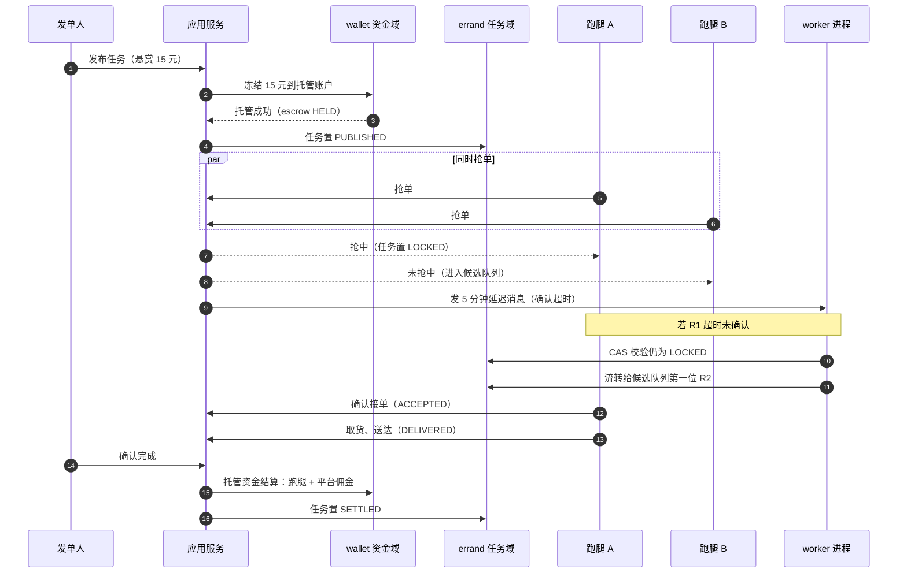
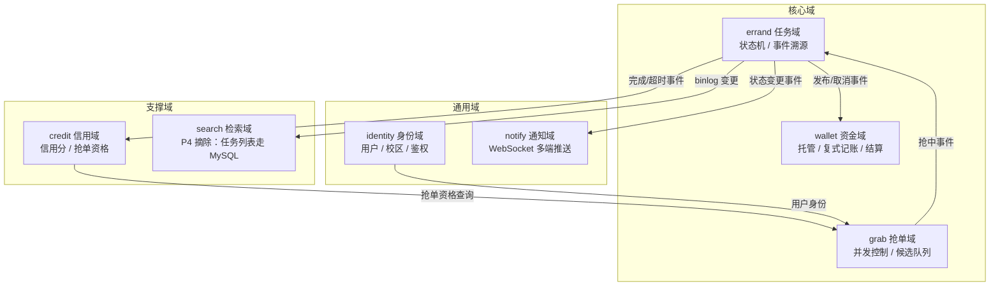
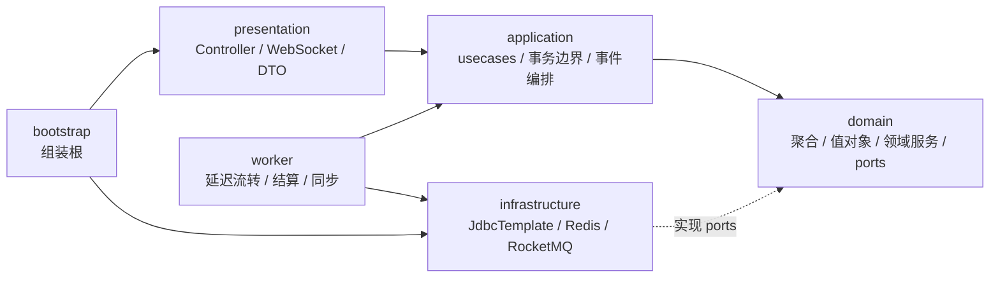
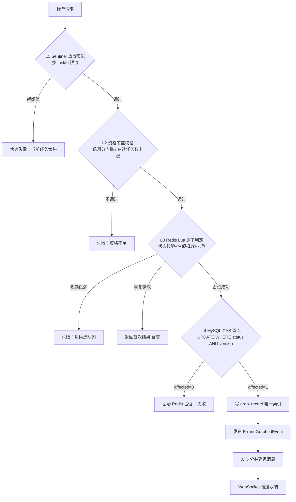
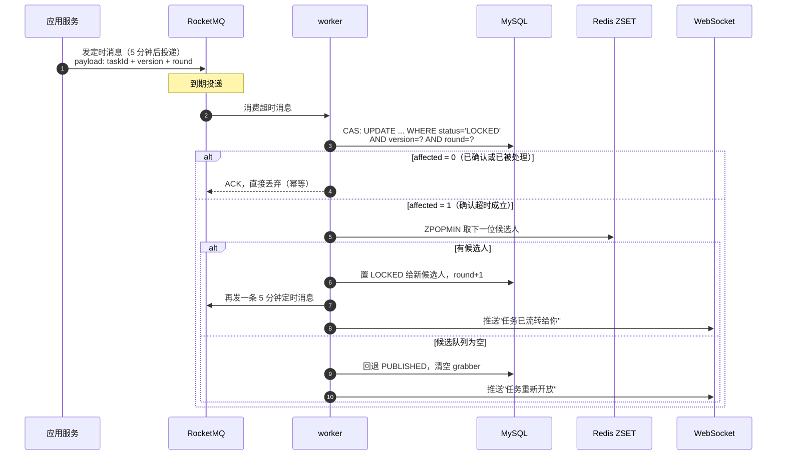
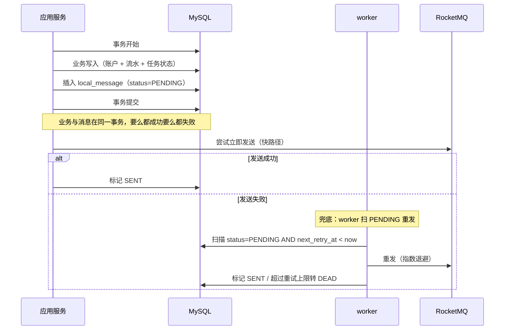
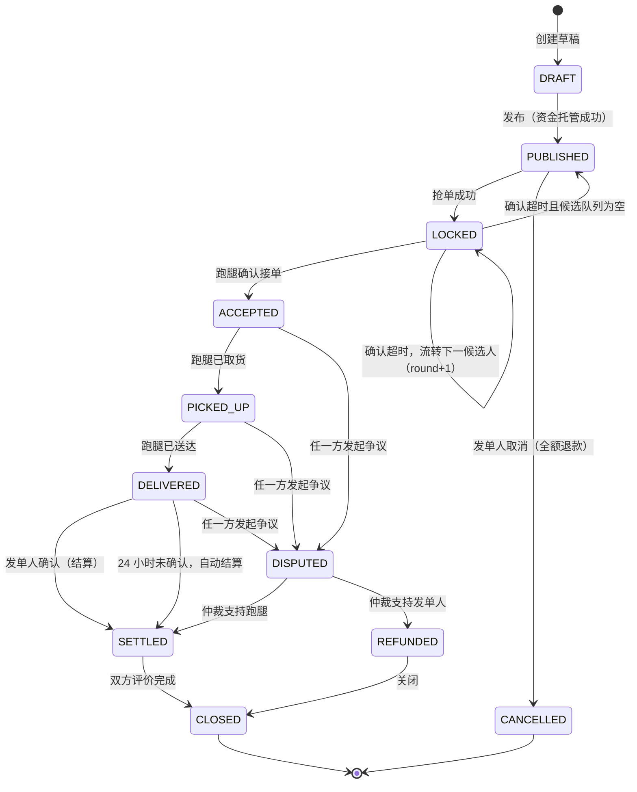

# CampusDash 架构设计与技术选型

> 项目代号：`campus-dash`（校园跑腿抢单市场）
> 文档定位：这是整个项目的设计基准。所有教程章节、工程代码、面试答辩口径都以本文为准，代码与本文冲突时先改本文再改代码。
> 配套文档：[压测方案与容量评估](压测方案与容量评估.md)

---

## 1 项目定位

这个项目和 `globex-agent`（全球电商搜索 Agent）是一对：一个讲智能体工程，一个讲**高并发 + 强一致的传统后端**。

选题是校园跑腿抢单市场，业务链路很短，但每个环节都踩在后端核心考点上：

```text
发单人发布悬赏任务（钱先托管）
  -> N 个跑腿同时抢单，只能有一个抢中
  -> 抢中后限时确认，超时自动流转给下一位候选人
  -> 跑腿送达、发单人确认
  -> 托管资金结算给跑腿 + 平台佣金
  -> 双方信用分变更
```

为什么这个选题值得做：

1. **抢单是天然的并发考题。** 一个任务 N 人同时抢、只能成功一个，这是分布式锁、CAS、幂等三件套的最佳载体，而且正确性可验证——超卖了就是错了，没有"差不多对"这种中间状态。
2. **钱相关的系统面试官天然爱追问。** 托管、结算、退款、对账，逼着你把事务边界、最终一致、幂等键设计讲清楚，糊不过去。
3. **超时流转把延迟队列做成了硬需求。** 不是为了用 MQ 而用 MQ，是业务上真的需要"5 分钟后如果还没确认就换人"。
4. **数据同步有真实场景。** 任务详情读多写少（要缓存），任务列表要按距离和关键词检索（要 ES），于是 MySQL / Redis / ES 三份数据的一致性成了必须解决的问题，而不是硬塞进来的技术点。

不做什么：不接真实支付渠道（资金用虚拟余额模拟，规避合规问题），不做骑手路径规划算法，不做完整的运营后台。重心是后端链路本身。

---

## 2 业务全景

### 2.1 角色

| 角色 | 说明 | 关键动作 |
|---|---|---|
| 发单人 Publisher | 发布跑腿任务的学生 | 发布任务（托管悬赏）、取消任务、确认送达、评价 |
| 跑腿 Runner | 接单的学生 | 抢单、确认接单、取货、送达、提现 |
| 平台 Platform | 系统自身 | 资金托管、抽取佣金、超时流转、仲裁、对账 |

### 2.2 主链路时序



### 2.3 四条主链路

后面所有设计都围绕这四条链路展开，它们也是面试时的四个主战场：

| 链路 | 核心问题 | 主要考点 |
|---|---|---|
| L1 抢单 | N 人抢 1 个名额，不能超卖、不能重复抢 | 分布式锁、Lua 原子性、CAS、幂等、限流 |
| L2 超时流转 | 抢中后限时未确认，自动换下一位 | 延迟队列、消息幂等、状态机并发跃迁 |
| L3 资金托管与结算 | 钱一分不能错，跨进程也要最终一致 | 复式记账、事务传播、本地消息表、对账 |
| L4 数据同步 | MySQL / Redis 两份数据保持一致（ES 已摘除，见 9.4 决策） | 缓存一致性、缓存三大问题、一致性校验 |

---

## 3 限界上下文划分

### 3.1 上下文地图



### 3.2 上下文职责

| 上下文 | 类型 | 聚合根 | 职责边界 | 承载技术点 |
|---|---|---|---|---|
| `errand` | 核心 | Errand | 任务生命周期与状态合法性，唯一的状态修改入口 | 状态机、乐观锁版本号、状态流转事件表 |
| `grab` | 核心 | GrabRecord、CandidateQueue | 抢单并发裁决与候选人排序，不负责任务业务规则 | Lua 原子判定、幂等去重、ZSET 候选队列 |
| `wallet` | 核心 | WalletAccount、EscrowOrder、Ledger | 一切资金变动，账户余额只能由本域修改 | 复式记账、事务边界、本地消息表、对账 |
| `credit` | 支撑 | CreditScore | 信用分计算与抢单资格判定 | 事件驱动、滑动窗口衰减、ZSET 排行榜 |
| `search` | 支撑 | —（P4 摘除） | 原计划承载 ES 读模型；附近任务与独立检索不做，任务列表走 MySQL 索引 | — |
| `identity` | 通用 | User、Campus | 用户身份、校区归属、鉴权 | JWT、角色与资格校验 |
| `notify` | 通用 | Notification | 消息推送，不含业务决策 | WebSocket、多节点广播、推送幂等 |

### 3.3 上下文之间的通信纪律

三条硬规矩，后面拆微服务能不能顺利，全看这三条守不守得住：

1. **跨上下文只通过领域事件 + 应用层编排。** `grab` 抢中后不直接改 `errand` 的字段，而是发 `ErrandGrabbedEvent`，由应用层编排调用 `errand` 的状态流转方法。
2. **禁止跨域引用聚合内部对象。** `credit` 需要任务信息时只能拿到 `ErrandSnapshot`（值对象），拿不到 `Errand` 聚合本体，也就没法绕过状态机改状态。
3. **账户余额只有 `wallet` 能改。** 任何其他域想动钱，只能调 `wallet` 暴露的用例，且必须带幂等键。

---

## 4 洋葱分层与模块结构

### 4.1 分层原则

依赖方向单向朝内，领域层不知道任何技术细节：



关键在那条虚线：`infrastructure` 依赖 `domain`，而不是反过来。领域层只定义 `ports`（接口），基础设施层提供适配器实现，这就是依赖倒置。好处很直接——换掉 Redis、换掉 MyBatis，领域层一行不用改；测试领域逻辑时也不需要起中间件。

这套分层与 `globex-agent` 完全对齐（`app/domain/order/ports/order_repository.py` 对应 `dash-domain/errand/ports/ErrandRepository.java`），两个项目在简历上呈现同一套架构方法论。

### 4.2 Maven 模块

```text
campus-dash/
├── pom.xml                 # 聚合 pom，统一依赖版本管理
├── dash-shared/            # 通用内核：Result、错误码、雪花 ID、Money、时间工具（零业务）
├── dash-domain/            # 领域层：纯 JDK，不依赖 Spring
│   ├── errand/{model,statemachine,event,ports}
│   ├── grab/{model,event,ports}
│   ├── wallet/{model,ledger,event,ports}
│   ├── credit/{model,ports}
│   ├── search/{model,ports}
│   └── identity/{model,ports}
├── dash-application/       # 应用层：usecases（命令/查询）、事务边界、领域事件处理器
├── dash-infrastructure/    # 适配器：JdbcTemplate 仓储、Redis、RocketMQ（ES/Canal P4 摘除，Sentinel P7）
├── dash-presentation/      # Controller、WebSocket、DTO、鉴权拦截器、全局异常
├── dash-bootstrap/         # 组装根（composition root）+ 配置 + 主启动类
├── dash-worker/            # 独立进程：延迟流转、自动结算、结算对账、缓存校验、消息表补偿
├── docker/                 # docker-compose（MySQL/Redis/RocketMQ；Prom/Grafana P7）
├── bench/                  # 压测工程
│   ├── scripts/            # JMeter jmx、wrk lua、造数与清理脚本
│   ├── profiles/           # 阶梯加压参数档
│   └── reports/            # report-YYYYMMDD-HHMMSS.md
└── docs/设计演进记录.md
```

### 4.3 为什么 worker 要独立成进程

抢单接口是低延迟在线请求，延迟流转、结算对账、缓存校验是后台批量任务，两者放一个进程里会互相拖累：对账 job 一跑，GC 抖动直接打到抢单的 P99 上。

拆成独立进程后：

- 资源隔离：worker 可以单独调大堆内存、单独设 GC 策略，不影响在线服务
- 部署隔离：worker 重启不影响在线抢单
- 扩缩容独立：抢单高峰扩在线服务，对账高峰扩 worker
- 面试口径清晰：能明确回答"在线链路和离线链路怎么隔离的"

两个进程共享 `dash-application` 和 `dash-infrastructure`，所以业务逻辑不重复写，只是启动入口和装配不同。

### 4.4 分层规则用 ArchUnit 守住

架构文档写得再漂亮，几个月后也会烂掉——除非把规则写成测试。`dash-domain` 里放一组 ArchUnit 测试：

```java
@AnalyzeClasses(packages = "com.campusdash")
class ArchitectureRuleTest {

    // 领域层不许碰任何技术框架
    @ArchTest
    static final ArchRule domain_should_be_framework_free = noClasses()
            .that().resideInAPackage("..domain..")
            .should().dependOnClassesThat().resideInAnyPackage(
                    "org.springframework..", "com.baomidou..",
                    "org.redisson..", "org.apache.rocketmq..", "javax.sql..");

    // 依赖方向：presentation -> application -> domain
    @ArchTest
    static final ArchRule layer_dependencies_are_respected = layeredArchitecture()
            .consideringAllDependencies()
            .layer("Presentation").definedBy("..presentation..")
            .layer("Application").definedBy("..application..")
            .layer("Domain").definedBy("..domain..")
            .layer("Infrastructure").definedBy("..infrastructure..")
            .whereLayer("Presentation").mayNotBeAccessedByAnyLayer()
            .whereLayer("Application").mayOnlyBeAccessedByLayers("Presentation", "Infrastructure")
            .whereLayer("Domain").mayOnlyBeAccessedByLayers("Application", "Infrastructure", "Presentation");

    // 仓储接口必须定义在领域层的 ports 包里
    @ArchTest
    static final ArchRule repository_ports_live_in_domain = classes()
            .that().haveSimpleNameEndingWith("Repository")
            .and().areInterfaces()
            .should().resideInAPackage("..domain..ports..");
}
```

这组测试进 CI，任何人想在领域层 `import` 一个 Spring 注解，构建直接红。面试讲架构时这也是加分项——你不只是画了图，还让规则可执行。

---

## 5 技术栈选型

### 5.1 选型总表

| 层 | 选型 | 在项目里解决什么 | 对应面试考点 |
|---|---|---|---|
| 运行时 | JDK 21 | 虚拟线程承接抢单 IO 密集请求 | 虚拟线程 vs 平台线程池、ZGC |
| 框架 | Spring Boot 3.3 | 依赖注入、事务、Web | 事务传播、`@Transactional` 失效场景、循环依赖 |
| ORM | MyBatis-Plus 3.5 | 手写 CAS SQL、可控索引命中 | 为何不用 JPA、乐观锁实现 |
| DB | MySQL 8（InnoDB，RC 隔离级别） | 任务/账户/流水/幂等表 | MVCC、间隙锁、RR vs RC、索引设计 |
| 分片 | ShardingSphere-JDBC 5.5 | `errand` 按 campus_id、`wallet_ledger` 按 user_id | 分片键选择、跨分片分页、分布式 ID |
| 缓存 | Redis 7 + Redisson（单一分布式缓存，不用本地缓存） | 抢单原子判定、任务详情缓存、候选 ZSET、布隆过滤器 | Lua 原子性、看门狗续期、Redlock 争议、热 Key 治理 |
| MQ | RocketMQ 5.x | 延迟流转、事务消息、领域事件、延迟双删 | 延迟消息实现、消费幂等、顺序/死信 |
| ~~搜索~~ | ~~Elasticsearch 8~~ | P4 决策摘除：校园场景无需独立检索引擎，任务列表走 MySQL | 知识点保留在教程方案对比章节 |
| ~~CDC~~ | ~~Canal~~ | P4 决策摘除：不做 binlog 订阅链路 | 知识点保留在教程方案对比章节 |
| 治理 | Sentinel | 抢单接口热点参数限流、熔断降级 | 限流算法、热点探测、降级策略 |
| 安全 | Spring Security 6 + JWT | 双端鉴权、token 黑名单、防重放 | 无状态鉴权、签名与幂等令牌 |
| 实时 | WebSocket + Redis Pub/Sub | 抢单结果多端实时同步 | 多节点广播、断线重连、推送幂等 |
| 状态机 | 领域层自研 enum + 事件表 | 任务状态合法流转 | 状态机 vs if-else、并发状态跃迁 |
| 调度 | XXL-Job（或 ShedLock 轻量替代） | 对账 job、消息表补偿、ZSET 兜底扫描 | 分布式调度、任务不重不漏 |
| 观测 | Micrometer + Prometheus + Grafana + SkyWalking + MDC traceId | 抢单成功率/流转准时率/同步延迟看板 | 指标设计、链路追踪 |
| 测试 | JUnit 5 + Testcontainers + ArchUnit | 集成测试真中间件、架构规则守卫 | 测试分层、并发用例怎么写 |
| 压测 | JMeter 5.6 + wrk + JMH | 抢单尖峰、阶梯加压、混合读写、结算 TPS | 加压模型、拐点判定、Little's Law |
| 剖析 | Arthas + async-profiler + GC 日志 | 把"QPS 上不去"定位到具体方法与锁点 | 锁竞争定位、GC 调优、线程状态分析 |

### 5.2 几个容易被追问的选型理由

**为什么用 MyBatis-Plus 而不是 JPA。** 抢单的核心是 `UPDATE ... WHERE status=? AND version=?` 这种带条件的 CAS 语句，需要精确控制 SQL 形态和索引命中，还要拿到 `affectedRows` 做判定。JPA 的乐观锁是抛 `OptimisticLockException`，在高并发失败率高的场景里用异常做流程控制不合适，而且 JPA 容易在不经意间发出 N+1 查询。洋葱架构下领域模型本来就和表结构解耦，用 MyBatis 手写 SQL 反而更干净。

**为什么隔离级别选 RC 而不是 MySQL 默认的 RR。** 这个项目的写操作全部是 `UPDATE ... WHERE 主键 AND 条件` 形式的点更新，不依赖可重复读。RC 下没有间隙锁，能显著降低并发更新时的锁冲突和死锁概率。代价是不可重复读，但业务上没有"同一事务内两次读必须一致"的需求。这是个明确的 trade-off，面试时要能说清代价。

**为什么状态机自研而不用框架。** 状态机是领域层的核心资产，用 COLA StateMachine 这类框架会让 `dash-domain` 引入外部依赖，破坏"领域层零框架"的规则。自研的成本其实很低——一个枚举加一张流转表，加上 `canTransitTo()` 校验方法就够了，而且能顺手把"流转时必须带 version"这种并发约束写进领域模型里。

**为什么 Redis 和 MySQL 都要参与抢单判定。** Redis 快但不可靠（主从切换可能丢数据），MySQL 可靠但慢。所以 Redis 做前置的高性能拦截，把 99% 的失败请求挡在数据库外面；MySQL 用唯一索引和 CAS 做最终裁决，保证即使 Redis 出问题也不会超卖。这是"性能靠缓存，正确性靠数据库"的典型分工，详见 6.3。

---

## 6 链路 L1：抢单 N 抢 1

### 6.1 不变式

设计并发方案之前，先把"什么叫做对了"定义清楚。抢单必须同时满足四条不变式，任何方案都要拿这四条去验：

| 编号 | 不变式 | 违反时的现象 |
|---|---|---|
| INV-1 | 一个任务的抢中人数 ≤ 名额数 | 超卖：两个跑腿都以为自己接到了同一个单 |
| INV-2 | 同一用户对同一任务最多占一个名额 | 刷单：一个人开多个客户端抢走全部名额 |
| INV-3 | 抢单请求重复提交只生效一次 | 网络重试导致重复占位 |
| INV-4 | 抢单失败的用户必须能进候选队列，且顺序稳定 | 超时流转时找不到下一位，或顺序随机导致纠纷 |

INV-1 是硬约束，压测时用"成功数是否严格等于名额数"来验证，没有妥协空间。

### 6.2 六种方案的演进对比

教程按这个顺序讲，每一步都先给出问题、再给出改进，最后落到终选方案。

| 方案 | 做法 | 为什么不够 |
|---|---|---|
| A. `synchronized` / `ReentrantLock` | 在抢单方法上加 JVM 锁 | 只在单进程内有效。一旦部署两个实例，两个 JVM 各自持锁，直接超卖。单机也有问题：锁粒度是整个方法，不同任务之间也在互相排队 |
| B. `SELECT ... FOR UPDATE` | 数据库悲观锁锁住任务行 | 正确但很贵。2000 并发全打到 DB，连接池瞬间打满，锁等待队列拉长，P99 直接崩；RR 隔离级别下还可能因间隙锁触发死锁 |
| C. 纯乐观锁 CAS | `UPDATE ... WHERE version=?`，失败即返回 | 正确性没问题，但 2000 个请求里 1999 个是"白跑一趟数据库"，DB 承担了大量无效写请求，吞吐上不去 |
| D. Redis `SETNX` 分布式锁 | 抢锁成功才继续走业务 | 三个经典坑：锁没设过期时间会永久死锁；设了过期时间但业务没跑完锁就到期了，别人能进来；释放锁时可能误删别人的锁（需要 value 比对 + Lua 原子删除） |
| E. Redisson 看门狗 | 可重入锁 + 自动续期 | 解决了续期和误删，但主从架构下 master 写入锁后未同步就宕机，slave 升主后锁丢失，仍可能双写。Redlock 试图解决这个问题，但 Martin Kleppmann 与 antirez 的争论说明它并不是"更安全"的银弹，只是把假设换了个地方 |
| F. **Lua 原子判定 + DB CAS 双保险（终选）** | Redis Lua 一次性完成校验与占位，MySQL 用 CAS + 唯一索引做最终裁决 | 兼顾吞吐与正确性：Redis 挡掉绝大部分无效请求，DB 只承接抢中者的落库，且即使 Redis 判错也无法在 DB 层造成超卖 |

面试时这张表的价值在于：能说清"为什么不用更简单的方案"，而不是一上来就报出终选方案的名字。追问"为什么不用 Redisson 就完事"时，答案是 Redisson 保证的是互斥，而我们要保证的是**名额守恒**——即使锁短暂失效，DB 的唯一索引仍然让 INV-1 成立。

### 6.3 终选方案：四层防护



每一层的职责边界很清楚：

- **L1 限流**：保护系统不被单个热点任务打垮。用 Sentinel 的热点参数限流，按 `taskId` 维度限流而不是接口维度——一个爆款任务被疯抢时，不该影响其他任务的抢单。
- **L2 资格校验**：业务规则前置，把没资格的人挡在并发判定之前，减少后续压力。信用分门槛和在途任务数上限都从 Redis 读，不查 DB。
- **L3 Redis Lua**：并发判定的主力。用 Lua 保证"读状态 + 扣名额 + 写抢中者 + 去重"这四步的原子性，这是本方案的性能来源。
- **L4 MySQL CAS**：正确性的最终保证。即使 L3 因为 Redis 主从切换判错，DB 的 `WHERE status='PUBLISHED' AND version=?` 和 `grab_record` 的唯一索引也不会让第二个人成功。

### 6.4 Lua 脚本设计

为什么必须用 Lua 而不是"先 GET 再 SET"：Redis 单条命令是原子的，但多条命令之间会被其他客户端插入。`GET 名额 → 判断 > 0 → DECR` 这个序列在并发下必然出错。Lua 脚本在 Redis 中作为一个整体执行，中途不会被打断。

```lua
-- KEYS[1] = errand:slot:{taskId}      剩余名额（string）
-- KEYS[2] = errand:grabbed:{taskId}   已抢中用户集合（set）
-- KEYS[3] = errand:idem:{requestId}   幂等键（string）
-- ARGV[1] = userId
-- ARGV[2] = 幂等键过期秒数
-- 返回：1=占位成功  0=名额已满  -1=用户已抢过  -2=重复请求  -3=任务不可抢

-- 幂等：同一 requestId 重复提交直接返回上次结果
local prev = redis.call('GET', KEYS[3])
if prev then
    return tonumber(prev) == 1 and -2 or 0
end

local slot = redis.call('GET', KEYS[1])
if not slot then
    return -3
end

-- INV-2：同一用户不能占两个名额
if redis.call('SISMEMBER', KEYS[2], ARGV[1]) == 1 then
    return -1
end

-- INV-1：名额守恒
if tonumber(slot) <= 0 then
    redis.call('SETEX', KEYS[3], tonumber(ARGV[2]), '0')
    return 0
end

redis.call('DECR', KEYS[1])
redis.call('SADD', KEYS[2], ARGV[1])
redis.call('SETEX', KEYS[3], tonumber(ARGV[2]), '1')
return 1
```

几个要点：

1. **脚本用 `EVALSHA` 调用**，避免每次传输脚本体。Redisson 的 `RScript` 会自动处理 `NOSCRIPT` 时的重新加载。
2. **所有 KEY 带 `{taskId}` hash tag**，保证在 Redis Cluster 模式下落到同一个 slot，否则 Lua 脚本无法跨 slot 操作。
3. **幂等键在名额已满时也要写入**，否则重复请求会反复穿透到名额判断，虽然结果一样但浪费性能。
4. **脚本里绝不做耗时操作**。Redis 执行 Lua 时是单线程阻塞的，脚本里写循环或大 key 遍历会阻塞整个实例。

### 6.5 DB 落库与回滚

Lua 占位成功后，进入 DB 落库：

```java
// application 层，抢单用例的核心片段
@Transactional(rollbackFor = Exception.class)
public GrabResult grab(GrabCommand cmd) {
    // L4-1：CAS 更新任务状态，affected=0 说明状态已被别人改掉
    int affected = errandRepository.lockForRunner(
            cmd.errandId(), cmd.runnerId(), cmd.expectedVersion());
    if (affected == 0) {
        throw new GrabConflictException(cmd.errandId());
    }

    // L4-2：唯一索引兜底，重复抢会抛 DuplicateKeyException
    grabRecordRepository.insert(GrabRecord.of(cmd.errandId(), cmd.runnerId()));

    // L4-3：状态流转日志（事件溯源）
    errandStatusLogRepository.append(
            cmd.errandId(), ErrandStatus.PUBLISHED, ErrandStatus.LOCKED, cmd.runnerId());

    return GrabResult.success(cmd.errandId());
}
```

对应的 SQL：

```sql
UPDATE errand
   SET status = 'LOCKED',
       grabber_id = #{runnerId},
       locked_at = NOW(3),
       version = version + 1
 WHERE id = #{errandId}
   AND status = 'PUBLISHED'
   AND version = #{expectedVersion};
```

**失败回滚是这里最容易忽略的坑。** 如果 Lua 占位成功但 DB 落库失败（CAS 冲突、唯一索引冲突、连接超时），Redis 里的名额已经被扣了，必须补回去，否则这个名额就永久泄漏了——任务会一直显示"已被抢"，但数据库里没有抢中者。

补偿方式：

```java
// 落库失败时的补偿，必须在事务外执行（事务已回滚）
try {
    grabUseCase.grab(cmd);
} catch (GrabConflictException | DuplicateKeyException e) {
    grabSlotPort.rollbackSlot(cmd.errandId(), cmd.runnerId());  // 反向 Lua：INCR + SREM
    return GrabResult.failed(...);
}
```

再加一道兜底：worker 里有个低频对账 job，扫描"Redis 显示名额为 0 但 DB 中 status 仍为 PUBLISHED 且超过 30 秒"的任务，把名额修回去。这就是典型的"补偿 + 定时校准"双保险，面试问"补偿动作本身失败了怎么办"时，答案就是这个 job。

### 6.6 候选队列

抢单失败的人不是直接被拒绝，而是进候选队列，为 L2 超时流转做准备：

```java
// score 越小越优先：抢单时间戳 - 信用分加权
double score = System.currentTimeMillis() - creditScore * CREDIT_WEIGHT_MILLIS;
candidateQueuePort.offer(errandId, runnerId, score);
```

用 Redis ZSET 存储，key 为 `errand:candidates:{errandId}`。设计考虑：

- **为什么 score 带信用分权重**：纯按时间排序会奖励"手速快的脚本党"，把信用分折算成时间提前量，让高信用用户在同等手速下更容易接到流转的单。权重系数 `CREDIT_WEIGHT_MILLIS` 要有上限，避免高信用用户完全垄断。
- **为什么 ZSET 而不是 List**：需要按分数取最优候选人，还需要支持"用户主动退出候选"（`ZREM`），List 做不到 O(log N) 的定位删除。
- **持久化镜像**：ZSET 是易失的，Redis 挂了候选队列就没了。所以异步落一份 `errand_candidate` 表，worker 发现 ZSET 为空但 DB 有候选记录时能重建。这是"Redis 做主、MySQL 做备"的取舍：候选队列丢了不会导致资金错误，只会导致流转变慢，所以可以接受最终一致。

---

## 7 链路 L2：超时未接自动流转

### 7.1 业务规则

抢中不等于接单。跑腿抢到后有 5 分钟确认窗口，超时未确认就自动流转给候选队列里的下一位；候选队列空了就把任务打回 `PUBLISHED` 重新开放。

同时还有第二个超时场景：跑腿已送达但发单人 24 小时未确认，自动结算给跑腿，避免资金无限期挂在托管账户里。

两个场景共用一套延迟消息机制，只是延迟时长和处理逻辑不同。

### 7.2 延迟队列五种方案对比

| 方案 | 做法 | 优势 | 劣势 |
|---|---|---|---|
| A. DB 轮询扫表 | 定时任务扫 `WHERE status='LOCKED' AND locked_at < now-5min` | 实现最简单，不引中间件 | 扫描周期决定精度，周期短则 DB 压力大；任务量大时全表扫描慢；多实例需要分布式锁防重复 |
| B. Redis ZSET | 到期时间戳作 score，定时 `ZRANGEBYSCORE` 取到期项 | 精度可控，性能好 | 需要自己实现轮询线程、宕机恢复、多实例竞争；消息可靠性靠自己保证 |
| C. Netty HashedWheelTimer | 内存时间轮 | 精度高（毫秒级），无外部依赖 | 纯内存，进程重启全丢；不支持分布式；不适合跨进程调度 |
| D. RabbitMQ TTL + 死信队列 | 消息设 TTL，过期后进 DLX 被消费 | 借用成熟 MQ 的可靠投递 | 队列头阻塞：TTL 是按队列顺序判定的，前面一条 30 分钟的消息会挡住后面 5 分钟的消息（除非用延迟插件） |
| E. **RocketMQ 延迟消息（终选）** | 5.x 支持任意精度定时消息 | 可靠投递、天然分布式、支持重试与死信、无队头阻塞 | 引入 MQ 依赖；4.x 只支持 18 个固定 level（本项目用 5.x） |

终选 **RocketMQ 5.x 定时消息作主通道 + Redis ZSET 兜底扫描**。为什么还要兜底：MQ 消息可能因为极端情况丢失（Broker 磁盘故障、消息被误删），而"超时不流转"意味着任务永久卡在 `LOCKED` 状态、资金永久冻结。所以 worker 里有个每分钟一次的兜底扫描，捞出"`LOCKED` 且超时 2 分钟以上仍未处理"的任务补偿处理。

**主通道 + 兜底扫描是这个项目里反复出现的模式**（抢单名额、延迟流转、本地消息表都用了它）。核心思路一致：主通道追求性能与实时性，兜底通道追求不丢，两者用幂等保证重复执行无副作用。

### 7.3 流转时序



### 7.4 幂等三件套

延迟消息一定会重复投递（MQ 的语义是 at-least-once），所以消费端必须幂等。这里用三层保证：

1. **version CAS**：`UPDATE ... WHERE version = #{expectedVersion}`。任务只要被任何操作改动过，version 就变了，旧消息的 CAS 必然失败。这是最主要的幂等手段。
2. **round 轮次校验**：`round` 记录这个任务流转了几轮。第 1 轮的超时消息如果延迟很久才到，此时任务已经在第 3 轮，`round` 不匹配直接丢弃。这解决了"version 恰好被改回同一个值"的极端情况，也让日志更好排查。
3. **消息表唯一索引**：`local_message.msg_key` 上的唯一索引，`msg_key = timeout:{taskId}:{round}`。同一轮的超时消息只会被记录一次。

面试常见追问："CAS 已经能保证幂等了，为什么还要 round？" 答案是 CAS 保证的是"状态没被改过"，但无法区分"这条消息是第几轮发出的"。当流转发生 A→B→A（第 3 轮又轮回到 A）时，如果没有 round，第 1 轮的旧消息可能误判为有效。round 让消息带上了它自己的世代信息。

### 7.5 状态机的并发跃迁

超时流转和用户主动确认可能同时发生：worker 正在执行"超时流转给 B"，跑腿 A 同时点了"确认接单"。这就是状态机的并发跃迁问题。

解决方式是**所有状态变更都走同一个入口，且都必须带 version**：

```java
// 领域层：状态流转的唯一入口
public void transitTo(ErrandStatus target, long expectedVersion, String operator) {
    if (this.version != expectedVersion) {
        throw new ConcurrentModificationException(this.id, expectedVersion, this.version);
    }
    if (!this.status.canTransitTo(target)) {
        throw new IllegalStateTransitionException(this.status, target);
    }
    this.status = target;
    this.version++;
    this.events.add(new ErrandStatusChangedEvent(this.id, this.status, target, operator));
}
```

数据库层面靠 CAS 让两者必有一个失败：A 的确认先到就 version+1，worker 的超时 CAS 失败、消息被丢弃；worker 先到则 A 的确认失败，前端收到"任务已流转"的提示。无论谁赢，状态都是自洽的，不会出现"既已确认又已流转"。

这个设计的关键是：**领域层不允许直接 `setStatus()`**，字段的 setter 不对外暴露。所有流转都必须经过 `transitTo`，于是"必须带 version""必须校验合法性"这两条约束在编译期就被固定住了，新人也没法绕过。

---

## 8 链路 L3：资金托管与结算

### 8.1 账户模型与复式记账

资金部分只有一条铁律：**钱不能凭空产生，也不能凭空消失。** 落到实现上就是复式记账——每笔资金流动必须同时记录一借一贷，且借贷金额相等。

三张表分工：

| 表 | 角色 | 说明 |
|---|---|---|
| `wallet_account` | 余额快照 | 存 `available`（可用）、`frozen`（冻结）、`version`；快照是为了查询快，不是事实来源 |
| `wallet_ledger` | 流水（事实来源） | 每笔动作两条记录，一条 DEBIT 一条 CREDIT；`biz_no` 唯一索引做幂等 |
| `escrow_order` | 托管单 | 一个任务对应一张托管单，状态 `HELD / RELEASED / REFUNDED` |

账户体系里有三类账户，任何一笔资金流动都是在这三类账户之间搬钱：

```text
用户账户（每个用户一个）
平台托管账户（系统户，存所有在途任务的悬赏金）
平台佣金账户（系统户，收佣金）
```

**为什么要有余额快照又要有流水。** 只有流水的话，查余额要 `SUM` 全部流水，随着数据增长会越来越慢；只有快照的话，余额错了无法追溯、无法自证。所以两者都要，并用对账 job 定期校验"快照 = 流水累计"。这也是面试高频题"你的余额是算出来的还是存出来的"的标准答案：**存快照、以流水为准、用对账兜底**。

### 8.2 三个资金动作的事务边界


三个动作都在**单个本地事务**内完成，这是模块化单体最大的红利——不需要分布式事务，`@Transactional` 就够了。教程里要明确写出这个红利，以及拆微服务后会失去它（见第 12 节）。

扣款的 SQL 必须是带条件的 CAS，绝不能先查后改：

```sql
-- 正确：一条语句完成判断与扣减，靠 affected 判定结果
UPDATE wallet_account
   SET available = available - #{amount},
       frozen    = frozen + #{amount},
       version   = version + 1
 WHERE user_id  = #{userId}
   AND available >= #{amount};

-- 错误：先 SELECT 余额再 UPDATE，两条语句之间余额可能被改
```

`affected = 0` 说明余额不足或并发冲突，直接抛异常回滚整个事务。这样连"余额不足"的判断都不需要单独查询，一条 SQL 搞定，并发安全。

### 8.3 幂等键设计

资金接口的幂等不能靠"查一下有没有处理过"，那本身就有并发窗口。靠 `wallet_ledger.biz_no` 的唯一索引：

| 业务动作 | biz_no 格式 | 说明 |
|---|---|---|
| 发布托管 | `escrow:{errandId}` | 一个任务只能托管一次 |
| 完成结算 | `settle:{errandId}` | 一个任务只能结算一次 |
| 取消退款 | `refund:{errandId}` | 一个任务只能退款一次 |
| 用户充值 | `recharge:{outTradeNo}` | 按外部流水号幂等 |
| 提现 | `withdraw:{withdrawId}` | 按提现单号幂等 |

重复请求会撞唯一索引抛 `DuplicateKeyException`，应用层捕获后返回"已处理"，而不是报错。这比"先查再插"可靠，因为唯一索引的判定和插入是数据库层的一个原子动作。

### 8.4 Spring 事务传播实战

项目里有三处需要不同传播行为，正好覆盖面试常问的三种：

**REQUIRED（默认）——主链路。** 结算用例调用 `wallet` 和 `errand` 两个域的方法，它们都用 `REQUIRED`，于是共用同一个事务，一起成功一起回滚。

**REQUIRES_NEW——审计日志。** 资金操作要记审计日志，但审计日志写失败不该导致资金操作回滚（反过来，资金回滚了审计日志也该保留，用来排查）。所以审计日志用独立事务：

```java
@Transactional(propagation = Propagation.REQUIRES_NEW, rollbackFor = Exception.class)
public void recordAudit(AuditLog log) {
    auditLogRepository.insert(log);
}
```

注意这里有个坑：`REQUIRES_NEW` 会挂起当前事务、从连接池另取一个连接。如果连接池只有 10 个连接而并发有 10 个主事务都在调 `REQUIRES_NEW`，就会死锁——主事务持有连接不放，新事务拿不到连接。所以用 `REQUIRES_NEW` 时连接池必须留足余量，或者干脆改成事件异步落库。这个坑要写进教程，因为它在压测时才会暴露。

**NESTED——批量结算的部分失败容忍。** 对账 job 批量补偿 100 笔异常记录时，希望某一笔失败不影响其他 99 笔。`NESTED` 用 savepoint 实现，单笔失败只回滚到 savepoint。实践中更常用的是"不用嵌套事务，改成循环里每笔一个独立事务 + 失败记录到重试表"，教程会把两种写法都给出并说明取舍。

### 8.5 `@Transactional` 失效的六种场景

这是 Spring 事务的经典面试题，本项目每一条都有对应的真实位置，教程里逐条演示：

| 场景 | 原因 | 项目中的对应位置 |
|---|---|---|
| 1. 同类内部方法自调用 | 绕过了代理对象，AOP 没生效 | 结算用例内部调私有的扣款方法 |
| 2. 方法非 public | Spring AOP 默认只代理 public 方法 | 早期版本里把扣款方法写成 protected |
| 3. 异常被 catch 吞掉 | 事务管理器看不到异常，正常提交 | 抢单落库失败后 catch 做 Redis 补偿时，若不重新抛出会导致事务提交 |
| 4. 抛的是 checked 异常 | 默认只对 RuntimeException 回滚 | 必须写 `rollbackFor = Exception.class` |
| 5. 类未被 Spring 管理 | 手动 `new` 出来的对象没有代理 | 领域对象本身不带事务，事务边界只在 application 层 |
| 6. 数据库引擎不支持事务 | MyISAM 不支持 | 建表时必须显式 `ENGINE=InnoDB` |

第 3 条在这个项目里尤其真实：抢单落库失败要回滚 Redis 名额，很容易写成 `try-catch` 里做补偿然后正常返回，结果 DB 事务提交了（虽然 CAS 失败没改数据，但如果事务里还有其他写操作就会脏写）。正确做法是补偿放在事务外层。

### 8.6 跨进程最终一致：本地消息表 vs 事务消息

资金变更后需要通知其他域（信用分变更、ES 索引更新、WebSocket 推送），这些都在 worker 进程。问题是：**本地事务提交了，但发消息失败了怎么办？**

两种方案都实现，教程做 A/B 对比：

**方案一：本地消息表（终选主方案）**



优点是不依赖 MQ 的特殊能力，任何 MQ 都能用，逻辑完全可控，排查方便（消息状态都在库里能查）。缺点是多一张表和一个扫描 job。

**方案二：RocketMQ 事务消息**

发半消息 → 执行本地事务 → 提交/回滚半消息 → Broker 回查本地事务状态。优点是不用维护消息表；缺点是必须实现回查接口（`checkLocalTransaction`），而回查逻辑本质上还是要查"业务数据到底写成功没有"，复杂度并没有消失，只是转移了。

**为什么主方案选本地消息表**：它把"消息有没有发出去"变成了一个可查询的数据库状态，运维和排障成本最低。事务消息的回查在业务表没有明确标记时很难写对。教程两种都实现，让读者理解"事务消息不是更高级，只是权衡不同"。

### 8.7 对账

worker 每日跑对账 job，三层校验：

| 层级 | 校验内容 | SQL 思路 |
|---|---|---|
| L1 借贷平衡 | 全表 `SUM(debit) == SUM(credit)` | 按日期分区聚合比对 |
| L2 快照一致 | 每个账户 `available + frozen` == 该账户流水净额 | 按 account_id 分组聚合 |
| L3 托管闭环 | 每张 `HELD` 托管单都有对应的冻结金额；每张 `RELEASED` 都有对应的结算流水 | escrow_order 左连 ledger |

任何差异写入 `recon_diff` 表并触发告警。这张表在正常情况下必须是空的——它有记录就说明代码有 bug，不是"允许存在的小误差"。

对账 job 自己也要幂等：按 `(对账日期, 校验类型)` 唯一索引，重复跑同一天不会产生重复差异记录。

---

## 9 链路 L4：数据同步

> **P4 范围决策：ES 与 Canal 彻底摘除，不是推后。**
> 附近任务（geo 检索）经评估不做——校园范围小，"附近"的业务意义弱；
> 关键词搜索在校园任务量级下直接走 MySQL 索引（`idx_campus_status`）足够，
> 为它引入 ES + Canal 整条 binlog 同步链路的成本不划算。
> 本节因此从"三方数据同步"改为"两方（MySQL + Redis）"。
> 原设计的 Canal → RocketMQ → ES 增量同步（external version 防乱序、
> alias 零停机切换）保留为知识储备，写进教程正文的方案对比章节，不进工程。

### 9.1 两份数据的角色

| 存储 | 角色 | 承载的查询 | 一致性要求 |
|---|---|---|---|
| MySQL | 事实来源 | 任务详情写入、状态流转、资金、任务列表 | 强一致 |
| Redis | 读加速与并发裁决 | 名额与候选队列、幂等键、缓存（P5）、会话 token | 名额链路强一致（Lua 原子），其余最终一致 |

写只写 MySQL，Redis 是派生数据（名额与候选队列是抢单裁决的一部分，见第 7 章）。
这个原则一旦破了（比如为了快直接改 Redis 绕过 DB），一致性就没法保证了。

### 9.2 缓存与 DB 一致性

先说清为什么"更新 DB 后更新缓存"和"先删缓存再更新 DB"都不够：

| 策略 | 并发下的问题 |
|---|---|
| 更新 DB + 更新缓存 | 两个并发写，DB 里是 B 的结果，缓存里可能是 A 的结果（两次更新顺序不一定一致） |
| 先删缓存 + 更新 DB | 删缓存后、DB 更新前，读请求把旧值重新加载进缓存，之后长期不一致 |
| **先更新 DB + 再删缓存（Cache Aside，终选）** | 理论上仍有极小窗口：读请求在 DB 更新前读到旧值、在删缓存后才写入缓存。但要求"读比写慢"，概率极低 |

终选 Cache Aside，并叠三层加固：

1. **延迟双删**：更新 DB 并删缓存后，延迟 500ms 再删一次，覆盖"读请求慢写入"的窗口。延迟通过 MQ 延迟消息实现，不用 `Thread.sleep` 占线程。
2. **TTL 兜底**：所有缓存都有过期时间（任务详情 10 分钟），即使前面全失效，最长 10 分钟后自动修正。这是最朴素也最有效的一道保险。
3. **binlog 修正（本项目不启用）**：原设计用 Canal 订阅 binlog 做"最终修正者"，
   P4 摘除 Canal 后这一层不存在，改由 9.6 的一致性校验 job 兜底（5 分钟粒度抽样比对 + 主动修正）。
   这是明确的已知边界：极端窗口下的不一致要等校验 job 发现，而不是 binlog 秒级纠正。

**为什么删除而不是更新缓存**：删除是幂等的，并发删除不会产生顺序问题；更新是有顺序的，并发更新会乱。另外删除是惰性的，冷数据被删了不会重建，省内存。

### 9.3 为什么只用分布式缓存，不加本地缓存

很多项目习惯性地堆一层 Caffeine 本地缓存做“二级缓存”，本项目明确不这么做，只用 Redis 一层分布式缓存：

```text
请求 → Redis（分布式，TTL 10min + 随机抖动）→ MySQL
```

这是一个有代价的主动取舍，面试被问到要能说清两边：

| 维度 | 加本地缓存 | 只用分布式缓存（本项目） |
|---|---|---|
| 读延迟 | 本地命中走内存，微秒级 | 一次 RTT，局域网内亚毫秒级 |
| 一致性 | 多实例各持一份副本，必须靠广播消息失效，广播丢了就不一致 | 单一数据源，不存在实例间分歧 |
| 可推理性 | 同一个 key 在不同实例可能返回不同值，线上问题难复现 | 任何实例读到的都一样，排障简单 |
| 额外复杂度 | 需要广播失效、版本比对防乱序回填、双层 TTL 对齐 | 无 |

选择的理由：这个项目的核心卖点是**并发正确性**（零超卖、资金零差异），而本地缓存恰好引入了一类“各实例看到不同事实”的不确定性。用微秒级的读延迟去换一致性与可推理性，在这个业务里不划算。任务详情的 QPS 量级（校园场景）远没到靠单台 Redis 扛不住的程度，先用简单方案，等压测真的测出 Redis 是瓶颈再说。

### 9.3.1 不加本地缓存，热 Key 怎么办

本地缓存最常见的正当理由就是抗热 Key。去掉它之后，热 Key 用下面三个手段解决：

1. **Key 分片打散**：爆款任务详情写成 `errand:detail:{id}:{shard}`，`shard` 取 `0..N-1`，读时随机挖一个分片。N 份副本把单个 key 的压力打散到不同 slot，避开单分片热点。失效时 N 份一起删。
2. **读写分离 / 多副本**：Redis 主从下让详情读走 replica，写走 master。读到略旧数据在详情场景可接受（名额与抢单判定绝不读 replica，那条链路必须读 master）。
3. **逻辑过期 + 互斥重建**（详见 9.5）：避免热 Key 到期瞬间的重建风暴。

什么时候应该反悔、把本地缓存加回来：当 S3 读写混合压测显示 Redis 已经成为瓶颈（Redis CPU 跑满、OPS 触顶、而应用 CPU 还有余量），且 key 分片与读副本都已用尽。那时再加，并且只给“强热且容忍短暂旧值”的 key 加。这个判断必须由压测数据触发，不是一上来就堆架构。

### 9.4 为什么不做 ES 增量同步（决策记录）

原设计里这一节是 Canal 订阅 binlog → RocketMQ → worker 批量写 ES，
需要解决乱序（external version）、同步延迟监控、alias 零停机重建三个问题。
P4 评估后整体摘除，理由：

| 维度 | 评估 |
|---|---|
| 附近任务 | 校园半径小，"距离我 500 米"与"本校任务列表"信息量几乎相同，geo 检索收益弱 |
| 关键词搜索 | 任务量级（单校区万级以内）下 `LIKE + 组合索引` 足够，且任务列表本就走 `idx_campus_status` |
| 同步链路成本 | Canal 部署运维 + 乱序处理 + 一致性校验 job + 全量重建，整条链路的教学与工程成本高于它带来的功能 |
| 教学价值 | external version、alias 切换等知识点保留在教程"方案对比"章节讲透，不必真落地 |

摘除的判据与缓存的判据是同一个：**由压测与真实需求触发，不预先堆架构**。

### 9.5 缓存三大问题在本项目的落点

| 问题 | 本项目的具体场景 | 解法 |
|---|---|---|
| 穿透 | 恶意刷不存在的 errandId，每次都打到 DB | Redisson 布隆过滤器前置判断 + 空值缓存（TTL 60s） |
| 击穿 | 热点任务缓存到期瞬间，大量请求同时重建 | 逻辑过期 + 互斥重建：只让一个线程回源，其他线程先返回旧值 |
| 雪崩 | 大批缓存同时到期，或 Redis 整体故障 | TTL 加随机抖动（10min ± 2min）+ Sentinel 熔断降级到"只返回任务列表不返回详情" |

击穿这里详细说下，因为它和抢单场景强相关：热门任务发布瞬间会有几百人同时看详情，如果用"互斥锁重建"，其他线程要么阻塞等待（占线程）要么返回失败（体验差）。用**逻辑过期**更好：缓存永不物理过期，值里存一个逻辑过期时间，读到逻辑过期的值时，一个线程去异步重建，所有线程先返回旧值。代价是短时间读到旧数据，但任务详情这种场景完全可以接受。

### 9.6 一致性校验 job

两方数据一致性不能靠"应该没问题"，要有可量化的验证。worker 里跑抽样校验 job：

```text
每 10 分钟随机抽 1000 个 errandId
  -> 分别从 MySQL / Redis 读取
  -> 比对关键字段（status、reward_amount、update_time）
  -> 不一致的记录到 sync_diff 表并触发修正（删缓存）
  -> 输出指标：MySQL-Redis 一致率、差异条数
```

这个 job 在 P5 缓存一致性专项落地。它同时也是排障工具——
用户报"列表里的状态和详情页不一样"时，先看这张表。

---

## 10 状态机与数据模型

### 10.1 任务状态机



设计要点：

- **`LOCKED → LOCKED` 是合法自环**，代表流转给下一位候选人，靠 `round` 字段区分轮次。这个自环是这个业务的特色，也是面试可以展开讲的点。
- **资金动作只挂在四个状态跃迁上**：`→PUBLISHED`（托管）、`→SETTLED`（结算）、`→CANCELLED`（退款）、`→REFUNDED`（仲裁退款）。其他跃迁不碰钱，这样资金链路的审查面很小。
- **`DISPUTED` 是资金的安全阀**：进入争议后托管资金既不结算也不退款，等仲裁结果，避免"钱已给跑腿但发单人说没收到"的死局。
- **状态流转表在领域层用枚举 + `Set` 定义**，不是 `if-else`。新增状态只改枚举，不改业务代码。

### 10.2 核心表 DDL 草案

只给关键字段与索引，完整 DDL 在工程阶段落到 `docker/init.sql`。

```sql
-- 任务表：抢单与状态机的核心
CREATE TABLE errand (
  id            BIGINT       NOT NULL COMMENT '雪花 ID',
  campus_id     BIGINT       NOT NULL COMMENT '校区 ID，分片键',
  publisher_id  BIGINT       NOT NULL,
  grabber_id    BIGINT       NULL     COMMENT '当前抢中者',
  type          VARCHAR(16)  NOT NULL COMMENT 'DELIVERY/BUY/QUEUE/OTHER',
  title         VARCHAR(64)  NOT NULL,
  reward_amount BIGINT       NOT NULL COMMENT '悬赏金额，单位分',
  slot_total    INT          NOT NULL DEFAULT 1 COMMENT '名额总数',
  slot_taken    INT          NOT NULL DEFAULT 0 COMMENT '已占名额',
  status        VARCHAR(16)  NOT NULL,
  round         INT          NOT NULL DEFAULT 0 COMMENT '流转轮次',
  version       BIGINT       NOT NULL DEFAULT 0 COMMENT '乐观锁',
  deadline      DATETIME(3)  NOT NULL,
  locked_at     DATETIME(3)  NULL     COMMENT '本轮抢中时间，超时扫描用',
  pickup_geo    POINT        NULL COMMENT '取货点。P4 决策不做附近任务，此字段未落地，保留 DDL 备查',
  created_at    DATETIME(3)  NOT NULL DEFAULT CURRENT_TIMESTAMP(3),
  updated_at    DATETIME(3)  NOT NULL DEFAULT CURRENT_TIMESTAMP(3) ON UPDATE CURRENT_TIMESTAMP(3),
  PRIMARY KEY (id),
  KEY idx_campus_status (campus_id, status, created_at),
  KEY idx_timeout_scan (status, locked_at),
  KEY idx_publisher (publisher_id, created_at)
) ENGINE=InnoDB COMMENT='跑腿任务';

-- 抢单记录：唯一索引是防超卖的最后一道防线
CREATE TABLE grab_record (
  id         BIGINT      NOT NULL,
  errand_id  BIGINT      NOT NULL,
  runner_id  BIGINT      NOT NULL,
  seq        INT         NOT NULL COMMENT '第几个名额，从 1 开始',
  round      INT         NOT NULL DEFAULT 0,
  result     VARCHAR(16) NOT NULL COMMENT 'GRABBED/CANDIDATE/EXPIRED',
  created_at DATETIME(3) NOT NULL DEFAULT CURRENT_TIMESTAMP(3),
  PRIMARY KEY (id),
  UNIQUE KEY uk_errand_seq (errand_id, seq)   COMMENT '同一名额只能被占一次 INV-1',
  UNIQUE KEY uk_errand_user (errand_id, runner_id) COMMENT '同一用户只能占一个名额 INV-2',
  KEY idx_runner (runner_id, created_at)
) ENGINE=InnoDB COMMENT='抢单记录';

-- 账户表：余额快照
CREATE TABLE wallet_account (
  id         BIGINT      NOT NULL,
  owner_id   BIGINT      NOT NULL COMMENT '用户 ID；系统户用固定负数',
  owner_type VARCHAR(16) NOT NULL COMMENT 'USER/ESCROW/COMMISSION',
  available  BIGINT      NOT NULL DEFAULT 0 COMMENT '可用余额，单位分',
  frozen     BIGINT      NOT NULL DEFAULT 0 COMMENT '冻结余额，单位分',
  version    BIGINT      NOT NULL DEFAULT 0,
  PRIMARY KEY (id),
  UNIQUE KEY uk_owner (owner_id, owner_type),
  CHECK (available >= 0 AND frozen >= 0)
) ENGINE=InnoDB COMMENT='钱包账户';

-- 流水表：资金事实来源，复式记账
CREATE TABLE wallet_ledger (
  id            BIGINT      NOT NULL,
  biz_no        VARCHAR(64) NOT NULL COMMENT '业务幂等号',
  account_id    BIGINT      NOT NULL,
  user_id       BIGINT      NOT NULL COMMENT '分片键',
  direction     VARCHAR(8)  NOT NULL COMMENT 'DEBIT/CREDIT',
  amount        BIGINT      NOT NULL COMMENT '单位分，恒为正',
  balance_after BIGINT      NOT NULL COMMENT '记账后余额，用于对账追溯',
  ref_type      VARCHAR(24) NOT NULL COMMENT 'ESCROW/SETTLE/REFUND/RECHARGE/WITHDRAW',
  ref_id        BIGINT      NOT NULL,
  created_at    DATETIME(3) NOT NULL DEFAULT CURRENT_TIMESTAMP(3),
  PRIMARY KEY (id),
  UNIQUE KEY uk_biz_direction (biz_no, account_id, direction) COMMENT '幂等：同一业务同一账户同方向只记一次',
  KEY idx_account_time (account_id, created_at),
  KEY idx_ref (ref_type, ref_id)
) ENGINE=InnoDB COMMENT='资金流水';

-- 本地消息表：跨进程最终一致
CREATE TABLE local_message (
  id            BIGINT       NOT NULL,
  msg_key       VARCHAR(96)  NOT NULL COMMENT '幂等键，如 timeout:{errandId}:{round}',
  topic         VARCHAR(64)  NOT NULL,
  payload       JSON         NOT NULL,
  status        VARCHAR(16)  NOT NULL COMMENT 'PENDING/SENT/DEAD',
  retry_count   INT          NOT NULL DEFAULT 0,
  next_retry_at DATETIME(3)  NOT NULL,
  created_at    DATETIME(3)  NOT NULL DEFAULT CURRENT_TIMESTAMP(3),
  PRIMARY KEY (id),
  UNIQUE KEY uk_msg_key (msg_key),
  KEY idx_scan (status, next_retry_at)
) ENGINE=InnoDB COMMENT='本地消息表';
```

其余表：`errand_status_log`（状态流转事件溯源）、`errand_candidate`（候选队列持久化镜像）、`escrow_order`（托管单）、`idempotent_record`（通用幂等）、`credit_score` / `credit_event`（信用分）、`recon_diff` / `sync_diff`（对账与同步差异）。

### 10.3 三个数据建模决策

**金额一律用 `BIGINT` 存分，不用 `DECIMAL`，绝不用 `DOUBLE`。** 整数运算没有精度问题，性能也更好。展示层再除 100。这是资金系统的基本功，面试问到"你怎么存金额"答 `DOUBLE` 基本就凉了。

**分片键选择。** `errand` 按 `campus_id` 分片：跑腿业务天然按校区隔离，绝大部分查询都带校区条件，不会跨分片。`wallet_ledger` 按 `user_id` 分片：账户流水查询都是"我的流水"。代价是"平台维度的全局统计"要跨分片聚合，走离线 job 而不是在线查询。

**分布式 ID 用雪花算法。** 自增 ID 在分库分表下会冲突；UUID 无序会导致 InnoDB 页分裂、写入性能差。雪花 ID 趋势递增且全局唯一。workerId 从 Redis 启动时分配，避免手工配置出错导致 ID 重复。

---

## 11 指标口径

所有指标必须由压测报告或线上看板背书，先留 `[待补充]`，压测后回填。详细压测方法见[压测方案与容量评估](压测方案与容量评估.md)。

| 指标 | 口径定义 | 数据来源 | 当前值 |
|---|---|---|---|
| 抢单接口单机 QPS | 稳态区间平均值，注明并发档位与机器规格 | S2 阶梯加压报告 | 默认稳定线 6455 QPS @400 并发；800 默认档 6346 QPS 但有 146 IOException；800 调参档 5205 QPS / 0 错误 |
| 抢单 P99 / P999 | 稳态区间统计，注明统计窗口 | S2 报告 | P99 151ms @400 默认稳定档；P99 472ms @800 调参 0 错误档 |
| 零超卖并发上限 | 成功数严格等于名额数时能压到的最大瞬时并发 | S1 尖峰报告 | **≥ 2000**（应用层与 HTTP 层双验证，四条校验 SQL 全 PASS） |
| QPS 提升倍数 | 默认档 → 调参档的同并发对比 | P7 调参复测 | 800 并发错误数 146→0，QPS 6346→5205，P99 390ms→472ms |
| 流转准时率与误差 | 到期时间与实际流转时间差的 P99 | S5 报告 | MQ 投递误差 106ms、端到端约 580ms；1 万条集中到期零卡单零重复流转。P99 口径 `[待补充]`（需自然到期时间轴重测） |
| 结算 TPS 与资金差异数 | 结算吞吐 + 对账差异条数（目标 0） | S4 报告 | **结算 TPS ≈191**（500 任务 / 64 线程 / 同机 / 关 MQ）；资金差异 **0**：三层对账全过、金额守恒一分不差、200 并发结算同一任务恰好一次成功、零死锁 |
| 缓存命中率与 DB QPS 降幅 | 开缓存前后同档位 DB QPS 对比 | S3 报告 | **命中率 97.5%**；详情回源 5000→123 次（**降 97.5%**）；P99 117→54ms；热 Key 场景 P99 37ms（S3，同机基线） |
| MySQL-Redis 一致率 | 抽样 1000 个任务两方关键字段一致比例（目标 100%） | 一致性校验 job（9.6） | **100%**：S3-c 读写混合压后校验差异 0；脏缓存注入可被检出并修正（CacheCheckIT） |

**口径纪律**：每个数字写进简历时都必须带环境标注（如"4C8G 单机、MySQL 8.0、Redis 7"）。面试官问"什么环境下测的、怎么测的"必须能立刻答出加压模型和统计窗口，答不出来的数字不如不写。

---

## 12 微服务演进路径

当前是模块化单体，但设计时就为拆分留了缝。这一节是面试高频追问"如果流量涨 100 倍你怎么改"的标准答案。

### 12.1 拆分边界

上下文划分本身就是拆分边界，优先拆这两个：

```text
campus-dash-monolith
  ├── trade-service    ← errand + grab（抢单交易，读写高频，需要独立扩容）
  └── wallet-service   ← wallet（资金，需要独立的安全边界与审计）
其余（credit / search / notify）继续留在主服务或作为 worker
```

为什么先拆这两个：抢单是流量峰值来源，需要独立扩缩容；资金需要独立的权限与审计边界，把它隔离出来能显著缩小安全审查面。

### 12.2 拆分后失去什么、要补什么

| 现在（单体） | 拆分后 | 需要补的机制 |
|---|---|---|
| 发布任务：托管 + 改状态在一个本地事务 | 跨 trade / wallet 两个服务 | Seata TCC 或 Saga 补偿 |
| 直接方法调用 | RPC 调用 | 超时、重试、熔断、限流（OpenFeign + Sentinel） |
| 共享 MySQL 事务 | 各自独立库 | 分布式事务 + 对账兜底 |
| 内存事件总线 | 跨进程消息 | MQ 可靠投递 + 消费幂等（本项目已具备） |
| 一次部署 | 多服务部署与版本兼容 | 注册中心、配置中心、灰度发布 |

### 12.3 托管扣款改 TCC 的对照

单体版的一个本地事务，拆分后变成 TCC 三段：

| 阶段 | 单体版对应动作 | TCC 版实现 |
|---|---|---|
| Try | `UPDATE ... SET available-=x, frozen+=x` | 同样的冻结操作，但只冻结不扣减，记录 TCC 事务日志 |
| Confirm | 无（事务提交即完成） | `frozen -= x`，写 ledger，托管单置 HELD |
| Cancel | 事务回滚 | `frozen -= x, available += x`，解冻 |

TCC 引入三个新问题，教程会逐个说明：**空回滚**（Try 没执行但 Cancel 先到，需要判断 Try 是否执行过）、**幂等**（Confirm/Cancel 可能重复调用）、**悬挂**（Cancel 比 Try 先到，Try 后到时必须拒绝执行）。这三个问题的解法都依赖一张 TCC 事务日志表，本质上和本地消息表是同一类思路。

### 12.4 什么情况下不该拆

拆分的收益是独立扩缩容与故障隔离，成本是分布式事务、链路追踪、联调复杂度全部上来。判断标准：

- 单机压测拐点还没被真实流量顶到，就不该拆（本项目的压测数据正好是这个判断的依据）
- 团队没有配套的可观测能力，拆完出问题会更难排查
- 只是为了简历上多写几个中间件而拆，是典型的过度设计

这个判断本身就是面试的加分项——能说清"我知道怎么拆，但当前规模下不拆是更优解"，比无脑上微服务更能体现工程判断力。

---

## 13 不刻意覆盖的范围

第一版聚焦"抢单并发 + 资金一致性 + 数据同步 + 压测调优"这条主干，以下能力明确不做，避免摊薄重点：

- 真实支付渠道接入（微信/支付宝）与提现打款，用虚拟余额模拟
- 骑手路径规划、智能派单算法、运力预测
- 实名认证、学信网校验等外部资质接入
- 完整的运营后台、财务报表、发票
- IM 聊天（发单人与跑腿沟通）
- 风控反欺诈的完整体系（只做基础的信用分与抢单资格）
- 多租户 / 多城市的完整隔离方案
- 前端只做最小验证页，不做完整小程序

这些都是真实业务需要的，但都不影响主干链路的技术深度。想扩展时，按第 3 节的上下文边界加新上下文即可，不需要改动现有链路。
