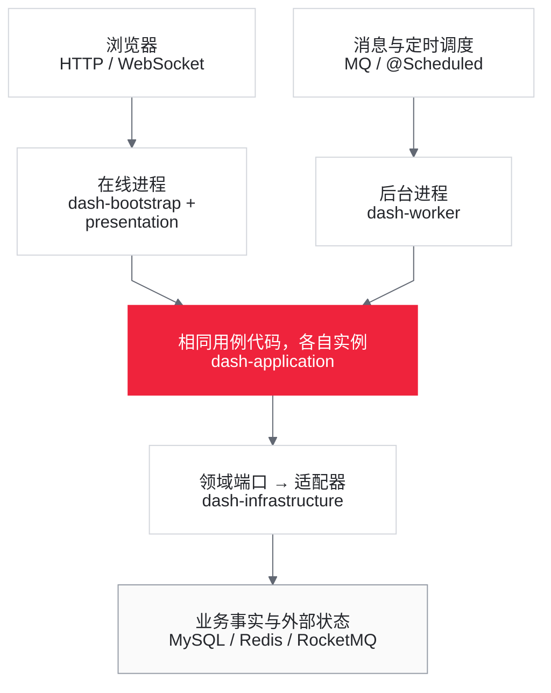
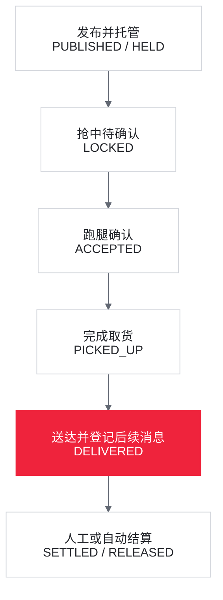
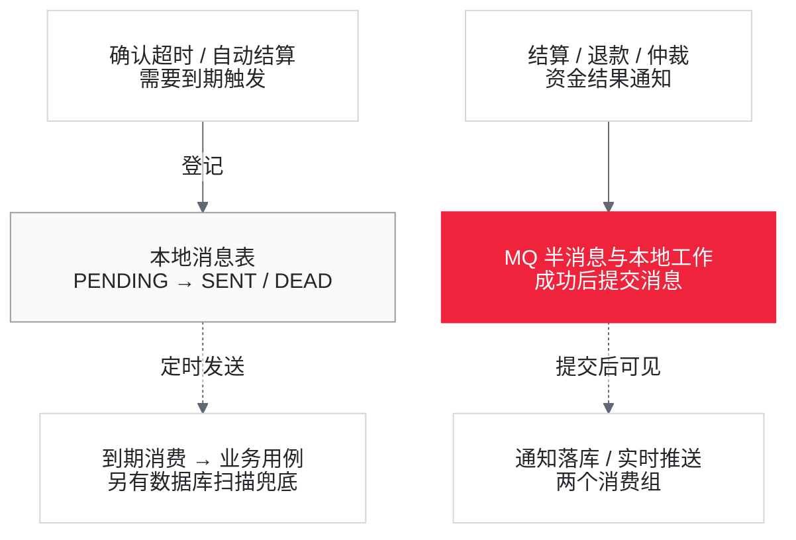

# 01 项目总览与核心文件定位

> 阅读目标：建立 CampusDash 的源码地图，再进入 [02 核心调用链](02_core_call_chain.md)。每个功能模块先说明**源码实际流程、处理机制与解决的问题**，再在同一节单列**当前隐患**。失败及并发时序是源码推导，不等于已经发生的运行事故。
>
> 本文以当前工作区为准。“默认”分别指 [在线 application.yaml](../dash-bootstrap/src/main/resources/application.yaml) 与 [worker application.yaml](../dash-worker/src/main/resources/application.yaml)，未配置项再看代码默认值。静态核对日期：2026-09-05。

## 1. 项目是什么

CampusDash 是以校园悬赏跑腿为业务载体的 Java 21 / Spring Boot 3.5.8 后端。当前形态是多模块单体加独立 worker（后台工作进程），不是已拆分的微服务集群。

| 业务能力 | 源码实际处理 | 阅读入口 |
| --- | --- | --- |
| 发布 | 用户资金转入平台托管账户，建立任务与状态日志 | §4.1 |
| 抢单 | 限流、资格检查、Redis Lua 占位、数据库条件更新 | §4.2 |
| 确认与流转 | 抢中者确认；超时换候选人或重新开放任务 | §4.3 |
| 履约与资金 | 取货、送达、结算、取消退款、争议及仲裁 | §4.4 |
| 查询 | 任务列表、详情、时间线、钱包、信用、通知 | §5 |
| 后台维护 | 定时消息、消息重发、缓存校验、信用校准、资金对账 | §6 |

学习时应追踪：谁最终裁决状态，哪些资金事实一起提交，重复请求和异步失败如何处理。有 CAS（Compare-And-Set，比较并更新）、唯一索引或对账，不等于这些问题全部解决。

## 2. 在线进程与后台进程

**实际流程与解决的问题**

在线入口是 [CampusDashApplication](../dash-bootstrap/src/main/java/com/campusdash/CampusDashApplication.java)，后台入口是 [WorkerApplication](../dash-worker/src/main/java/com/campusdash/worker/WorkerApplication.java)。两者扫描 application、infrastructure；在线还装配 presentation，worker 开启定时调度。复用的是用例代码，不是共享 Java 对象或 WebSocket 连接。

<!-- diagram:01-runtime -->

**两个进程，共用业务代码**

[放大预览](assets/diagrams/01-runtime.html) · 箭头表示处理入口与访问方向；共用代码不等于共享内存或连接。

<!-- /diagram:01-runtime -->

| 进程 | 实际职责 | 入口方式 |
| --- | --- | --- |
| 在线应用 | 27 个 HTTP（超文本传输协议）处理方法、认证、业务用例、WebSocket、资金推送消费者 | 默认 8080；`/api/**` 与 `/ws` |
| worker | 确认超时、自动结算、资金通知落库、延迟删缓存，以及扫描/重试/校验任务 | RocketMQ 消费与 `@Scheduled` |

27 是 `@GetMapping/@PostMapping` 静态计数，包含 4 个内部运维入口和健康接口，不等于 27 个业务写操作。

| 依赖 | 实际承担的状态 | 关闭或失败后的处理 |
| --- | --- | --- |
| MySQL | 任务、账户、托管、流水、本地消息、通知、信用、差异记录 | 核心事实依赖，没有空实现 |
| Redis | Session（服务端会话）、抢单名额、候选队列、详情缓存、布隆、信用榜 | 详情读有局部降级；默认登录和抢单没有整体降级 |
| RocketMQ | 定时投递、资金事务事件、延迟双删 | 显式关闭后装配 Noop（空实现）；超时和自动结算仍可由 worker 扫描 |

**当前隐患**

显式关闭 MQ 与 MQ 开启但不可用不是同一模式：后者资金半消息发送失败会阻止本次资金操作，消费者初始化失败也可能阻止启动。两进程配置分别生效，单改一个进程不代表整套服务切换。多实例还需要外部分配唯一 worker-id；配置的 1/2 只区分当前两类进程，不能自动避免同类多副本 ID 冲突。

## 3. 分层与源码导航

### 3.1 八个模块

**实际结构与解决的问题**

[根 POM](../pom.xml) 声明 8 个 Maven 模块。当前统计为 137 个生产 Java 文件、37 个测试源码文件，后者包含测试辅助类。

| 模块 | 职责与入口 | 主要内部编译依赖 |
| --- | --- | --- |
| dash-shared | [Money](../dash-shared/src/main/java/com/campusdash/shared/Money.java)、Result、ErrorCode、BizException、SnowflakeIdGenerator | 通用底层 |
| dash-domain | [Errand](../dash-domain/src/main/java/com/campusdash/domain/errand/model/Errand.java)、状态枚举、钱包/信用模型及 ports | shared |
| dash-application | 发布、抢单、流转、资金用例及 query 查询编排 | domain |
| dash-infrastructure | JDBC（Java 数据库连接接口）SQL、Redis、MQ、认证、限流及分片适配器 | domain |
| dash-presentation | [ErrandController](../dash-presentation/src/main/java/com/campusdash/presentation/ErrandController.java)、拦截器、WebSocket | application |
| dash-bootstrap | 在线组装、配置、集成测试 | presentation、infrastructure |
| dash-worker | 消费者、扫描、维护与后台组装 | application、infrastructure |
| dash-bench | 压测客户端、消息探针、运行记录 | shared |

domain 声明端口，infrastructure 实现端口，application 通过端口编排。领域生产代码不依赖 Spring；应用层直接使用 `@Service`、`@Transactional`、`TransactionTemplate`。持久化主要是 JdbcTemplate 与手写 SQL，不存在需要先假设出来的 ORM（对象关系映射）实体层。

**当前边界**

任务详情 Controller 直接访问 ErrandRepository。部分写用例绕过领域行为方法，直接走仓储 CAS，所以领域有校验不代表实际请求会执行。[ArchitectureRuleTest](../dash-domain/src/test/java/com/campusdash/domain/ArchitectureRuleTest.java) 只检查它导入的 domain 类和声明的规则，不能证明所有模块边界及运行时授权正确。

### 3.2 领域状态与实际接线

**实际流程与解决的问题**

[ErrandStatus](../dash-domain/src/main/java/com/campusdash/domain/errand/model/ErrandStatus.java) 声明允许的状态边，Errand 行为方法可额外校验操作者、版本和业务约束。正常主路径如下；取消走 CANCELLED，争议裁给发单人走 REFUNDED，分支在 §4.4 展开。

<!-- diagram:01-lifecycle -->

**正常履约：从发布到结算**

[放大预览](assets/diagrams/01-lifecycle.html) · 此图只表达成功主线；取消、争议、候选流转见 §4，CLOSED 尚无用例入口。

<!-- /diagram:01-lifecycle -->

**当前边界**

发布事务内部 INSERT DRAFT 后立即转 PUBLISHED，没有保存草稿接口；DRAFT 不是正常发布后留给用户操作的持久状态。取消用例能处理数据库中既存的 DRAFT。SETTLED/REFUNDED→CLOSED 只有枚举边，没有关闭用例；枚举允许 LOCKED/ACCEPTED→CANCELLED，但实际取消只接受 DRAFT/PUBLISHED。`lockBy()`、`transferToNextRunner()`、`settle()` 等领域方法的规则，必须与仓储实际调用区分。

## 4. 任务生命周期与资金

### 4.1 发布与托管

**实际流程与解决的问题**

`POST /api/errands` → [PublishErrandUseCase.publish](../dash-application/src/main/java/com/campusdash/application/usecase/PublishErrandUseCase.java#L67)。一个数据库事务完成用户条件扣款、托管户入账、等额 DEBIT/CREDIT 流水、HELD 托管单、发布任务和状态日志；随后在事务方法内初始化 Redis 名额、登记布隆。

资金从 USER 的 available 转入 owner=-1 的 ESCROW 账户，不同时增加用户 frozen。返回字段 frozenCents 表达本次托管金额。金额用 long 分保存；[wallet_ledger / escrow_order 唯一索引](../docker/init.sql) 约束同任务的重复记账。

**当前隐患**

每次请求生成新 errandId，没有客户端请求幂等号，重试可能再次托管。Redis 不参加 MySQL 事务，部分初始化成功后失败可能留下名额，布隆登记失败又会被吞掉。`WalletRepository.escrowExists()` 有定义和实现但没有生产调用者。字段校验、账户更新结果与流水后余额边界见 [02 发布](02_core_call_chain.md#publish) 和 [02 对账](02_core_call_chain.md#reconciliation)。

### 4.2 抢单

**实际流程与解决的问题**

[GrabErrandUseCase](../dash-application/src/main/java/com/campusdash/application/usecase/GrabErrandUseCase.java#L100) 依次做热点限流、数据库信用和在途数检查、[Lua 占位](../dash-infrastructure/src/main/resources/lua/grab.lua)、[GrabTransactionalStep](../dash-application/src/main/java/com/campusdash/application/usecase/GrabTransactionalStep.java#L34) 数据库事务。CAS 将 PUBLISHED 改为 LOCKED、设置 grabber_id，再写 grab_record 和状态日志；唯一键冲突抛异常使该事务回滚，外层尝试 Lua 补回名额。

这分别减少热点压力、过滤当前不合格请求、原子扣减 Redis 名额、以数据库状态决定实际抢中者。Controller 传的固定 creditScore=60 被忽略，实际信用来自数据库。

**当前隐患**

- 任务只有一个 grabber_id，首次抢中即 LOCKED；slotTotal>1 不是完整多人履约模型。
- 幂等键保存 Lua 占位结果，不保存最终 DB 结果，并发重放可提前返回成功，且 key 未绑定用户。
- 在途数仅含 ACCEPTED/PICKED_UP，是抢前快照，没有跨任务原子上限；服务端未禁止自抢。
- 抢中后的消息登记、再次查询异常也进入大 catch，可能对已经提交的抢单补回 Redis。

具体顺序和条件见 [02 抢单](02_core_call_chain.md#grab)。

### 4.3 确认超时与候选人

**实际流程与解决的问题**

[TimeoutTransferUseCase](../dash-application/src/main/java/com/campusdash/application/usecase/TimeoutTransferUseCase.java#L96) 接收 MQ 或扫描触发。任务仍 LOCKED 且 round 匹配时取候选人；[TimeoutTransferStep](../dash-application/src/main/java/com/campusdash/application/usecase/TimeoutTransferStep.java#L54) 在事务内换 grabber、增加 round/version、写日志和下一轮消息。候选为空或累计 round 达上限则回退 PUBLISHED，再尝试归还 Redis 名额和扣信用。

round 区分轮次，SQL 状态/版本条件裁决同轮并发，数据库扫描为定时投递失败提供第二个触发入口。

**当前隐患**

换人只更新 DB，Redis grabbed 仍保存旧跑腿。A 抢中→换 B→B 回退时，补偿找不到 B，可以不抛错但不归还名额。pollBest 是读后删两条命令；换人不复核资格、不写 grab_record、不删缓存、不推送。消息 version 未用于消费校验，确认接口也没有硬截止时间。见 [02 超时](02_core_call_chain.md#timeout)。

### 4.4 履约、结算、退款与仲裁

**实际流程与解决的问题**

| 操作 | 实际事务处理 | 解决的问题 |
| --- | --- | --- |
| 确认/取货 | 当前跑腿校验，状态 CAS、日志同事务 | 约束正常履约操作者，保留状态历史 |
| 送达 | DELIVERED、delivered_at、日志、自动结算 local_message 同事务 | 送达与后续待发事实一起提交 |
| 普通结算 | TransactionTemplate 内先改托管、再改任务，之后分账、流水、信用+2 | 成功路径把资金与信用一起提交 |
| 取消/仲裁退款 | 先改任务/日志，再单独执行托管退款事务 | 全额退回发单人 |
| 仲裁跑腿胜 | ArbitrateSettleStep 从 DISPUTED 结算、分佣、计信用 | 争议后的跑腿收款路径 |

入口：[DeliverErrandUseCase](../dash-application/src/main/java/com/campusdash/application/usecase/DeliverErrandUseCase.java#L54)、[SettleErrandUseCase](../dash-application/src/main/java/com/campusdash/application/usecase/SettleErrandUseCase.java#L87)、[RefundErrandUseCase](../dash-application/src/main/java/com/campusdash/application/usecase/RefundErrandUseCase.java#L64)、[ArbitrateErrandUseCase](../dash-application/src/main/java/com/campusdash/application/usecase/ArbitrateErrandUseCase.java#L75)。佣金为 `floor(total * commissionRate)`，跑腿所得为 total 减佣金。

**当前隐患**

普通/仲裁结算在“托管更新成功、任务更新为 0”时返回 false，没有标记 DB 回滚，可能只提交 RELEASED。取消/仲裁退款则有任务终态而资金仍 HELD 的窗口。资金操作未检查全部账户更新 affectedRows（受影响行数）。

结算未校验是否发单人，仲裁未校验是否仲裁员；availableActions 只控制按钮。履约推送可能先于提交；提交后的读信用失败又可能让请求报错。仲裁事件金额是总额、实际分账扣佣，通知可能偏大。见 [02 履约与结算](02_core_call_chain.md#fulfillment)、[02 退款与仲裁](02_core_call_chain.md#refund)。

## 5. 查询、身份与展示状态

### 5.1 认证与接口契约

**实际流程与解决的问题**

[WebConfig](../dash-presentation/src/main/java/com/campusdash/presentation/WebConfig.java) 保护 `/api/**`，排除登录、刷新、健康、`/api/internal/**`。Bearer token 默认经 [RedisAuthAdapter](../dash-infrastructure/src/main/java/com/campusdash/infrastructure/auth/RedisAuthAdapter.java) 解析为用户 ID，`dash.auth.mode=jwt` 改装 [JwtAuthAdapter](../dash-infrastructure/src/main/java/com/campusdash/infrastructure/auth/JwtAuthAdapter.java)。Controller 通过 CurrentUser 读取身份。

Result 统一业务 code/message/data；[JacksonConfig](../dash-presentation/src/main/java/com/campusdash/presentation/config/JacksonConfig.java) 将全部 long/Long 转 JSON 字符串，解决雪花 ID 在 JavaScript 中丢精度的问题。

**当前隐患**

登录只凭 userId，无密码和账户存在性检查；内部接口未做应用级认证。Session 固定 120 分钟不滑动续期。JWT（JSON Web Token，签名身份令牌）撤销与刷新依赖 Redis，刷新读删非原子；前端退出只清本地状态，后端退出不撤销 refresh token。全部 long 转字符串也影响金额，与前端部分 number 声明不一致。见 [02 入口与认证](02_core_call_chain.md#entry)。

### 5.2 任务查询与详情缓存

**实际流程与解决的问题**

[QueryErrandListUseCase](../dash-application/src/main/java/com/campusdash/application/usecase/query/QueryErrandListUseCase.java) 支持偏移/游标分页、我的任务、时间线；列表默认 PUBLISHED。[GetErrandDetailUseCase](../dash-application/src/main/java/com/campusdash/application/usecase/query/GetErrandDetailUseCase.java#L47) 做随机分片读、逻辑过期锁重建、布隆预检查、空值缓存。[CacheEvictSupport](../dash-application/src/main/java/com/campusdash/application/usecase/CacheEvictSupport.java#L66) 默认提交后删除并安排延迟双删。这些机制控制读取量、减少重复回源、缓解逻辑过期的并发重建和旧值回填。

**当前隐患**

HTTP 详情只用缓存 JSON 判空，之后又读 DB 组装响应，命中也不能省该次查询。冷未命中不争抢重建锁；布隆存在但登记不完整会误挡真实任务；抽检跳过空值缓存。通过流转接单者未必有 grab_record，可能在“我抢过的”缺席。见 [02 查询与缓存](02_core_call_chain.md#query)。

### 5.3 钱包、信用与通知

**实际流程与解决的问题**

钱包按当前用户查余额/流水；信用查分数和最近 30 天事件，校园榜来自 Redis ZSET（有序集合）；worker 写资金通知，接口提供列表和未读数。入口：[QueryWalletUseCase](../dash-application/src/main/java/com/campusdash/application/usecase/query/QueryWalletUseCase.java)、[QueryCreditUseCase](../dash-application/src/main/java/com/campusdash/application/usecase/query/QueryCreditUseCase.java)、[QueryNotificationUseCase](../dash-application/src/main/java/com/campusdash/application/usecase/query/QueryNotificationUseCase.java)。

**当前隐患**

信用 applyEvent 自身无事务，只有被资金事务包裹时事件/快照才原子；超时回退、仲裁退款后的独立调用可能部分提交。日校准只改 DB，不补 Redis 榜单或未写入事件。通知无已读写接口，余额查询将账户不存在视作零余额。见 [02 信用](02_core_call_chain.md#credit)、[02 展示查询](02_core_call_chain.md#display-queries)。

### 5.4 WebSocket 实时通道

**实际流程与解决的问题**

[WebSocketConfig](../dash-presentation/src/main/java/com/campusdash/presentation/realtime/WebSocketConfig.java) 注册 `/ws`，query token 经 AuthPort 校验，连接存进程内 WsSessionRegistry。用例推 `errand.status`，资金消费者推 `notification.new`，普通结算还推 `credit.changed`，供前端更新展示或重新查询。

**当前隐患**

worker 也创建 FundEventPushConsumer，却用 Noop notifier，与在线同组竞争消息。即使移除它，多在线实例仍需将事件路由到目标连接所在进程，单靠粘性路由不够。推送与通知落库没有跨组顺序保证；握手允许全部来源，URL 携带 token，连接没有持续鉴权。见 [02 实时通知](02_core_call_chain.md#realtime)。

## 6. 消息、后台维护与对账

### 6.1 消息一致性与扫描

**实际流程与解决的问题**

<!-- diagram:01-messages -->

**两种消息机制，对应两类工作**

[放大预览](assets/diagrams/01-messages.html) · 虚线表示异步投递；本地消息表仅记录待发事实，不是已完成业务的证明。

<!-- /diagram:01-messages -->

确认超时、自动结算用 local_message 保存待发事实；资金事件用 MQ 半消息包裹本地工作，Broker（消息服务器）按 wallet_ledger 的 bizNo 回查。缓存双删直接发送，不写本地消息表。

| 后台组件 | 默认触发/批量 | 实际作用 |
| --- | --- | --- |
| TimeoutTransferConsumer / AutoSettleConsumer | MQ 定时消息 | 进入对应生命周期用例 |
| TimeoutScanJob / AutoSettleScanJob | 每 5 秒，最多 200 | 按 DB 状态/时间提供兜底触发 |
| LocalMessageRetryJob | 每 10 秒，最多 100 条到期 PENDING | 发送、标 SENT；失败增加 retry，最终 DEAD |
| CacheEvictConsumer | MQ 定时消息 | 第二次删详情缓存 |
| FundEventConsumer | 资金事务事件 | 按消息/用户唯一键写通知 |
| BloomRebuildJob | worker 启动，分布式锁 | 全量读 ID，逐个登记布隆 |
| CacheConsistencyCheckScheduler | 每 5 分钟，抽样默认 100 | 比对关键字段，记差异并尝试失效 |
| CreditCalibrationJob | 每天 03:00，最多 1000 个差异用户 | 重算 DB 的 30 天窗口分数 |
| ReconciliationJob | 每天 02:00 | 三层资金检查，写 recon_diff |

**当前隐患**

重发查询无领取锁，更新不检查旧状态，多 worker 可重复发送和覆盖行状态。next_retry_at 初值为 deliver_at，所以每 10 秒扫描不是初发失败 10 秒后必补发。MQ 关闭后 Noop 也可使消息标 SENT，业务靠扫描而非以后开 MQ 再补发。除 Bloom 重建外无统一分布式调度锁。见 [02 消息](02_core_call_chain.md#messages)。

### 6.2 三层资金对账

**实际处理与解决的问题**

[ReconciliationJob](../dash-worker/src/main/java/com/campusdash/worker/ReconciliationJob.java) → [JdbcReconRepository](../dash-infrastructure/src/main/java/com/campusdash/infrastructure/persistence/JdbcReconRepository.java)：L1 检查全历史流水借贷全局差额；L2 检查 ESCROW/COMMISSION 快照与流水净额；L3 检查托管终态的流水存在性和任务终态但托管仍 HELD。日期用于归档差异，不限定当日交易。

**当前边界**

L1 不逐业务号检查，L2 不覆盖 USER 初始余额或每条 balance_after，L3 不核验全套金额和对象。没有自动修复用例，零差异不证明所有资金状态正确。见 [02 对账](02_core_call_chain.md#reconciliation)。

## 7. 配置与默认接线

**实际装配与解决的问题**

| 配置项 | 默认/取值 | 生效行为 |
| --- | --- | --- |
| MySQL / Redis | 127.0.0.1:3307 / :6380 | 在线 Hikari 20，worker 10；共享存储 |
| dash.mq.enabled | 两进程 true；endpoint :8081 | false 装空消息适配器，扫描仍运行 |
| dash.auth.mode | 缺省 session；可选 jwt | 选择认证实现；其他值可能缺 AuthPort Bean |
| dash.auth.allow-header-identity | false | true 才开放 X-User-Id |
| dash.ws.enabled | 在线缺省 true；worker false | 实时 notifier 或 Noop |
| dash.grab.limit.type / enabled | 在线 sentinel / true | Sentinel 为 Primary（优先注入），其他类型用本地实现；enabled=false 放行 |
| dash.grab.limit.per-second | 500 | 单 JVM（Java 虚拟机）、单任务限制，不是共享配额 |
| dash.timeout.confirm-seconds / max-transfer-rounds | 300 / 5 | 调度窗口与累计 round 上限 |
| dash.settle.auto-settle-seconds / commission-rate | 86400 / 0.05 | 自动结算时长/佣金；worker 未写出时取代码默认 |
| dash.cache.enabled / shards | true / 4 | Redis 详情缓存或空实现；随机读一片、写全部片 |
| ttl-seconds / jitter-seconds / empty-ttl-seconds | 600 / 120 / 60 | TTL（存活时长）有抖动；普通值逻辑过期约为物理 TTL 一半 |
| bloom-enabled / double-delete-enabled | true / true | 布隆预检查与第二次删缓存 |
| double-delete-ms / eviction-order | 500 / AFTER_COMMIT | 双删间隔；BEFORE_COMMIT 是实验对照 |

缓存子项完整前缀为 `dash.cache.`。调度还依赖运行时区和各进程时钟。详情分片只是 key 布局，默认仍连单机 Redis，不代表已经分散到多台服务器。

**未接线能力与当前隐患**

[CampusDashShardingRuleFactory](../dash-infrastructure/src/main/java/com/campusdash/infrastructure/sharding/CampusDashShardingRuleFactory.java) 和取模算法有实现/测试源码，但默认普通 JDBC URL 未装配 ShardingSphere 数据源。发送 topic 的 policy 常量与消费者 `@Value` 需逐一对齐，不是改一个消费配置就完成整链迁移。关配置不等于回收已经产生的 Redis key、本地消息或客户端会话。

## 8. 数据与测试阅读入口

**实际结构与用途**

表结构权威入口：[docker/init.sql](../docker/init.sql)。沿任务 errand/errand_status_log/grab_record → 账户 wallet_account/托管 escrow_order/流水 wallet_ledger → 消息 local_message/notification → 信用 credit_event/credit_score → 差异 recon_diff/sync_diff 阅读。fund_audit_log 是事后审计，bench_run/bench_run_item 用于压测追踪。

| 证据类别 | 入口 | 能说明什么 |
| --- | --- | --- |
| 领域规则 | [ErrandStatusMachineTest](../dash-domain/src/test/java/com/campusdash/domain/ErrandStatusMachineTest.java)、ArchitectureRuleTest | 模型规则及声明的依赖约束 |
| 用例/存储集成 | [SettlementIT](../dash-bootstrap/src/test/java/com/campusdash/it/SettlementIT.java)、[TimeoutTransferIT](../dash-bootstrap/src/test/java/com/campusdash/it/TimeoutTransferIT.java) | 所设配置下的具体断言 |
| HTTP / 缓存 | [ApiEndpointIT](../dash-bootstrap/src/test/java/com/campusdash/it/ApiEndpointIT.java)、[CacheConsistencyIT](../dash-bootstrap/src/test/java/com/campusdash/it/CacheConsistencyIT.java) | 特定接口/实验，不自动覆盖所有权限 |
| 压测 | dash-bench、bench/reports | 历史记录与再运行入口 |

**验证边界**

根 POM 显式让 Surefire 包含 `*IT.java`；部分测试在中间件未就绪时跳过，SettlementIT 还关闭 MQ。因此测试成功需连同通过/跳过数和配置解释，不代表真实 MQ 回查、多实例或所有故障分支已验证。本轮只做文档、源码与链接静态核对，没有重跑业务测试或历史压测。

## 9. 建议阅读顺序

从 [02 入口](02_core_call_chain.md#entry) 沿发布 → 抢单 → 确认/超时 → 送达 → 结算阅读。每步先看 Controller 和 UseCase，再看 SQL/Lua 与副作用。资金专题接着读退款、事务消息、对账；查询专题读详情缓存、信用、实时通知。

每节的当前隐患紧接实际机制，便于回到同一调用点验证。“有接口”“有测试源码”“默认接入”“实测通过”需分别判断。
