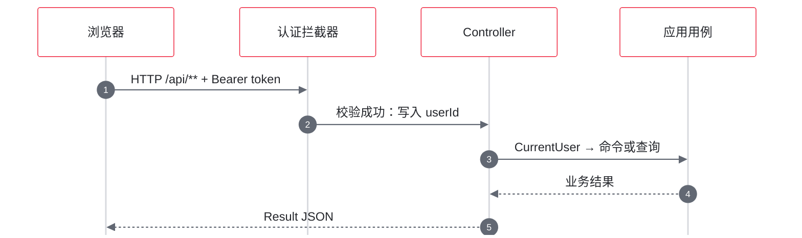
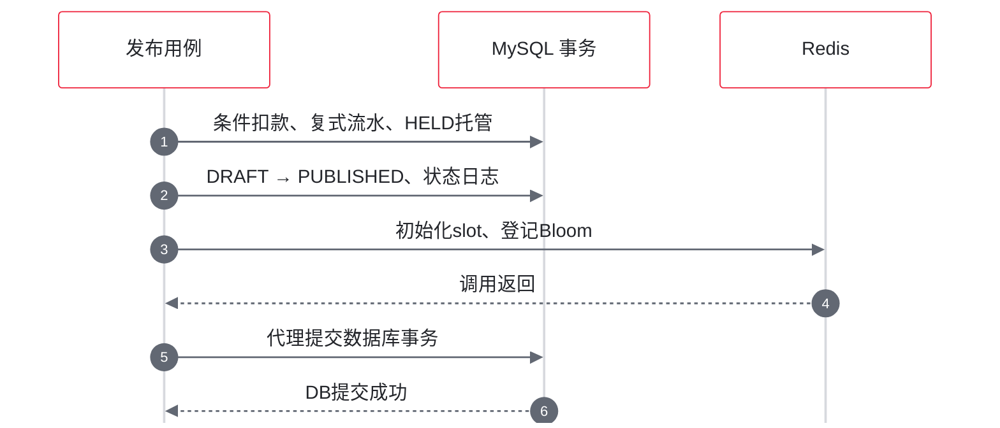
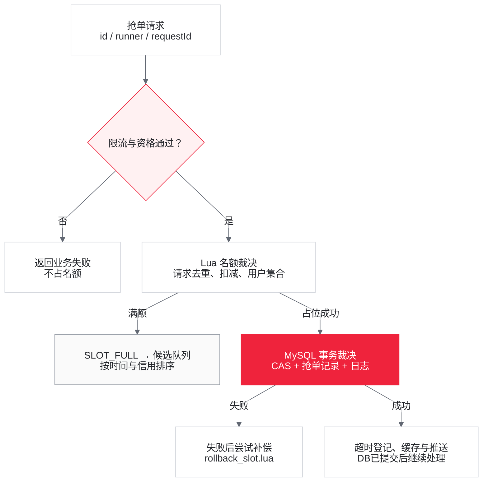
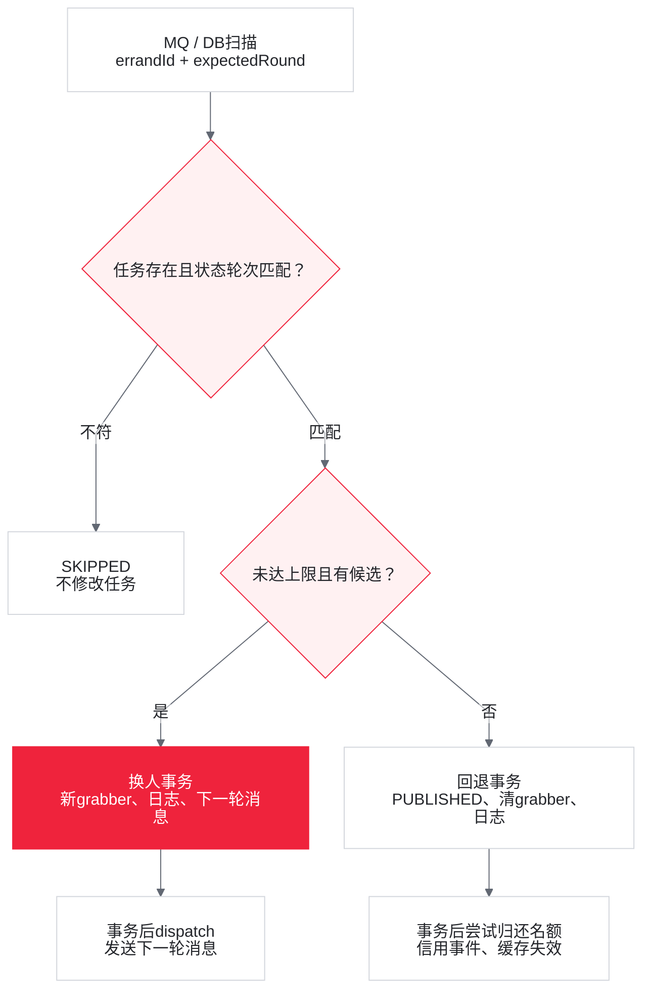
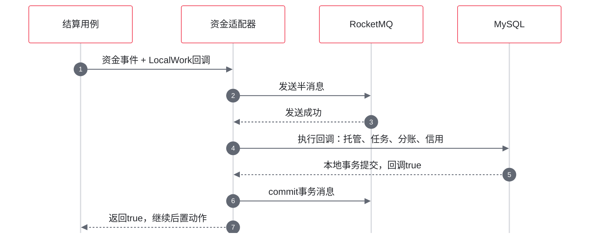
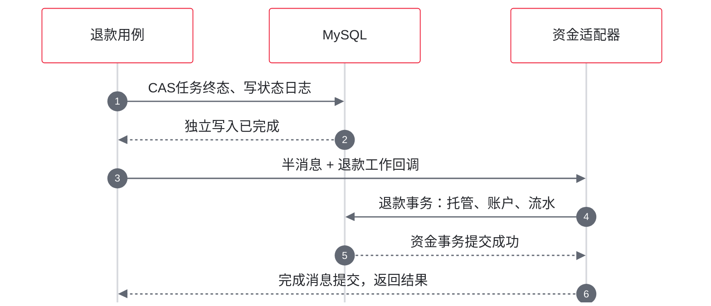
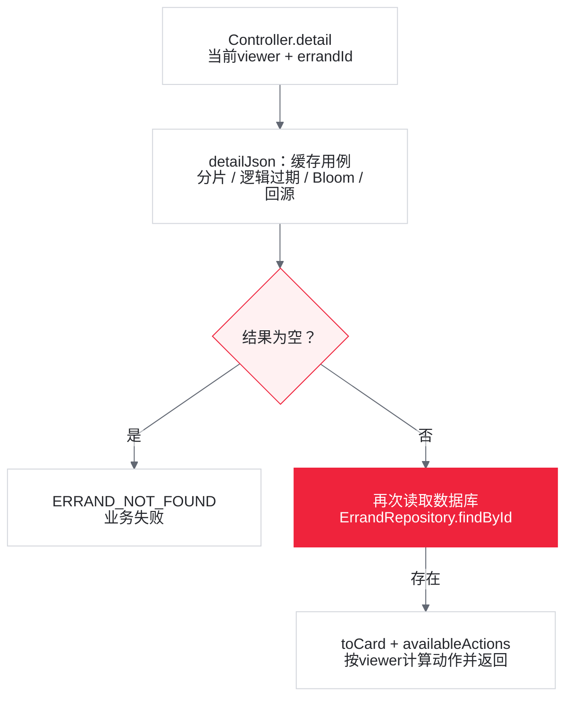
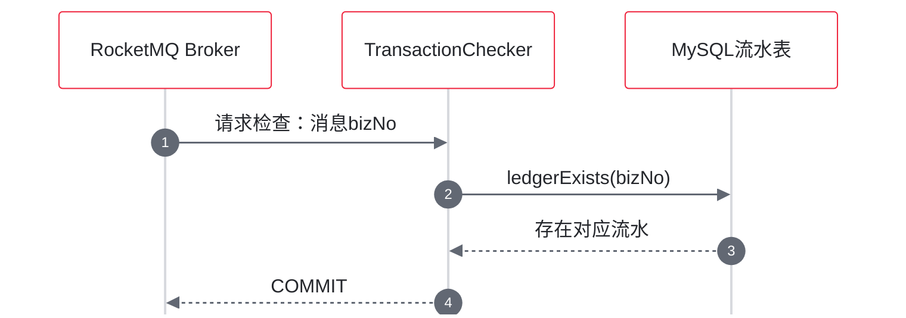

# 02 一次用户请求的完整调用链追踪

> 主线：发布 → 抢单 → 确认或超时流转 → 取货 → 送达 → 结算。每节先说明源码实际流程与解决的问题，再列同一模块的当前隐患。退款、查询、信用、消息和对账分别展开，不把正常流程图当作完整正确性保证。
>
> 本文依据当前源码静态核对。并发与故障后果是有条件的代码推导，未做运行时故障注入。默认值以两进程 YAML 和实际 `@Value` 为准；缩略流程不替代其下方的分支说明。

<a id="entry"></a>
## 1. 前端到 HTTP 响应

### 1.1 请求封装与序列化

**实际流程与解决的问题**

[前端 api.ts](../../campus-dash-frontend/src/api.ts) 初始化时从 localStorage 读取 token/userId，正常请求使用模块内 token 添加 `Authorization: Bearer ...`，fetch `/api/**` 后解析 `Result<T>`。HTTP 401 会清本地身份并跳回登录路由；业务 code 非 OK 抛 BizError（携带业务码的异常）。这把身份携带和业务错误处理集中在请求层。

并发抢单演示例外：[Square.tsx](../../campus-dash-frontend/src/pages/Square.tsx) 临时登录多个用户并直接 fetch。[ActionButtons.tsx](../../campus-dash-frontend/src/components/ActionButtons.tsx) 按 availableActions 渲染任务生命周期按钮；登录、发布、并发演示不由该数组驱动。

[JacksonConfig](../dash-presentation/src/main/java/com/campusdash/presentation/config/JacksonConfig.java) 对 **全部 long/Long** 使用 ToStringSerializer，解决雪花 ID 超出 JavaScript 安全整数范围的问题。HTTP 中 errandId、publisherId、金额 long 字段等均序列化为字符串；不是只有 ID 转字符串。

**当前隐患**

前端部分金额声明仍为 number，`as ApiResult<T>` 不做运行时转换。当前普通 `api.grab` 也没有传稳定 X-Request-Id；手动再点一次会让服务端生成新请求号。前端保存 access token，但不保存 refresh token、没有自动刷新重试；退出只清本地存储，没有调用后端 logout。

### 1.2 Spring MVC、认证和返回值

**实际流程与解决的问题**

<!-- diagram:02-entry -->

**认证成功请求：身份进入用例**



[放大预览](assets/diagrams/02-entry.html) · 实线为调用，虚线为返回；未认证返回401，不进入该正常路径。

<!-- /diagram:02-entry -->

[CampusDashApplication](../dash-bootstrap/src/main/java/com/campusdash/CampusDashApplication.java) 启动组件扫描；[WebConfig](../dash-presentation/src/main/java/com/campusdash/presentation/WebConfig.java) 将 [AuthInterceptor](../dash-presentation/src/main/java/com/campusdash/presentation/auth/AuthInterceptor.java) 挂到 `/api/**`。排除路径为 login、refresh、health 和 `/api/internal/**`。正常 Bearer 校验后 userId 放入 request attribute，Controller 通过 [CurrentUser.get](../dash-presentation/src/main/java/com/campusdash/presentation/auth/CurrentUser.java) 读取。

| 返回路径 | 实际响应 | 调用方要判断什么 |
| --- | --- | --- |
| 正常 Controller | Result 的 code/message/data | code 以及具体 data |
| BizException | HTTP 200 + 业务失败 code | 不能仅判断 HTTP 成功 |
| DuplicateKeyException | 抢单冲突语义 | 全局映射，不是逐业务类型区分 |
| 未预期异常 | 记录日志，HTTP 500 | 请求失败与事实是否已提交需分开 |
| 拦截器拒绝 | 裸 HTTP 401 | 不保证有统一 Result 正文 |

异常映射见 [GlobalExceptionHandler](../dash-presentation/src/main/java/com/campusdash/presentation/GlobalExceptionHandler.java)。`settle/cancel/arbitrate` Controller 还会将用例枚举装进 OK 响应的 `data.result`，所以顶层 OK 不总等于业务状态已改变。

**当前隐患**

排除认证的内部接口没有另一套应用级校验；生产网关屏蔽是部署前提。非法 status/cursor、部分空字段会落入未预期异常，而不是规范的参数错误。已认证只证明有 userId，不证明其有权操作该任务；写接口权限见各业务节。

## 2. 登录、刷新与连接身份

### 2.1 默认 Session 与可选 JWT

**实际流程与解决的问题**

`POST /api/auth/login` → [AuthController.login](../dash-presentation/src/main/java/com/campusdash/presentation/auth/AuthController.java#L29) → AuthPort：

| 模式 | 登录 | 后续认证 | 退出/刷新 |
| --- | --- | --- | --- |
| 默认 Session（服务端会话） | 生成去掉连字符的 UUID，Redis 保存 `auth:token:{token} → userId` | GET 会话，默认 TTL（存活时长）120 分钟 | logout 删会话；refresh 返回业务 UNAUTHORIZED |
| JWT（JSON Web Token，签名身份令牌） | 签发含 subject=userId、jti、到期时间的 access token，同时可签发随机 refresh token | 验签/到期检查，再查 Redis jti 黑名单 | refresh GET→DEL 旧 token 后签新对；logout 将 jti 加入剩余有效期黑名单 |

实现：[RedisAuthAdapter](../dash-infrastructure/src/main/java/com/campusdash/infrastructure/auth/RedisAuthAdapter.java)、[JwtAuthAdapter](../dash-infrastructure/src/main/java/com/campusdash/infrastructure/auth/JwtAuthAdapter.java#L40)。Session 直接保存身份映射，JWT 将身份装入签名数据但仍借助 Redis 支持撤销与刷新。`allow-header-identity` 默认 false，开启后才有 X-User-Id 入口。

**当前隐患**

登录只需要 userId，没有密码、验证码、账户存在性校验，是演示身份系统。Session resolve 不刷新 TTL；Redis 不可用没有本地认证降级。JWT 默认密钥是演示值；refresh 的读取与删除非原子，两个并发刷新可都取得旧 userId 并各自签发新 token。后端 logout 仅撤销 access token，`revokeRefresh()` 未接进该端点；access 过期后 logout 本身也会被拦截器拒绝。前端退出又没有调用该端点，不能将其描述为服务端完整会话注销。

### 2.2 WebSocket 握手

**实际流程与解决的问题**

[ws.ts](../../campus-dash-frontend/src/ws.ts) 连接 `/ws?token=...`，包含重连与心跳逻辑。[WsAuthHandshakeInterceptor](../dash-presentation/src/main/java/com/campusdash/presentation/realtime/WsAuthHandshakeInterceptor.java) 调用同一个 AuthPort.resolve，成功后将 userId 放入 session attributes，由 WsHandler 登记到当前进程 WsSessionRegistry。query token 使浏览器原生 WebSocket 能携带认证信息。

**当前隐患**

默认 AllowedOrigins 为 `*`，token 进入 URL；当前连接没有逐消息重新认证。HTTP 退出或 token 到期不等于既有 WebSocket 自动关闭。重连也没有持久化事件游标/补发协议，断连期间事件可能缺失。跨进程路由另见 [§11](#realtime)。

<a id="publish"></a>
## 3. 发布任务与资金托管

**实际流程与解决的问题**

入口：`POST /api/errands` → [ErrandController.publish](../dash-presentation/src/main/java/com/campusdash/presentation/ErrandController.java#L76) → [PublishErrandUseCase.publish](../dash-application/src/main/java/com/campusdash/application/usecase/PublishErrandUseCase.java#L67)。publisherId 来自 CurrentUser；campusId/type/slotTotal 缺省为 1/DELIVERY/1。

<!-- diagram:02-publish -->

**发布：外部写入仍在提交之前**



[放大预览](assets/diagrams/02-publish.html) · 图为成功路径；Redis不参加DB事务，已写的key不会因DB回滚自动撤销。

<!-- /diagram:02-publish -->

数据库事务内实际顺序如下：

1. `Money.ofCents` 构造金额，生成新 errandId，查询 USER 发单人账户和 owner=-1 的 ESCROW 账户。
2. [casDebit](../dash-infrastructure/src/main/java/com/campusdash/infrastructure/persistence/JdbcWalletRepository.java#L53) 执行 `UPDATE wallet_account SET available=available-?, version=version+1 WHERE id=? AND available>=?`；0 行转为 INSUFFICIENT_BALANCE。
3. 写发单人 DEBIT、托管户 CREDIT 流水，再增加托管 available；业务号 `escrow:{errandId}`。
4. 插入 HELD escrow_order；构造 Errand.draft，INSERT DRAFT/version=0，再领域 publish 与仓储 CAS 为 PUBLISHED，写状态日志。
5. 事务方法末尾 `initSlot` 写 7 天 TTL 名额、删旧 grabbed 集合；`registerExisting` 登记布隆。代理方法正常返回后才提交 DB。

[schema](../docker/init.sql) 中 `wallet_ledger(biz_no,account_id,direction)` 和 `escrow_order(errand_id)` 唯一键约束同业务号重复记账/同任务重复托管。返回 `{errandId,status,frozenCents}`；托管是账户间资金转移，用户 frozen 列没有同时增加。

**当前隐患**

- **请求重试不幂等。** 每次新 errandId，唯一索引不会把两次发布合并。escrowExists 没有生产调用者。
- **外部副作用不随 DB 回滚。** initSlot 不吞异常，写 Redis 一部分后失败可让 DB 回滚但 key 残留；布隆登记则吞异常，可能 DB 已提交但缺登记。即使 Redis 都成功，之后 DB 提交失败也不会撤回这些 key。
- **校验不齐。** rewardCents=null 在构造 long 命令时拆箱失败；负数由 Money 拒绝，零金额/slotTotal<1 由 draft 拒绝；title 没业务校验，NOT NULL 不拒绝空字符串，超长由数据库约束处理。
- **记账后余额不是加锁后读取。** 流水 balance_after 用先前查询的 available 运算，并发时可能陈旧；托管入账 affectedRows 未检查。详见 [§12](#reconciliation)。

<a id="grab"></a>
## 4. 抢单：前置检查、Lua 与最终数据库裁决

**实际流程与解决的问题**

入口：`POST /api/errands/{id}/grab` → [Controller.grab](../dash-presentation/src/main/java/com/campusdash/presentation/ErrandController.java#L156) → [GrabErrandUseCase.grab](../dash-application/src/main/java/com/campusdash/application/usecase/GrabErrandUseCase.java#L100)。X-Request-Id 未传时生成 UUID。

<!-- diagram:02-grab -->

**抢单：占位后还要数据库裁决**



[放大预览](assets/diagrams/02-grab.html) · 仅展示主分支；请求重放、不可抢、重复用户和后置异常见 §4 正文。

<!-- /diagram:02-grab -->

### 4.1 实际裁决顺序

| 层次 | 代码实际处理 | 解决的问题 |
| --- | --- | --- |
| 热点限流 | tryPass(errandId,runnerId)，默认 Sentinel 为 Primary（优先注入） | 在访问 DB/Redis 之前拒绝过热任务请求 |
| 资格快照 | DB 信用 score<40 拒绝；进行中任务数>=5 拒绝 | 避免当前不合格用户进入名额争抢 |
| Lua | 检查请求键、名额存在、重复用户与余量，原子扣名额 | 减少并发重复占用 Redis 名额 |
| DB 事务 | 状态/版本/名额 CAS，再写抢单记录与日志 | 以业务事实决定是否真的抢中 |

[countOngoingByRunner](../dash-infrastructure/src/main/java/com/campusdash/infrastructure/persistence/JdbcErrandQueryAdapter.java#L110) 只算 ACCEPTED、PICKED_UP；Command.creditScore 不参与裁决。默认 Sentinel 为单 JVM（Java 虚拟机）、单任务每秒 500，没有集群配额或持久化规则接线；关闭 limit.enabled 后放行。

### 4.2 Lua 键和返回分支

[RedisGrabSlotAdapter](../dash-infrastructure/src/main/java/com/campusdash/infrastructure/cache/RedisGrabSlotAdapter.java#L35) 调用 [grab.lua](../dash-infrastructure/src/main/resources/lua/grab.lua)。三个 key 使用相同 `{errandId}` hash tag（哈希标签），为同槽 Lua 操作保留键布局。

| 检查顺序 | 实际 key/动作 | 返回及用例处理 |
| --- | --- | --- |
| 旧请求 | `errand:idem:{id}:requestId`，TTL=300 秒 | 值1→DUPLICATE_REQUEST→返回成功；值0→SLOT_FULL→候选入队 |
| 名额存在 | `errand:slot:{id}` | 不存在→NOT_GRABBABLE |
| 已占位用户 | `errand:grabbed:{id}` | runner 存在→ALREADY_GRABBED |
| 余量 | slot<=0，写失败幂等键 | SLOT_FULL→候选入队 |
| 获得名额 | DECR、SADD、SETEX值1 | ACQUIRED→进入 DB 步骤 |

候选 score=`当前毫秒 - min(credit,100)*10`，高信用最多提前 1000 毫秒。入队会再读一次数据库信用，返回 ZSET size 作为 candidateRank；这实际是队列人数，不是该人的排序名次。

### 4.3 数据库事务、补偿与提交后动作

Lua 成功后先读 Errand 快照，再进入独立 Spring Bean [GrabTransactionalStep.lockAndRecord](../dash-application/src/main/java/com/campusdash/application/usecase/GrabTransactionalStep.java#L34)：

```sql
UPDATE errand
   SET status = 'LOCKED', grabber_id = ?, slot_taken = slot_taken + 1,
       locked_at = NOW(3), version = version + 1
 WHERE id = ? AND status = 'PUBLISHED' AND version = ?
   AND slot_taken < slot_total
```

这是 [casLockForRunner](../dash-infrastructure/src/main/java/com/campusdash/infrastructure/persistence/JdbcErrandRepository.java) 的条件。成功后写 `grab_record(result=GRABBED)` 和 PUBLISHED→LOCKED 日志；`uk_errand_round_seq/uk_errand_round_user` 冲突抛异常，使该事务整体回滚。

查无任务、CAS=0 或 try 内运行时异常，会尝试 [rollback_slot.lua](../dash-infrastructure/src/main/resources/lua/rollback_slot.lua)：仅 SREM 当前 runner 成功才 INCR 并删请求幂等键。CAS=0 分支还入候选队列；唯一键异常走 catch 返回 GRAB_CONFLICT，不会统一入队。

DB 事务成功返回后，依次登记首轮超时消息并尝试发送、立即失效缓存/安排双删、再次读任务并推送状态，最后返回成功。首轮登记是另一个事务，与抢单提交分离。

**当前隐患**

1. **Lua 幂等不等于最终结果幂等。** 值1在 DB 之前写入；并发重放可在原请求尚未提交、后来还会失败时返回成功。key 不含 runnerId，未绑定请求归属。重放前仍执行限流和 DB 资格查询，可能先被拒绝；不能说重放“不再访问 DB”。
2. **资格与角色不是强约束。** 在途数是快照，多个 LOCKED 后续确认不受该检查约束，跨任务并发可能超上限。用例/SQL 未禁止发单人自抢，UI 隐藏 GRAB 不能代替服务端校验。
3. **补偿 catch 过宽。** 抢单已提交后，消息登记或再次查任务失败仍进入 catch 并回补 Redis，造成 DB LOCKED 而 Redis 归还。补偿自己失败没有持久化重试表。
4. **模型仍单抢中者。** slotTotal>1 时第一次 DB 成功就 LOCKED，后续仍可能先扣 Redis 再被 DB 拒绝，并非多人完成同一任务。
5. **键生命周期未闭环。** grabbed 集合与候选队列没有同等 TTL/统一终态清理；名额 key 到期不代表任务结束。回退与新一轮占位的身份关系见下一节。

<a id="timeout"></a>
## 5. 确认、超时与候选流转

### 5.1 确认接单

**实际流程与解决的问题**

`POST /confirm` → [ConfirmErrandUseCase.confirm](../dash-application/src/main/java/com/campusdash/application/usecase/ConfirmErrandUseCase.java#L36)：读任务，已 ACCEPTED 直接返回；否则领域 acceptByRunner 检查当前跑腿，DB 按 LOCKED/grabber/version 更新 ACCEPTED，写日志、推送，注册提交后删缓存。状态改变后旧超时调用会跳过。

**当前隐患**

已 ACCEPTED 的早退在身份校验前，其他用户调用也可收到成功，但该分支不再改状态。接口没有 locked_at 截止检查；超过 300 秒但尚未流转仍可确认。推送发生在提交前，之后事务失败可能让客户端先看到一个未生效状态。

### 5.2 两种触发与数据库步骤

**实际流程与解决的问题**

<!-- diagram:02-timeout -->

**超时：校验后换人或重新开放**



[放大预览](assets/diagrams/02-timeout.html) · 归还步骤是一次尝试；换人后的Redis身份不匹配等隐患见同节正文。

<!-- /diagram:02-timeout -->

首轮消息 `timeout:{errandId}:{round}` 的 payload 包含 errandId/round/version；[TimeoutTransferConsumer](../dash-worker/src/main/java/com/campusdash/worker/TimeoutTransferConsumer.java) 实际只解析 id/round。[TimeoutScanJob](../dash-worker/src/main/java/com/campusdash/worker/TimeoutScanJob.java) 每 5 秒查询最多 200 个 `locked_at` 超过 confirmSeconds+graceSeconds（默认302秒）的 LOCKED 任务；SQL 有 `(status,locked_at)` 索引支持，未以执行计划证明实际索引选择。

两者进入 [handleTimeout](../dash-application/src/main/java/com/campusdash/application/usecase/TimeoutTransferUseCase.java#L96)，先检查任务存在、LOCKED、round 匹配，再处理：

| 分支 | 事务内事实 | 事务外动作 |
| --- | --- | --- |
| 有候选且未达最大 round | [transfer](../dash-application/src/main/java/com/campusdash/application/usecase/TimeoutTransferStep.java#L54)：替换 grabber、round/version+1、locked_at=NOW、日志、下一轮 local_message | dispatch 发送并标 SENT；CAS=0 重新 offer 候选 |
| 候选为空或累计 round>=5 | [revert](../dash-application/src/main/java/com/campusdash/application/usecase/TimeoutTransferStep.java#L73)：PUBLISHED、清 grabber/locked_at、slot_taken减1、round/version+1、日志 | rollback 尝试归还 Redis，写超时扣分事件，失效缓存 |
| 状态/round 不符 | 不更新 | SKIPPED；消费者确认消费 |

换人 CAS 使用**当前查询出的 version**，不是消息里的 version。round 每次换人和回退都递增，不在重新开放时归零。超时模块本身没有再次比较截止时间，时间触发依赖投递/扫描。正常 TRANSFERRED/REVERTED/SKIPPED 均 ACK（确认消费）；运行时异常返回 FAILURE。

**当前隐患**

- **换人后补偿对象不匹配。** A 首抢时 Redis grabbed={A}、slot=0；换 B 只改 DB。B 超时回退用 B 做 SREM，返回0，不归还 slot，适配器也不检查返回值。于是 DB PUBLISHED/slot_taken=0，Redis 仍满；无需 Redis 故障就可触发。
- **队列读删非原子。** [pollBest](../dash-infrastructure/src/main/java/com/campusdash/infrastructure/cache/RedisCandidateQueueAdapter.java#L30) 为 ZRANGE→ZREM；并发 worker 可读同一人，CAS 失败者再 offer 时可能把已被选中的人重新入队。新 score 是当前时间，原信用权重/顺序丢失；数据库事务抛异常时也没有统一候选回补。
- **换人副作用缺失。** 不复核候选信用/在途数，不写 grab_record，不失效缓存、不推送；当前跑腿和“我抢过的”查询会分离。
- **回退恢复有限。** DB 提交后 Redis/信用失败，下一次扫描见 PUBLISHED 不会重新进入该回退；信用事件自己也不是独立原子事务，见 [§9](#credit)。
- **异常分类不完整。** 消息格式解析错误也属于 RuntimeException，会返回 FAILURE；不能描述成只有系统异常重试。消息 version 有字段不等于被验证，确认窗口也不是 HTTP 硬截止。

<a id="fulfillment"></a>
## 6. 取货、送达与结算

### 6.1 取货和送达

**实际流程与解决的问题**

`POST /pickup` → [PickUpErrandUseCase](../dash-application/src/main/java/com/campusdash/application/usecase/PickUpErrandUseCase.java)：领域身份/状态校验，SQL 以当前 runner/version 将 ACCEPTED→PICKED_UP，记日志、推送、注册提交后失效。

`POST /deliver` → [DeliverErrandUseCase](../dash-application/src/main/java/com/campusdash/application/usecase/DeliverErrandUseCase.java#L54)：领域 deliver，SQL 将 PICKED_UP→DELIVERED 并写 DB `NOW(3)` 的 delivered_at，记日志，注册失效、同步推送；同一 DB 事务登记 `local_message(key=autosettle:{id})`。消息计划时间用应用 `Instant.now()+autoSettleSeconds`，默认86400秒。

送达用例**只登记消息，没有立即发送 MQ**。后续由 LocalMessageRetryJob 取到期 PENDING 发送，或由 AutoSettleScanJob 按 DB delivered_at 兜底。这样送达事实与待执行任务一起提交。

**当前隐患**

推送在本地消息登记和事务提交之前，后续失败可能已经推了 DELIVERED 却回滚 DB。应用时钟用于消息时间、DB 时钟用于 delivered_at，时钟漂移会使实际等待不一致。重复取货/送达没有像确认那样统一的成功早退，应按领域当前状态判断结果。

### 6.2 普通结算成功路径

**实际流程与解决的问题**

入口为 HTTP `POST /settle`，operatorId=**当前登录用户**；或 AutoSettleConsumer/AutoSettleScanJob，operatorId=`Errand.SYSTEM_OPERATOR(-1)`。均进入 [SettleErrandUseCase.settle](../dash-application/src/main/java/com/campusdash/application/usecase/SettleErrandUseCase.java#L87)。

<!-- diagram:02-settle -->

**结算成功：数据库与消息分别提交**



[放大预览](assets/diagrams/02-settle.html) · 此图为成功路径；回调false可留下已提交的部分DB更新，不能画成DB自动回滚。

<!-- /diagram:02-settle -->

1. 读任务；已 SETTLED 返回 ALREADY_SETTLED。读托管金额，计算 `commission=floor(total*rate)`、`runner=total-commission`。
2. 资金适配器先发半消息，只有成功才执行 TransactionTemplate 回调。
3. [doSettle](../dash-application/src/main/java/com/campusdash/application/usecase/SettleErrandUseCase.java#L146) 依次 CAS 托管 HELD→RELEASED、任务 DELIVERED→SETTLED，写日志。
4. 托管户扣 total，跑腿入 runner，佣金户入 commission；写两条或三条 `settle:{id}` 流水，佣金为0不写佣金流水；同事务写 SETTLE 信用+2。
5. DB 成功后提交 MQ 事务消息，删缓存、读取信用更新榜单、写审计、推状态和信用变化。

托管状态条件、任务状态条件、流水唯一键分别约束重复推进及重复记账。[casSettle](../dash-infrastructure/src/main/java/com/campusdash/infrastructure/persistence/JdbcErrandRepository.java#L190) 虽接收 expectedVersion，但 SQL **只检查 status=DELIVERED，不检查 version**。

### 6.3 当前结算隐患

**当前隐患**

- **无发单人授权校验。** operatorId 只用于日志/审计，没有与 publisherId 比较，也没调用领域 Errand.settle。其他已登录用户可手工调用结算；UI 只给发单人按钮并非服务端约束。
- **return false 不等于回滚。** 第一条托管 CAS 成功，第二条任务 CAS 返回0时直接 false，没有异常或 setRollbackOnly。TransactionTemplate 会正常提交已执行的托管更新，MQ 适配器回滚的只是消息。对 PUBLISHED+HELD 任务调用结算即可进入这类分支；结算与争议竞争也可能触发。返回 CONFLICT 后可留下 RELEASED 无结算流水。
- **账户更新返回值忽略。** casDebit/casCredit 的行数未检查，不能仅凭流水插入就推断账户一定更新。金额运算或其他异常若逃出事务会回滚，但0行不是异常。
- **提交后仍可抛错。** `creditRankingPort.update(..., creditRepository.scoreOf(...))` 的 scoreOf 在进入适配器前执行，失败不受 Redis 适配器 try/catch 保护。资金已提交，HTTP 仍可能失败，后续审计/推送跳过；重试见 ALREADY_SETTLED 也不补副作用。
- **自动结算也共享这些边界。** AutoSettleConsumer 对 CONFLICT 返回 ACK；扫描提供触发不等于能修复已经错误释放的托管状态。

<a id="refund"></a>
## 7. 取消、争议与仲裁

### 7.1 发单人取消退款

**实际流程与解决的问题**

`POST /cancel` → [RefundErrandUseCase.cancelAndRefund](../dash-application/src/main/java/com/campusdash/application/usecase/RefundErrandUseCase.java#L64)：读取任务，检查 publisher，领域限定 DRAFT/PUBLISHED，CAS 为 CANCELLED、写日志，再 doRefund 查询托管。若 HELD，则发半消息并用 TransactionTemplate 执行托管 REFUNDED、ESCROW→USER 全额转账和两条 `refund:{id}` 流水；成功后删缓存、推送、审计。

<!-- diagram:02-refund -->

**退款：任务状态先于资金事务**



[放大预览](assets/diagrams/02-refund.html) · 前两步不在资金事务中；后续失败不会自动恢复任务状态或再次退款。

<!-- /diagram:02-refund -->

**当前隐患**

整个 cancelAndRefund 没有统一事务，状态 CAS、日志在资金事务之前已独立写入。半消息发送、资金步骤失败或中途退出可留下 CANCELLED+HELD。再次 cancel 会先被领域状态拒绝，不能当作可靠退款重试入口。L3 对账可以检测该组合，但不自动修复。

### 7.2 发起争议

**实际流程与解决的问题**

`POST /dispute` → [DisputeErrandUseCase.raise](../dash-application/src/main/java/com/campusdash/application/usecase/DisputeErrandUseCase.java)：发单人或当前跑腿可在 ACCEPTED/PICKED_UP/DELIVERED 发起；同事务改 DISPUTED、记日志，托管保持 HELD，推送并安排缓存失效。争议先记录业务状态，不立即决定款项归属。

**当前隐患**

提交前推送与其他履约步骤相同。旧自动结算消息并不会被物理删除；若随后触发 settle，必须结合 §6 的任务状态失败分支理解，不能仅说“状态不符所以无副作用跳过”。

### 7.3 仲裁两分支

**实际流程与解决的问题**

`POST /arbitrate` → [ArbitrateErrandUseCase](../dash-application/src/main/java/com/campusdash/application/usecase/ArbitrateErrandUseCase.java#L75)。Controller 将大小写不敏感的 PUBLISHER 解释为支持发单人，其余值都解释为 RUNNER。

| 分支 | 实际状态/资金 | 信用与通知 |
| --- | --- | --- |
| 支持发单人 | 先 CAS DISPUTED→REFUNDED、日志，再复用 doRefund 资金事务 | 成功后另写跑腿 DISPUTE_LOSE 事件，再推信用/状态 |
| 支持跑腿 | [ArbitrateSettleStep](../dash-application/src/main/java/com/campusdash/application/usecase/ArbitrateSettleStep.java#L51) 事务中托管 RELEASED、任务 SETTLED、分佣/流水/信用+2 | 构造 ARBITRATED 资金事件，成功后缓存失效、审计、状态推送 |

已 SETTLED/REFUNDED 时仲裁用例返回 ALREADY_DONE，其余非 DISPUTED 状态抛业务异常。

**当前隐患**

用例不验证 operatorId 是否为配置仲裁员，已登录普通用户也可裁决；favor 非法值不会拒绝。发单人胜有与取消相同的状态/资金分离窗口，后置信用独立写入又可失败。跑腿胜同样有“托管 CAS 成功、任务 CAS 为0却正常提交”的问题。

跑腿胜事件 amountCents=托管总额、commissionCents=0，但实际分账仍扣佣。例如总额1000、佣金5%，跑腿入950，FundEventConsumer 可写“你获得1000分”。该路径未更新 Redis 信用榜，不应在数据地图中写成“榜单已同步”。

<a id="query"></a>
## 8. 任务查询与详情缓存

### 8.1 列表、我的任务与时间线

**实际流程与解决的问题**

[QueryErrandListUseCase](../dash-application/src/main/java/com/campusdash/application/usecase/query/QueryErrandListUseCase.java) → [JdbcErrandQueryAdapter](../dash-infrastructure/src/main/java/com/campusdash/infrastructure/persistence/JdbcErrandQueryAdapter.java)。page 最小0，size限制1..50，status缺省PUBLISHED。Controller 仅在 cursor 参数存在时选择游标路径，空字符串代表首批。

游标是 `createdAtMillis:id` 的 URL-safe Base64；SQL 用 `created_at DESC,id DESC` 和小于游标条件，查 size+1 判断是否还有下一页。我的发布按 publisher_id；我的抢单 JOIN grab_record 的 DISTINCT errand_id；时间线先读任务取得 campusId，再按任务/校园查询日志。

**当前隐患**

status非法、游标损坏走运行时异常；游标未签名但它本身不是授权凭据。偏移列表只按 created_at 排序，同时间戳页边界不稳定。流转接单没有 grab_record，可能不在“我的抢单”里；campusId 是查询参数，没有用户归属校区授权校验。查询用例/写仓储共用数据库不等于已部署读写分库。

### 8.2 详情的实际读路径

**实际流程与解决的问题**

<!-- diagram:02-cache -->

**详情：缓存判空，数据库组装响应**



[放大预览](assets/diagrams/02-cache.html) · 缓存命中仍有这次DB读取；第二次查无任务也返回NOT_FOUND，算法分支见正文。

<!-- /diagram:02-cache -->

[GetErrandDetailUseCase.detailJson](../dash-application/src/main/java/com/campusdash/application/usecase/query/GetErrandDetailUseCase.java#L47) 的内部算法：

| 缓存状态 | 处理 | 作用 |
| --- | --- | --- |
| 命中空值 | 返回 empty | 避免短时间重复查不存在任务 |
| 命中未逻辑过期 | 返回 JSON | 减少用例内回源 |
| 命中逻辑过期、拿到锁 | 当前请求同步回源/回填，finally 解锁 | 控制这一分支的重建并发 |
| 命中逻辑过期、没拿到锁 | 返回旧 JSON | 避免等待重建阻塞 |
| 完全未命中 | Bloom否→empty；可能存在→直接回源/回填 | 预过滤不在已登记集合的 ID |

[RedisErrandCacheAdapter](../dash-infrastructure/src/main/java/com/campusdash/infrastructure/cache/RedisErrandCacheAdapter.java) 随机读 `errand:detail:id:shard` 的一片，写全部4片；物理 TTL 默认600±120秒，逻辑过期为其一半；空值60秒。Redisson 锁不等待，租期10秒。Redis 读写/布隆查询大多捕获异常，允许局部回源。

Controller 的真实终点是：`detailJson(id)` 判空 → **再次 `errandRepository.findById(id)`** → toCard → actionResolver → HTTP。缓存 JSON 并没有直接返回。图中的“存在性预检查”和“DB 组卡片”刻意分开。

**当前隐患**

命中仍查一次 DB，冷未命中且存在会查两次；统计 dbLoadCount 只计用例内回源，不能据此推断接口总查询数。冷未命中没有重建锁，不能称全部请求都防击穿。锁租期届满后长回源仍可能重叠；写4片中途失败可留下部分片。

布隆 key 不存在/查询异常会保守放行，但**已存在却登记不全**时 contains=false 会挡真实任务：发布登记失败、Redis清空后只登记新任务、重建尚未完成或绕过发布造数均可能造成这一状态。空值缓存命中也不会再次核对 DB。缓存 JSON 手写转义只处理反斜杠/引号，不是完整 JSON 转义器。

### 8.3 写后失效、布隆维护和一致性抽检

**实际流程与解决的问题**

[CacheEvictSupport.evictAfterCommit](../dash-application/src/main/java/com/campusdash/application/usecase/CacheEvictSupport.java#L66)：有事务同步上下文则注册 afterCommit 删除，无上下文立即删除；默认安排500毫秒后第二次删除。BEFORE_COMMIT 是实验对照开关。第二次删除不走本地消息表，失败只记录。

[BloomRebuildUseCase](../dash-application/src/main/java/com/campusdash/application/usecase/query/BloomRebuildUseCase.java#L33) 调用 sampleIds(Integer.MAX_VALUE) 全量读 ID 后逐个 registerExisting；worker 启动触发并有 Redisson 锁，内部接口也可触发。[CacheConsistencyCheckUseCase](../dash-application/src/main/java/com/campusdash/application/usecase/query/CacheConsistencyCheckUseCase.java) 随机取任务 ID，读一片非空缓存，比较 status/version/rewardCents，差异写 sync_diff 并尝试删除。

**当前隐患**

延迟500毫秒不能覆盖任意长旧请求，MQ关闭或删除失败仍需 TTL 收敛。底层 evict 自己吞异常时，上层 evictFailureCount 不一定计到失败。布隆重建是追加登记，不清空重建后原子切换；没有就绪标记，返回数量不代表每条成功。全量 `ORDER BY RAND()` 与一次性列表有扩展成本。

抽检跳过空值/未命中，只比较选中片和三个字段；记录 fixed=true 后删除又可能失败，所以记录不是修复成功的证明。它也不检查或修复抢单 slot/grabbed 状态。

<a id="credit"></a>
## 9. 信用计分与展示查询

### 9.1 事件、数据库分数、Redis 榜单

**实际流程与解决的问题**

[JdbcCreditRepository.applyEvent](../dash-infrastructure/src/main/java/com/campusdash/infrastructure/persistence/JdbcCreditRepository.java#L51) 先 INSERT credit_event，再 UPSERT credit_score，SQL 裁剪上下限、递增 version。biz_no 重复时返回 false，不再次更新分数。无快照用户读取基础分。

| 触发 | 事件/分数所在事务 | 榜单更新 |
| --- | --- | --- |
| 普通结算 | 资金事务内 SETTLE +2 | 提交后读取分数并更新 Redis |
| 仲裁跑腿胜 | ArbitrateSettleStep 事务内 SETTLE +2 | 未接入 |
| 超时回退 | 回退提交后独立 applyEvent，业务号含 round | 未接入 |
| 仲裁发单人胜 | 退款成功后独立 DISPUTE_LOSE | 未接入 |
| 每日校准 | 30天事件 SUM 与基础分重算，批量覆盖 DB 快照 | 未接入 |

计分事件便于去重和追溯，快照供抢单快速读取，榜单是单独的展示副本。[CreditCalibrationJob](../dash-worker/src/main/java/com/campusdash/worker/CreditCalibrationJob.java) 每日调用一次 [calibrateScores](../dash-infrastructure/src/main/java/com/campusdash/infrastructure/persistence/JdbcCreditRepository.java#L104)，最多1000个差异用户。

**当前隐患**

applyEvent 自身没有 `@Transactional`；超时回退/仲裁退款独立调用时，事件插入成功而快照更新失败可部分提交。同一 biz_no 重试又会早退。日校准能利用已存在事件重算快照，但不能补不存在的事件或 Redis 榜单；超过批量的差异不在同一轮全处理。读取汇总后绝对值覆盖分数也有与并发增量计分相互覆盖的窗口。调用点注释中的“自身原子”“榜单日校准自愈”不能照搬为实际保证。

<a id="display-queries"></a>
### 9.2 钱包、信用与通知读接口

**实际流程与解决的问题**

| 接口 | 调用链与实际过滤 | 返回用途 |
| --- | --- | --- |
| `/api/wallet`、`/ledger` | [WalletController](../dash-presentation/src/main/java/com/campusdash/presentation/WalletController.java) → QueryWalletUseCase → WalletQueryPort；当前用户，page>=0/size1..50 | 余额与资金流水 |
| `/api/credit/*` | [CreditController](../dash-presentation/src/main/java/com/campusdash/presentation/CreditController.java) → QueryCreditUseCase；本人分数/30天最近50事件，校园榜limit1..100 | 资格与展示数据 |
| `/api/notifications`、`/unread` | [NotificationController](../dash-presentation/src/main/java/com/campusdash/presentation/NotificationController.java) → QueryNotificationUseCase → JdbcNotificationQueryAdapter；user_id过滤 | 站内通知与read_flag=0数量 |

**当前隐患**

钱包账户缺失返回零余额，接口不区分不存在。通知没有标已读操作，列表也不返回已读字段，不能称完整通知管理。信用榜不会实时反映上述所有计分路径。金额的 HTTP 字符串类型需与 §1 的序列化一起理解。

<a id="messages"></a>
## 10. 定时消息、事务消息与 worker 执行

### 10.1 本地消息表的完整周期

**实际流程与解决的问题**

| 场景 | 登记时的事务 | 首次发送 |
| --- | --- | --- |
| 抢中首轮确认超时 | 抢单提交后独立 enqueueTimeout 事务 | 登记返回后立即 dispatch |
| 换人下一轮超时 | 与换人、日志同事务 | transfer 返回后 dispatch |
| 送达自动结算 | 与送达、日志同事务 | 送达只登记，由 worker 取到期 PENDING 发送 |
| 缓存第二次删除 | 无 local_message | 直接 MQ 定时消息 |

[JdbcLocalMessageRepository.enqueue](../dash-infrastructure/src/main/java/com/campusdash/infrastructure/persistence/JdbcLocalMessageRepository.java#L26) 保存 PENDING，`msg_key` 唯一，next_retry_at 初值=deliver_at。[LocalMessageRetryJob](../dash-worker/src/main/java/com/campusdash/worker/LocalMessageRetryJob.java) 每10秒取最多100条 `PENDING AND next_retry_at<=NOW(3)`，发送成功标 SENT，失败 markRetry。代码 MAX_RETRY=6，SQL 更新计数、退避时间和 DEAD 状态；具体退避应按 SQL 赋值语义核对，不能只从变量名推断每次延迟。

SENT 是发送状态，不表示消费者已处理。超时和自动结算扫描分别按 locked_at/delivered_at 重新进入业务用例，给未投递成功的定时业务另一条触发路径。

**当前隐患**

每10秒扫描不代表立即补发所有失败消息；还要满足 next_retry_at。重发没有领取/租约状态，markSent/markRetry 也无旧状态条件，多实例可能重复投递及相互覆盖。DEAD 没有自动复活入口。MQ关闭时空适配器返回成功仍可标 SENT，不能期待以后开 MQ 自动把这些行补投。

### 10.2 资金事务消息与回查

**实际流程与解决的问题**

<!-- diagram:02-fund -->

**事务回查：以流水存在为提交依据**



[放大预览](assets/diagrams/02-fund.html) · 无流水且年龄≤60秒返回UNKNOWN，超过60秒返回ROLLBACK；回查不校验事件金额。

<!-- /diagram:02-fund -->

[RocketMqFundEventAdapter.publishInTransaction](../dash-infrastructure/src/main/java/com/campusdash/infrastructure/config/RocketMqFundEventAdapter.java#L94)：beginTransaction → 发半消息 → 执行 LocalWork → true 时 commit 消息、false/异常时 rollback 消息。客户端 commit/rollback 指令失败记录日志，等待回查：对应 bizNo 流水存在→COMMIT；不存在且消息年龄>60秒→ROLLBACK；否则 UNKNOWN。

回查使用 [WalletRepository.ledgerExists](../dash-infrastructure/src/main/java/com/campusdash/infrastructure/persistence/JdbcWalletRepository.java)，资金事件承载通知，资金修改仍在 DB。MQ关闭时 NoopFundEventAdapter 直接执行 LocalWork，不产生资金事件。

**当前隐患**

半消息发送失败时本地工作根本不会执行；退款状态却可能已先写入。MQ rollback 不能回滚已提交 DB；false 部分提交见 §6。60秒后无流水即回滚隐含本地事务及时完成的假设，超长事务及异常回查需另行验证。回查只问流水是否存在，不验证金额/收款方，不能补救错误的事件 payload。

### 10.3 消费与调度清单

**实际处理与解决的问题**

| 组件 | 实际结果/异常处理 | 再执行依据 |
| --- | --- | --- |
| TimeoutTransferConsumer | TRANSFERRED/REVERTED/SKIPPED ACK；所有运行时异常FAILURE | 状态+round+当前version CAS |
| AutoSettleConsumer | SETTLED/ALREADY_SETTLED/CONFLICT ACK；IllegalArgumentException ACK，其余运行时异常FAILURE | 结算状态与资金条件 |
| CacheEvictConsumer | 格式错误ACK，其他系统异常重试 | 删除重复执行 |
| FundEventConsumer | 通知唯一键去重；异常FAILURE | `(msg_key,user_id)` |
| FundEventPushConsumer | 推送异常也ACK | 不维护持久化推送结果 |
| TimeoutScanJob / AutoSettleScanJob | 单任务异常记录，下次再扫 | 仍满足DB状态/时间条件 |
| BloomRebuildJob | 启动尝试全量登记，锁控制重建 | 另有内部接口可触发 |
| CacheConsistencyCheckScheduler | 周期调用抽检 | 见§8.3 |
| CreditCalibrationJob / ReconciliationJob | 每日校准/记录资金差异 | 见§9/§12 |

**当前隐患**

所有 job 没有统一分布式调度锁，Bloom 的锁只覆盖其重建。扫描只重试仍符合查询状态的任务；已经部分提交为其他状态的副作用缺失不自动恢复。消费者异常捕获范围可能包含业务执行中的 IllegalArgumentException，并不只代表消息解析失败。发送 policy 的 topic 常量与消费者可配置 topic 要一致，改动配置不能只看 YAML 字段存在。

<a id="realtime"></a>
## 11. 资金通知落库与实时推送

**实际流程与解决的问题**

同一 `errand-fund-event` topic 被两个组消费：

- [FundEventConsumer](../dash-worker/src/main/java/com/campusdash/worker/FundEventConsumer.java) 写 notification。发单人用 `msgKey:pub`；SETTLED/ARBITRATED 且 runnerId>0 才给跑腿写 `msgKey:runner`。唯一键去重使一方写完、另一方失败后能够重投补齐。
- [FundEventPushConsumer](../dash-infrastructure/src/main/java/com/campusdash/infrastructure/realtime/FundEventPushConsumer.java) 转 WebSocket `notification.new`，runnerId>0 时也给跑腿推送；REFUNDED 的跑腿可收到推送但不对应新增站内通知。

用例直接通过 [RealtimePushService](../dash-presentation/src/main/java/com/campusdash/presentation/realtime/RealtimePushService.java) 推状态/信用，消费者只负责资金事件的通知展示。两个消费组让通知存储和实时体验分别处理，不让发送失败直接推翻资金结果。

**当前隐患**

worker 组件扫描包含基础设施推送消费者，默认与在线共用 dash-fund-event-push 组，却用 Noop notifier，可能分走并丢弃推送。多在线实例也只持本地连接；单靠粘性路由不能保证 MQ 消息到达目标连接所在实例。

两组没有先落库后推送的完成顺序，前端收到事件立即查未读数可能仍旧。推送不是持久化投递，断连/重试没有补发保障。仲裁跑腿胜通知金额与实际入账的偏差见§7.3。

<a id="reconciliation"></a>
## 12. 资金事实、对账与验证边界

### 12.1 三层检查实际覆盖什么

**实际处理与解决的问题**

[ReconciliationJob.run(date)](../dash-worker/src/main/java/com/campusdash/worker/ReconciliationJob.java) → [JdbcReconRepository](../dash-infrastructure/src/main/java/com/campusdash/infrastructure/persistence/JdbcReconRepository.java)：

| 层次 | 实际 SQL 口径 | 差异记录 |
| --- | --- | --- |
| L1 | 全历史 DEBIT 总额减 CREDIT 总额 | DEBIT_CREDIT / GLOBAL |
| L2 | 仅 ESCROW、COMMISSION 的 available+frozen 对流水净额 | SNAPSHOT / accountId |
| L3 | RELEASED无settle流水，REFUNDED无refund流水；任务SETTLED/REFUNDED/CANCELLED但托管HELD | ESCROW_CLOSURE / errandId |

date 只写入 check_date，不筛交易日期；同日同检查类型同主体唯一键避免重复插入。USER 初始余额来自种数，无对应入账流水，故当前 L2 只检查初始为0的系统户。

**当前隐患**

L1 全局零差额可能被不同业务错误抵消；L2 不验证 USER 余额和每条 balance_after；L3 只检查流水存在，不核对条数、金额、收款人。资金用例先读 available 再执行原子增减，流水后余额由旧读数推算，并发下可能错误；账面净额正确不代表后余额字段正确。差异记录没有自动修复或清除工作流，不能用“对账能发现”替代事务当场保证。

### 12.2 事实与副作用按动作核对

**实际处理与用途**

| 动作 | 主要数据库事实 | Redis/消息及展示动作 |
| --- | --- | --- |
| 发布 | PUBLISHED、HELD、托管双向流水 | 初始化slot、登记Bloom |
| 抢中 | LOCKED、grab_record、状态日志 | 占位；独立首轮消息；失效/推送 |
| 超时换人 | LOCKED新grabber、新round、日志/下一轮消息 | 候选出队；未同步grabbed/缓存/推送 |
| 超时回退 | PUBLISHED、slot_taken减1、日志 | 尝试归还、独立信用事件、失效 |
| 确认/取货 | ACCEPTED/PICKED_UP、日志 | 事务内推送、提交后失效 |
| 送达 | DELIVERED、日志、本地自动结算消息 | 事务内推送、提交后失效 |
| 普通结算 | 成功路径SETTLED/RELEASED、分账、信用 | 资金事件、榜单、失效、审计/推送 |
| 取消/仲裁退款 | 状态先提交，资金退款另事务 | 资金事件、失效/审计/推送；仲裁后独立扣信用 |
| 仲裁跑腿胜 | 成功路径SETTLED/RELEASED、分账、信用 | 资金事件、失效/审计/推送；无榜单更新 |

**验证边界**

表中“成功路径”不覆盖上文的 false 部分提交。测试入口包括 [SettlementIT](../dash-bootstrap/src/test/java/com/campusdash/it/SettlementIT.java)、[SettleConcurrencyIT](../dash-bootstrap/src/test/java/com/campusdash/it/SettleConcurrencyIT.java)、[TimeoutTransferIT](../dash-bootstrap/src/test/java/com/campusdash/it/TimeoutTransferIT.java)、[ApiEndpointIT](../dash-bootstrap/src/test/java/com/campusdash/it/ApiEndpointIT.java)。有测试源码不等于当前执行通过；关闭 MQ 的用例测试不证明真实事务消息回查，直接测缓存用例不证明 HTTP 命中无回源。

本轮核对覆盖文档所述代码、配置、SQL/Lua 和链接，不报告未经执行的业务测试结论。继续阅读时，对每个结果都核对：**哪个事务已经提交，哪条分支会抛异常，哪个只是返回值，副作用失败后是否真的还有调用者恢复。**
