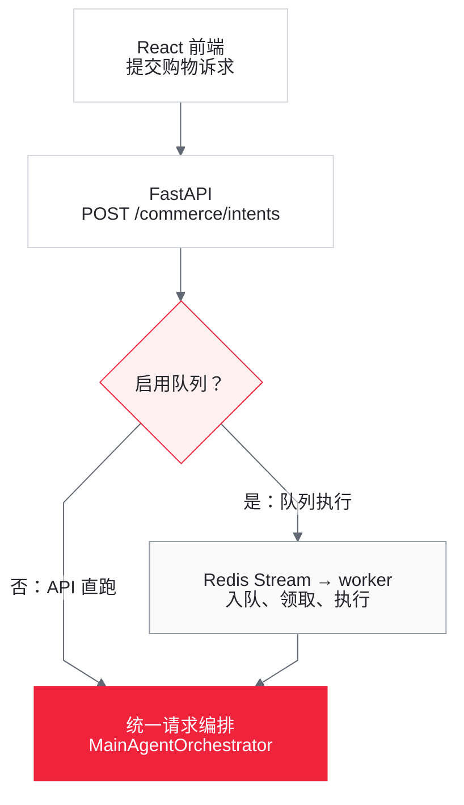
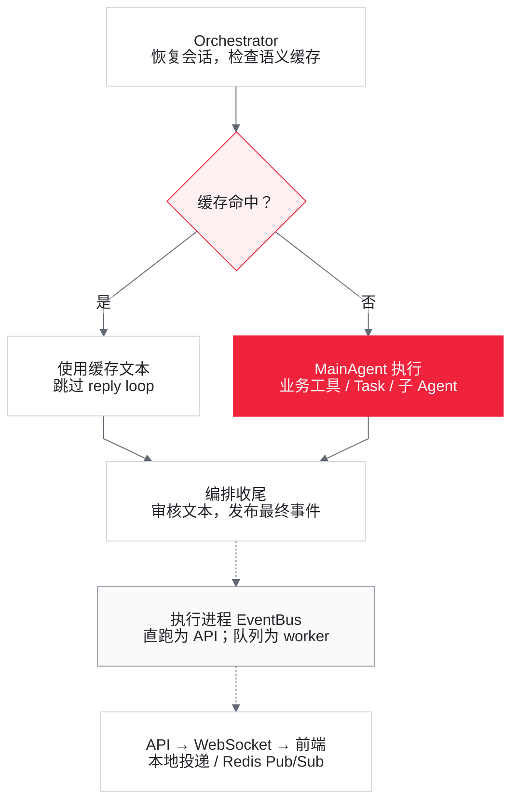
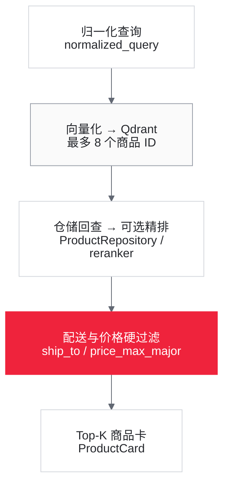
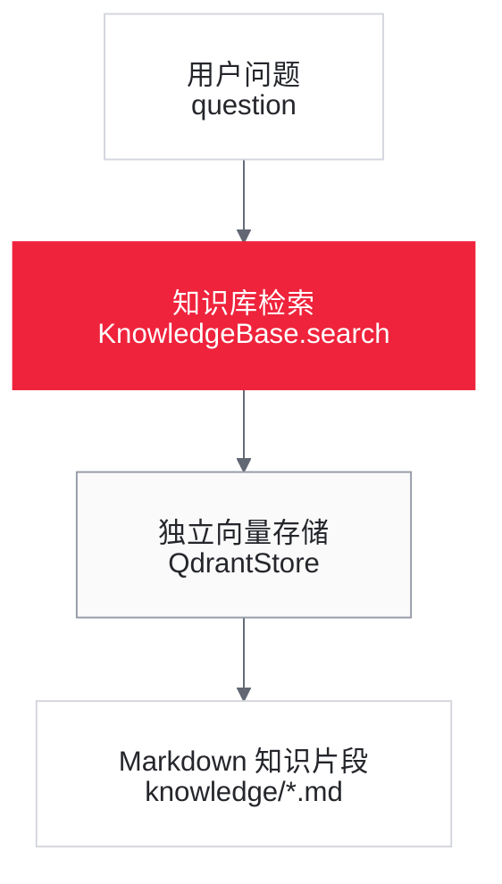

# 01 项目总览与核心文件定位

> 阅读目标：建立 Globex 的源码地图，理解各模块的实际处理和作用，再进入 [02 一次用户请求的完整调用链追踪](02_core_call_chain.md)。每个功能模块先说明实际流程与解决的问题，再单列当前隐患。风险时序属于源码推导，不等于已发生的运行事故。

## 1. 项目是什么

Globex 是面向跨境购物的自然语言 Agent（智能体）服务。React 前端提交购物诉求，MainAgent 可以直接调用业务工具，也可以经 `task_dispatch` 临时创建 SearchAgent 或 TradeAgent。FastAPI 提供 HTTP（超文本传输协议）接口，WebSocket 提供实时事件通道。

| 能力 | 当前实现 | 对应模块 |
| --- | --- | --- |
| 商品检索 | 问句向量化、Qdrant 召回、可选精排、配送与价格过滤 | §4.2 |
| 品类知识 | 检索 knowledge/*.md 的知识片段，供模型组织回答 | §4.2 |
| 到手价估算 | 按静态汇率、运费、免税额和关税规则组装商品卡 | §4.4 |
| 订单 | 创建、查询、取消，以及执行进程内的库存扣减和回补 | §4.4 |
| 多轮与偏好 | 缓存/恢复 AgentState，读取、写入和撤回买家偏好 | §5.1–5.3 |
| 任务与事件 | API 直跑或 Redis Stream 入队，发布过程与最终结果 | §3.1、§4.5 |

项目当前是 MVP（最小可行产品）：订单状态仅为 `DRAFT → CONFIRMED → CANCELLED`，没有支付、发货、物流、退款流程。这个产品范围与具体实现缺陷分开理解，见 [order.py](../app/domain/order/order.py#L23)。

## 2. 一张图看懂运行结构

<!-- diagram:01-execution -->

**请求在哪里执行**



[放大预览](assets/diagrams/01-execution.html) · API 与 worker 共用编排代码，但分别持有各自的内存状态。

<!-- /diagram:01-execution -->

<!-- diagram:01-agent-events -->

**编排、工具与事件出口**



[放大预览](assets/diagrams/01-agent-events.html) · 这里只画正常完成 / 缓存命中；过程事件也经 EventBus，异常分支见正文。

<!-- /diagram:01-agent-events -->

两图分别展开执行位置与编排出口；共享 Orchestrator 表示同一套代码，不表示 API 和 worker 共享内存实例。

**实际流程与作用**：API（应用程序编程接口）直跑与 worker 执行共用 `MainAgentOrchestrator.handle_intent()`。缓存命中走输出审核、最终事件和持久化尝试；未命中才进入 Agent loop（智能体执行循环）。固定编排负责会话、输入、事件和收尾，模型负责在已注册工具中选择动作。

**调用图的适用范围**：是否调用工具、建立计划或派发子 Agent 由 Prompt（提示词）、工具参数结构和模型输出共同决定，项目没有按自然语言意图写死的分支路由。静态调用图不能证明某一句话必然经过哪条工具链；相关数据一致性隐患放在各模块下说明。

## 3. 分层、接口与生命周期

### 3.1 接口与前端

**实际流程与作用**

[server.py](../app/presentation/server.py#L54) 创建 FastAPI 路由，[dto.py](../app/presentation/dto.py#L13) 定义 DTO（数据传输对象）。[App.tsx](../frontend/src/App.tsx#L22) 保存 buyer/session，发送意图并消费 WebSocket 事件；[connection.py](../app/presentation/connection.py#L25) 按 session 订阅总线。

前端用 `token.delta` 追加临时文本，收到 `final.result` 后清空临时气泡并加入最终回复。商品卡读取最近一条含非空 hits 的工具事件；fetch 网络异常由前端 catch 自行生成失败气泡。这样文本生成和工具过程可以在长请求完成前展示。

| 接口 | 入口 | 是否进入 Agent |
| --- | --- | --- |
| `GET /health` | `health()` | 否 |
| `POST /commerce/intents` | `submit_intent()` | 是；队列开启时先入队并同步等待 |
| `POST /commerce/intents/async` | `submit_intent_async()` | 是；仅队列开启时可用 |
| `GET /commerce/tasks/{task_id}` | `get_task()` | 否，只读任务状态 |
| `WS /commerce/events` | `commerce_events()` | 否，订阅 Agent 事件 |
| `GET /commerce/orders/{order_id}` | `get_order()` | 否，直连查询用例 |
| `POST /commerce/orders/{order_id}/cancel` | `cancel_order_endpoint()` | 否，直连取消用例 |

**当前隐患**

- 前端不解析 HTTP 正文、不检查 response.ok，提交也不要求 WebSocket 已连接。因此服务端最终回复依赖 final.result 到达；HTTP 已返回文本仍可能没有聊天回复。断线无补拉，部分 token 后只收到 error 时临时气泡不清空。
- 商品卡来自工具原始候选，不是模型最终推荐清单。零命中、缓存命中或直接回答时，旧卡可能保留；前后端事件类型也缺少 cache.hit/task.queued/task.started 的完整对应。具体路径见 [02 §1.1](02_core_call_chain.md#11-前端)。
- buyer/session 由客户端提交，task/order 标识由客户端持有；没有终端用户认证、会话绑定或资源归属校验。WebSocket 仅凭 session 订阅，任务仅凭 task ID 查询。订单授权见 §4.4，事件中的个人信息边界见 02 §5.3。

### 3.2 组装根与启动关闭

**实际流程与作用**

[composition.py](../app/composition.py#L129) 是 Composition Root（组装根），API 与 worker 共用它创建依赖：配置/追踪 → seed 商品和向量客户端 → Redis 缓存/队列/事件背板 → SQL 或文件仓储 → 熔断/模型限流/护栏 → UseCase（应用用例）、Agent factory、SessionRegistry 和 Orchestrator。共享装配使两种执行入口使用同一业务实现。

`Container.startup()` 依次尝试建 SQL（结构化查询语言）表、建立消费者组、商品向量索引和品类知识库。对应 bootstrap（启动初始化）捕获的异常记录告警。正常关闭时，API 取消远端事件转发协程，再调用 shutdown，依次关闭商品向量客户端、Redis 客户端和数据库 engine。

**当前隐患**

- bootstrap 的告警不等于自动更换后端：数据库/队列失败不会切文件存储或直跑；商品向量异常的降级范围见 §4.2，知识库没有替代检索链。
- 配置读取、tracing、Qdrant/KnowledgeBase 和数据库 engine 构造没有统一兜底。build_app 为 CORS（跨源资源共享）在 lifespan 前也会读取配置，故仍可直接启动失败，见 [server.py](../app/presentation/server.py#L89)。
- shutdown 未显式关闭知识库 vector store、等待 EventBus 待发送广播；前一个 close 抛错会跳过后续关闭。worker 的 startup 又在消费 try/finally 之前，启动失败和正常信号退出的清理保证不同，详见 02 §6.5。这只描述本仓显式清理范围，不推断依赖永远不会自行释放资源。

### 3.3 Application / 应用层

| 目录 | 职责 | 核心对象 |
| --- | --- | --- |
| `application/agents/` | Agent 装配、会话实例管理、请求编排 | `MainAgentOrchestrator`、三个 Agent factory、`SessionRegistry` |
| `application/tools/` | 模型可见参数到 UseCase / Store 的适配，发布工具事件 | 商品、RAG、订单、偏好、子 Agent 工具 |
| `application/usecases/` | 确定性的业务流程 | `CatalogSearchUseCase`、三个订单 UseCase |
| `application/memory/` | 长期偏好筛选和提示消息渲染 | `PreferenceSelector` |
| `application/harness/` | 顺序、Schema、循环和漂移判定 | `SequencingTracker`、`LoopDetector`、`DriftDetector` |
| `application/prompts/` | 主/子 Agent 系统提示词 | `globex.yml`、`loader.py` |

应用层将模型选择与确定性业务处理连接起来：Agent factory 注册工具，工具转换入参，UseCase 执行检索或订单规则；Orchestrator 负责请求级状态和事件。具体工具与迭代配置见 §4.1。

### 3.4 Domain / 领域层

领域层保存不依赖 FastAPI、AgentScope 或数据库实现的业务模型与端口：

- `catalog/`：`Product`、`Sku`、`Money`、`ProductSearchSpec`、汇率和检索端口。
- `order/`：`Order`、`OrderLine`、`Address`、订单仓储端口。
- `shipping/`：到手价规则。
- `buyer/`：买家偏好及存储端口。
- `session/`：会话状态与对话流水端口。
- `queue/`：`IntentTask`、`TaskStatus` 和队列端口。

### 3.5 Infrastructure / 基础设施层

这一层实现外部系统和横切能力：

- `llm.py`：统一创建 Agent Chat Model，并包装并发限制、起跑间隔、重试、备用模型和 token 记账。
- `embedding/`、`vector/`、`rerank/`、`rag/`：两条检索链的基础设施。
- `persistence/`：SQL、JSON 文件和内存仓储实现。
- `cache/`、`queue/`：Redis 缓存、语义缓存、Stream 队列和 Pub/Sub 背板。
- `eventbus.py`：进程内按 session 发布/订阅事件。
- `resilience.py`、`harness_middleware.py`、`security/`：工具超时/熔断、工具护栏和最终完整文本脱敏。
- `context.py`、`budget.py`、`throttle.py`、`tracing.py`：请求上下文、预算、模型限流和可观测性。


这些层次解决的是职责分离：接口处理传输，应用层组织流程，领域层保存业务规则，基础设施实现外部访问。目录或类名不构成事务、安全或可靠性保证，实际边界见下面对应功能模块。

## 4. Agent 与业务执行模块

### 4.1 Agent 与工具分工

**实际流程与作用**

| 来源 | 工具 |
| --- | --- |
| `SearchAgentFactory.build_tools()` | `product_search_tool`、`category_insight_tool`、可选 `web_search_tool` |
| `TradeAgentFactory.build_tools()` | `create_order_tool`、`query_order_tool`、`cancel_order_tool` |
| AgentScope | `TaskCreate`、`TaskUpdate`、`TaskList`、`TaskGet` |
| MainAgent 自有 | `task_dispatch`、`remember_preference_tool`、`forget_preference_tool` |

业务工具由 `FunctionTool` 包装，schema 来自函数签名；仓库中没有单独维护一份 OpenAI function schema 文件。

MainAgent 每次 reply 尝试设置最多 15 次 ReAct（推理与行动）迭代；子 Agent 每次派发新建，最多 6 次。直接工具处理短链任务，task_dispatch 提供专家工具集合和独立上下文；内置 TaskCreate/Update/List/Get 管理模型计划，随 AgentState 保存，与 Redis IntentTask 不同。

**当前隐患**

迭代限制按 reply 尝试/子 Agent 实例计算，不是整个 HTTP 请求的累计上限。is_concurrency_safe 标记允许框架并发派发，但不保证模型一定并行；子 Agent 也不会自动获得主会话历史，需 demands 和服务端注入提供信息。工具一旦选定后的路径见 02 §4.3–4.4。

### 4.2 商品检索与品类知识

**实际流程与作用**

商品检索链：

<!-- diagram:01-product -->

**商品检索：召回后再过滤**



[放大预览](assets/diagrams/01-product.html) · 库存不参与硬过滤；异常 / 空候选的降级分支见调用链 §4.1。

<!-- /diagram:01-product -->

品类知识链：

<!-- diagram:01-knowledge -->

**品类知识：独立检索链**



[放大预览](assets/diagrams/01-knowledge.html) · 商品向量与知识向量使用不同的 collection 和 embedding 接线。

<!-- /diagram:01-knowledge -->

商品链返回结构化商品卡，知识链返回文档片段；知识库 embedding 不经过商品链的 Redis 缓存包装。

商品向量调用被用例捕获的异常或过滤前空候选，会使用关键词 2-gram（相邻双字符）召回；精排失败保留向量结果。这为商品库提供语义匹配和受限的异常兜底。`category` 只在关键词评分时加权；配送和价格才是结构化硬条件，见 [catalog_search.py](../app/application/usecases/catalog_search.py#L104)。

商品启动索引使用 searchable_text 批量向量化、确定性 UUID5 标识和 upsert（按标识新增或更新）。知识库单独用 AgentScope OpenAIEmbeddingModel，按文档 stem 建库、每块约 512 token、重叠 50；它不走商品的 Redis embedding 包装，见 [index_bootstrap.py](../app/infrastructure/vector/index_bootstrap.py#L19)、[category_knowledge.py](../app/infrastructure/rag/category_knowledge.py#L34)。

**当前隐患**

- 前 8 个候选被硬过滤全部排除后，不会扩召回或再走关键词兜底；hits 为空不能证明全库没有符合条件的商品。库存不在硬过滤中，能检索到也不等于能下单。
- embedding HTTP 与商品工具外层超时都为 15 秒；外层取消可能先发生，无法保证向量故障都转成关键词结果。
- 商品已有 collection 不校验新向量维度，删除 seed 商品不主动删除旧 point；知识库已有同 stem 文档直接跳过，文件改写不会自动刷新。知识库建库失败后工具仍注册，后续可能恢复、空结果或报错，没有替代 RAG（检索增强生成）链。详见 02 §4.1–4.2。

### 4.3 工具保护、模型限流与输出审核

**实际流程与作用**

项目业务工具挂 `ToolResilienceMiddleware`，将超时、熔断短路和普通异常转换为 ERROR ToolChunk，供模型继续决策。MainAgent 自有 task_dispatch 和两个偏好工具额外挂可选 HarnessToolMiddleware（工具护栏），检查顺序、循环和结果内容。

三个 Agent 的模型共用进程内 GatewayThrottle，限制并发和起跑间隔；模型层重试建流前瞬时故障，并可用备用模型。Orchestrator 对逃出的瞬时错误最多再进 reply loop 两次。完整文本由 OutputGuard 固定正则审核，漂移检测可在轮末发布告警，详见 [llm.py](../app/infrastructure/llm.py#L217)、[orchestrator.py](../app/application/agents/orchestrator.py#L126)。这些机制分别缓解外部故障、网关拥塞和部分输出问题。

**当前隐患**

- 商品/订单工具没有挂 Harness，内置 Task 工具也没有项目 Tool middleware；定义的顺序和 Schema 规则不等于实际生效。
- 熔断把工具业务 ERROR 也计入失败，按工具名共享，错误输入可影响其他买家；半开探测没有严格单请求排他，共享状态读改写非原子。细节见 02 §6.1。
- 模型限流按进程，不限制整个集群；重试不回滚状态和写工具副作用。请求预算只软降档，耗尽没有硬停机链。
- token.delta 先推送、完整文本后审核，无法撤回已发出的敏感片段；审核也不覆盖全部内部标识和工具事件。漂移告警不重写或阻止最终回复，见 02 Step 5–7。

### 4.4 跨境估价、订单与库存

**实际流程与作用**

商品卡传入 ship_to 时，按静态汇率、运费、关税和免税额，为 primary_sku（主库存单位，即首个 SKU）、数量 1 生成 landed_price（到手价）。price_max_major 比较目标币种的主 SKU 货价；卡片普通价格保留原币种。规则见 [tariff_schedule.py](../app/domain/shipping/tariff_schedule.py#L18)。

[订单用例](../app/application/usecases/order_usecases.py#L29) 查商品/SKU → 扣库存 → 构造单价快照 → 分配编号 → Order.place 立即确认 → 保存；查询返回快照；取消检查 CONFIRMED、改状态、回补库存、保存。订单只合计同币种订单行货价。这提供购物估价和意向订单记录。

**当前隐患**

- 展示估价不参与订单结算；下单不校验地址对应的 ships_to，不写入运费关税，混币订单被拒绝。
- 确认依赖 Prompt，业务工具被 allow 规则直接放行；REST 取消不经过 Prompt。查询/取消只按 order_id，不校验 buyer 归属。
- 商品库存始终在进程内。worker 扣自己的副本，API 取消可能给从未扣减的副本加库存，重启又恢复 seed。file 模式订单也仅在内存，API 与 worker 未必看到同一订单。
- 库存与订单没有统一事务：负数量校验太晚会增加库存；save 在回补范围外；CancelledError 可绕过 except Exception 回补；取消保存失败不会撤销已回补库存。
- SQL 编号使用订单总数加一；撞号可能保存失败，也可能被 db.merge 更新已有订单头、删除并重写订单行。具体时序与源码见 02 §4.5，不能把主键当成避免覆盖的保证。

### 4.5 队列与任务结果

**实际流程与作用**

REDIS_URL 与 QUEUE_ENABLED 同时生效时，API 使用 session/问句指纹做 600 秒 SET NX 去重，按会话轮数选普通或大请求 Stream，再写 queued。worker 消费新消息、执行 Orchestrator、写 done/failed，成功返回后 XACK（消费确认）。任务状态每次写入保留 3600 秒。

同步接口监听 session 事件，连续 2 秒无事件才查任务状态；异步接口直接返回 task ID。队列将执行移到 worker，状态查询提供事件之外的结果入口，见 [server.py](../app/presentation/server.py#L222)、[redis_stream_queue.py](../app/infrastructure/queue/redis_stream_queue.py#L101)。

**当前隐患**

去重不含业务轮次，10 分钟内合法的再次“确认”也可能被复用；命中不重放事件。XADD 与 queued 写入非原子，状态可倒退；final.result 无 task ID，同 session 等待者可能收错结果。双 Stream 的 COUNT 按流计算，不能严格限制总并发。claim_stale 未接入且缺少大请求和准确 ack 信息，失败任务不会自动恢复；XACK 不删除 Stream 历史。详见 02 §2.2 和 §6.4。

## 5. 会话、偏好、缓存与持久化

### 5.1 会话状态与上下文压缩

**实际流程与作用**

[SessionRegistry](../app/application/agents/main_agent.py#L171) 优先复用进程内 Agent，否则从 SessionStore 恢复 AgentState；读失败或反序列化失败记录告警并创建新状态。每轮 finally 尝试保存。ConversationStore 保存对话流水，恢复 Agent 不从它回放。

[context_policy.py](../app/application/agents/context_policy.py#L57) 传入压缩触发比例 0.75、保留比例 0.15、工具结果长度限制及定制摘要模板，要求保留偏好、商品/SKU、订单和待确认动作。它解决长上下文容量问题；summary 变化时发送 context.compressed。

**当前隐患**

_agents 无淘汰和 session 锁；多 worker 除并发分叉外，串行 A → B → A 也会因 A 复用旧内存状态而遗漏 B 的轮次。共享 Store 无版本检查，最后写入可覆盖新状态。仅串行化而不刷新缓存也不充分。压缩配置不能保证摘要准确保留事实，详见 02 Step 2。

### 5.2 买家偏好

**实际流程与作用**

偏好按 buyer 跨会话保存。所有 dislike 保留，like 最多 top-k；默认选最新项，可选按 embedding 相关性选取，之后恢复原列表相对顺序。MainAgent 对变化后的 hint 注入一次；SearchAgent 派发可按 demands 独立选择注入。写入去重按 buyer/kind/statement，撤回按 statement 精确删除，解决跨轮记忆与重复提示膨胀，见 [preference_selector.py](../app/application/memory/preference_selector.py#L70)。

**当前隐患**

偏好靠提示影响模型，不是商品硬过滤。Store 删除不会清除旧 context 或 summary；压缩还可能保留旧偏好。清空后注入快照未清除，重建同偏好可能被误判已注入；进程重启又可能重复注入。详见 02 Step 4、§4.6。

### 5.3 语义缓存与 embedding 缓存

**实际流程与作用**

语义缓存按主模型名/Prompt 指纹、buyer、全量偏好 scope 分桶，仅对空 AgentState.context 且未命中拒绝正则的问句查询；默认余弦阈值 0.95，每桶最近 30 条，整桶写入 TTL（生存时间）24 小时。命中跳过 reply loop，输出审核后发最终结果。embedding 缓存按模型/文本保存 7 天，批量只回源未命中项，减少重复向量请求。

**当前隐患**

语义缓存命中不把本轮问答加入 AgentState，也不重放商品卡；下一轮可能无法引用缓存回答。拒绝正则不是完整意图判定，桶不含语言/币种/业务版本；条目无独立过期时间，后续写入续期可延长旧回复寿命。并发整桶覆盖可能丢缓存条目，偏好读取失败按空 scope 处理。详见 02 Step 3。

### 5.4 存储实现与落盘

**实际流程与作用**

| 数据 | 默认实现 | `DATABASE_URL=file` 或可选实现 |
| --- | --- | --- |
| 商品目录与库存 | 每进程 `InMemoryProductRepository` + seed | 无数据库实现 |
| 商品向量 | Qdrant 本地嵌入模式 | 配 `QDRANT_URL` 后连接服务端 |
| 品类知识向量 | 本地 `QdrantStore` | 配 `QDRANT_URL` 后连接服务端 |
| 会话状态 | SQLite `agent_session_states` | JSON 文件 |
| 对话与事件 | SQLite 3 张表 | 单 session JSONL |
| 订单 | SQLite `orders`、`order_items` | 仅进程内订单仓储 |
| 买家偏好 | SQLite `buyer_preferences` | JSON 文件 |
| Redis 能力 | embedding 缓存随 `REDIS_URL` 启用；语义缓存还受独立开关控制；队列与背板还要求 `QUEUE_ENABLED` | 未配置 Redis 时全部关闭；关闭队列时仍可保留 Redis 缓存 |

SQLAlchemy 当前定义 7 张表：`conversation_sessions`、`conversation_messages`、`conversation_events`、`agent_session_states`、`orders`、`order_items`、`buyer_preferences`，见 [tables.py](../app/infrastructure/persistence/sql/tables.py#L42)。

默认 SQL 将业务订单与 AgentState、偏好、对话分开保存；file 模式便于本地开发。SQL 对话分别提交会话触达、买家消息、Agent 消息和事件批次。final.result 先于轮末落盘和 worker done，完整完成时序见 02 Step 8。

**当前隐患**

SQL 分次提交不是整轮事务，写失败可能只有部分流水且仍已发布成功文本。file 模式 `_safe_name` 会把 buyer/a 与 buyera 映射到同名文件，不能保证原始标识隔离；write_text 直接覆盖且无跨进程锁，异步方法内部仍做同步文件读写，见 [json_file_stores.py](../app/infrastructure/persistence/json_file_stores.py#L29)。

## 6. 配置、部署与验证入口

### 6.1 有效配置与运行模式

**实际处理与作用**

配置以 [load_settings](../app/infrastructure/settings.py#L94) 为准，.env.example 只列子集。LLM_API_KEY 检查非空，不在此验证凭据有效性；DATABASE_URL 默认 SQLite、特殊值 file 选文件实现；QDRANT_URL 空时使用两个本地目录。HARNESS_ENABLED/OUTPUT_GUARD_ENABLED 默认开，漂移检测/请求 token 预算/共享熔断/偏好相关性默认关。TAVILY_API_KEY 和 RERANKER_BASE_URL 分别决定 Web 工具和精排是否装配。

Compose 使用服务端 Qdrant、Redis 和共享 SQLite 卷，将 API、worker、前端分进程运行。[pyproject.toml](../pyproject.toml) 声明 Python >=3.11,<3.14 和 AgentScope >=2,<3；[uv.lock](../uv.lock#L11) 锁定 AgentScope 2.0.6，锁文件不等于当前环境已安装该版本。

**当前隐患**

- API/worker 同时打开相同本地 Qdrant 目录会遇到多进程使用限制；共享 SQLite 虽启用 WAL（预写日志）和 5 秒 busy timeout，仍可能写锁竞争。
- worker 使用 loop.add_signal_handler，原生 Windows 默认事件循环不支持；当前按 Linux/Docker 入口理解。
- Compose 两边透传配置不一致：worker 没透传 LLM_MAX_RETRIES、SEMANTIC_CACHE_THRESHOLD；多项可选 Agent 配置两边都未透传，只改 API 不一定影响实际 worker。详见 02 §6.5。
- /health 捕获数据库/Redis 探测失败后仍组装 status=ok，不能只看该字段判就绪；已配置 Redis 失联也不会切回直跑，见 [server.py](../app/presentation/server.py#L105)。

### 6.2 验证入口

**实际入口与作用**

| 范围 | 入口 | 说明 |
| --- | --- | --- |
| 单元与基础设施测试 | `tests/` | 领域规则、检索、存储、缓存、队列、护栏和偏好等 |
| 商品 / 品类召回 | `scripts/eval/run_product_recall.py`、`run_category_recall.py` | 使用 `eval/*.jsonl` 做确定性召回指标 |
| 评测数据校验 | `scripts/eval/validate_datasets.py` | 校验评测 JSONL 的结构、标识引用与基础字段 |
| Agent 行为回归 | `scripts/eval_regression.py` | 需要已启动服务与模型；应关闭语义缓存，避免评分命中旧回复 |
| 端到端冒烟 | `scripts/smoke_e2e.py` | 人工观察 HTTP 最终结果和 WebSocket 事件数量；脚本主要打印结果，没有系统断言两者一致或必需事件齐全 |
| 并行与容量 | `scripts/verify_parallel.py`、`loadtest.py`、`locustfile.py` | 分别观察单意图内并行和多意图压力；`verify_parallel.py` 没观察到重叠也不一定失败退出，脚本存在不等于当前环境已经通过 |

**当前验证缺口**

现有测试覆盖较多领域规则和 Fake/Mock（替代依赖）的基础设施行为，但仓库中未找到 build_app REST、ConnectionManager、handle_intent、worker.main、claim_stale、真实 Redis pending/PubSub，以及同 session、多 worker 竞态的完整接线测试。脚本入口不能当成这些边界已通过集成验证的证明；阅读时应区分源码事实、条件推导和实际运行结果。

## 7. 目录地图

```text
globex-agent/
├── app/
│   ├── composition.py             # API / worker 共用的组装根
│   ├── worker.py                  # Redis Stream 消费进程
│   ├── presentation/              # FastAPI、DTO、WebSocket
│   ├── application/
│   │   ├── agents/                # Agent factory、Orchestrator、SessionRegistry
│   │   ├── tools/                 # 模型可调用的业务工具
│   │   ├── usecases/              # 商品与订单应用流程
│   │   ├── prompts/               # 主/子 Agent Prompt
│   │   ├── memory/                # 偏好筛选
│   │   └── harness/               # 断言、循环与漂移检测
│   ├── domain/                    # 领域对象、规则和端口
│   └── infrastructure/            # LLM、检索、存储、Redis、治理与安全
├── frontend/                      # React + Vite 前端
├── knowledge/                     # 品类知识 Markdown
├── eval/                          # 评测数据
├── scripts/                       # 冒烟、评测、并行与压测脚本
├── tests/                         # 单元和基础设施测试
├── docker/                        # Docker Compose
└── review/                        # 源码学习文档
```

## 8. 建议阅读顺序

| 顺序 | 文件 | 先回答的问题 |
| --- | --- | --- |
| 1 | [App.tsx](../frontend/src/App.tsx) | 请求从哪里发出，结果如何显示？ |
| 2 | [server.py](../app/presentation/server.py) | HTTP、WebSocket 和队列在哪里分叉？ |
| 3 | [composition.py](../app/composition.py) | 当前实际装配了哪些实现？ |
| 4 | [orchestrator.py](../app/application/agents/orchestrator.py) | 每次意图固定经过哪些阶段？ |
| 5 | [main_agent.py](../app/application/agents/main_agent.py) | MainAgent 有哪些工具和状态？ |
| 6 | [globex.yml](../app/application/prompts/globex.yml) | 模型被怎样约束选择工具？ |
| 7 | [catalog_search.py](../app/application/usecases/catalog_search.py) | 商品检索如何召回、降级和过滤？ |
| 8 | [task_dispatch_tool.py](../app/application/tools/task_dispatch_tool.py) | 子 Agent 如何创建及隔离上下文？ |
| 9 | [order_usecases.py](../app/application/usecases/order_usecases.py) | 下单/取消改变了什么数据？ |
| 10 | [llm.py](../app/infrastructure/llm.py) | 模型限流、重试、回退和预算在哪里发生？ |
| 11 | [eventbus.py](../app/infrastructure/eventbus.py) | 事件如何到达 WebSocket？ |
| 12 | [repositories.py](../app/infrastructure/persistence/sql/repositories.py) | 会话、对话、订单和偏好如何落库？ |
