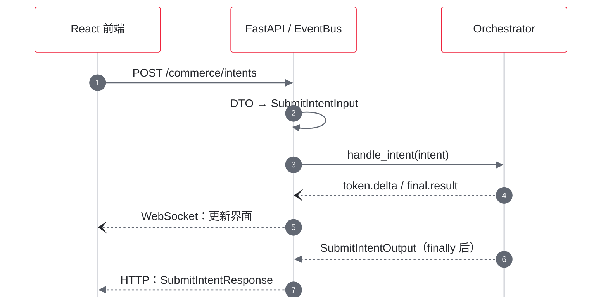
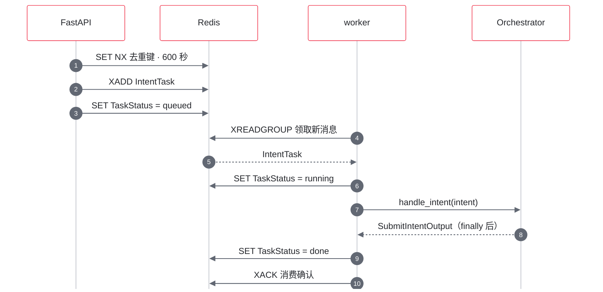
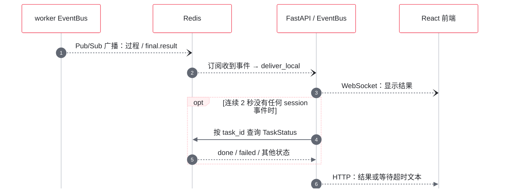
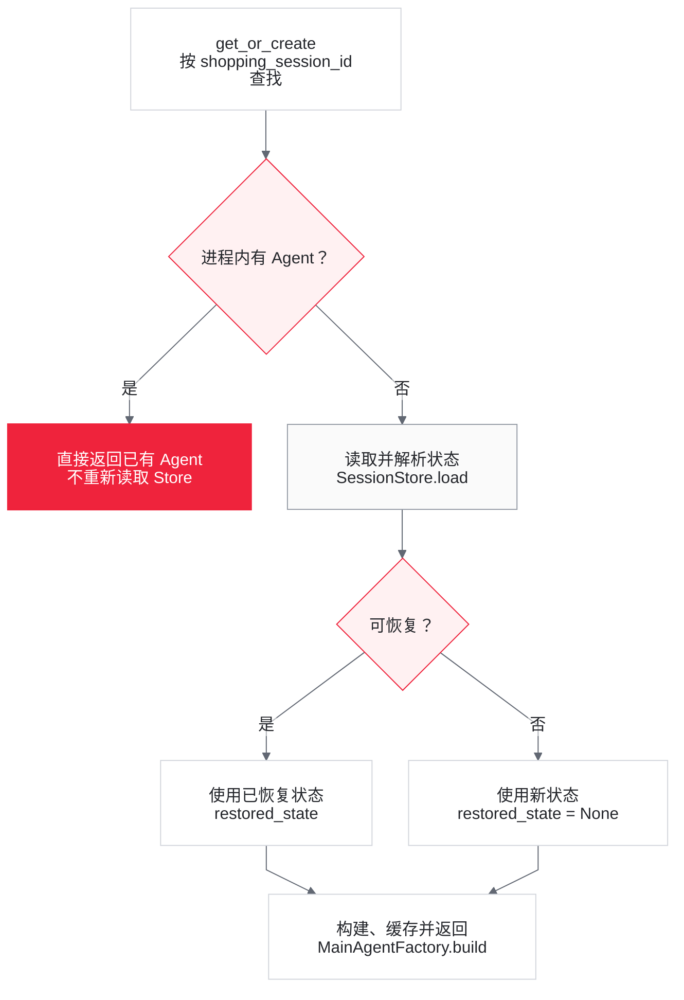
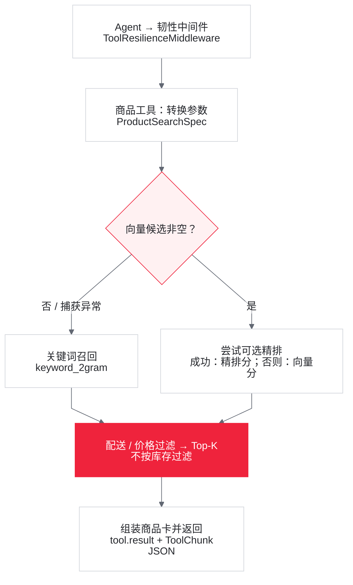
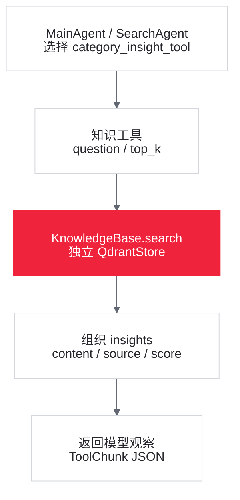
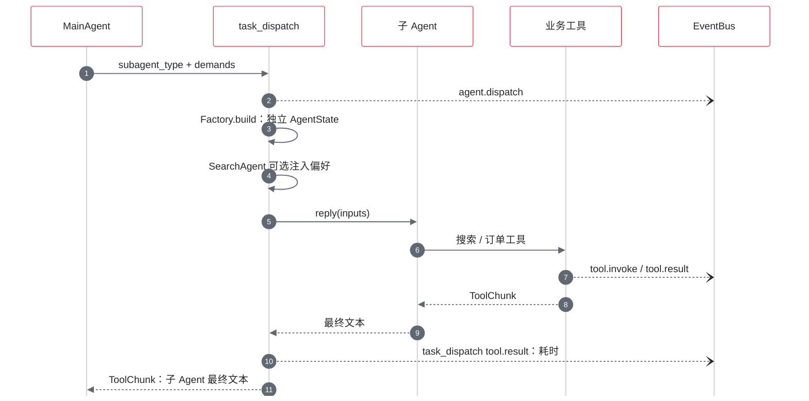
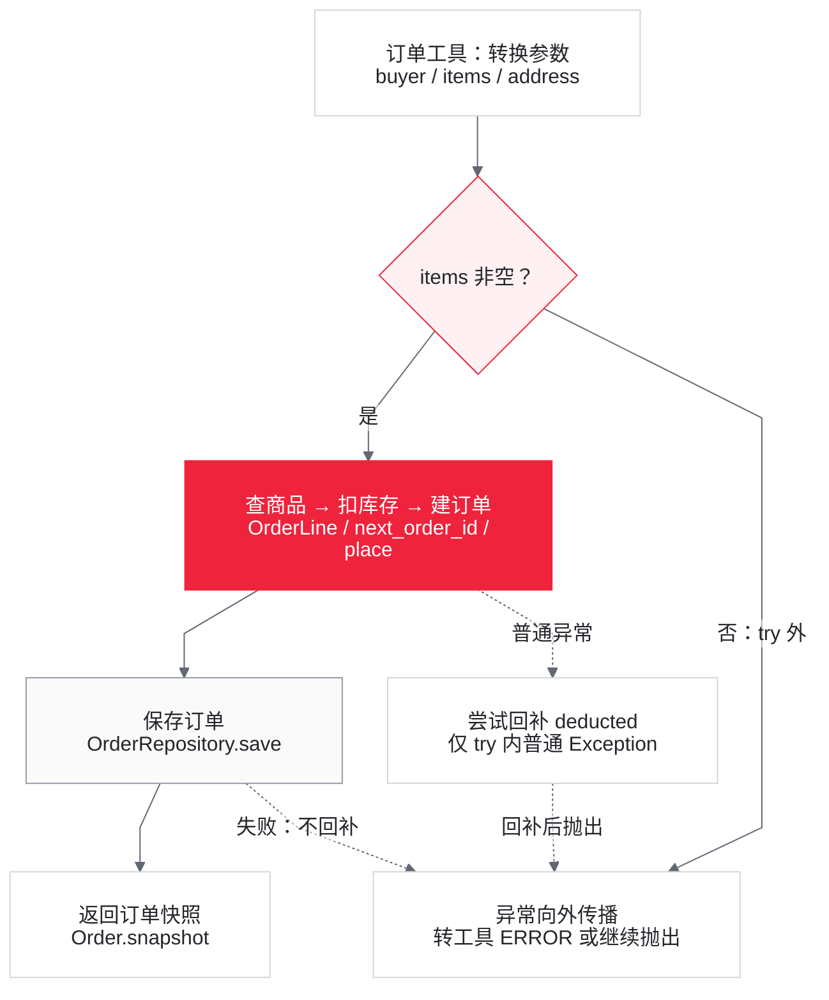
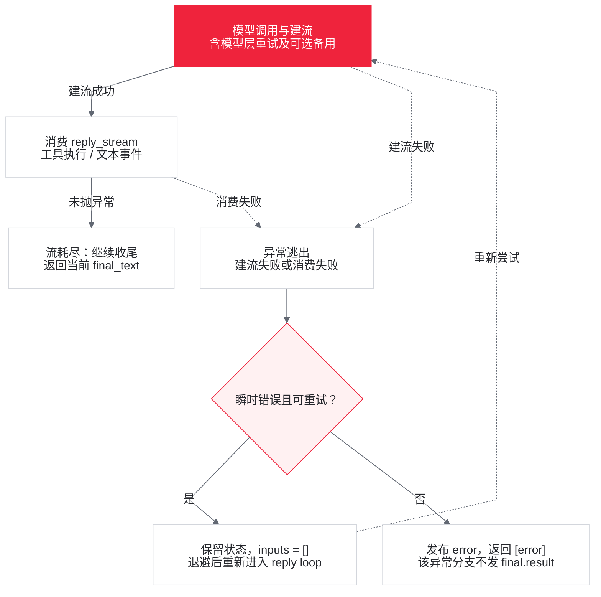

# 02 一次用户请求的完整调用链追踪

> 主线选择当前前端使用的 `POST /commerce/intents`。队列关闭时由 API（Application Programming Interface，应用程序编程接口）进程执行；队列开启时由 API 入队、worker 执行。请求成功进入 Agent 执行阶段后，两条路径都会进入 `MainAgentOrchestrator.handle_intent()`。
>
> Agent 内部不是固定业务流水线。每个模块先说明实际流程、处理和作用，再列当前隐患。框架内部行为只描述到本仓调用边界；并发/失败时序为有条件的源码推导，不代表生产实测。

## 1. 入口与响应通道

### 1.1 前端

**实际流程与解决的问题**

[App.tsx](../frontend/src/App.tsx#L22) 从 `localStorage` 读取或创建 `sessionId` 和 `buyerId`，随后并行使用两条通道：

- HTTP（Hypertext Transfer Protocol，超文本传输协议）：`submit()` 向 `POST /commerce/intents` 提交 session、buyer、locale、currency 和 `raw_query`。
- WebSocket：组件 `useEffect()` 连接 `/commerce/events`，连接成功后先发送同一个 `shopping_session_id` 作为订阅条件。

当前前端等待 fetch 完成，但不解析 HTTP JSON。WebSocket 提供服务端回复及实时进度，避免必须等整个请求返回才能展示：

- `token.delta`：追加到临时流式气泡。
- `final.result`：清空临时气泡并加入最终 Agent turn。
- 其他事件：加入时间线；最近一条带 `hits` 的 `tool.result` 用于商品卡。

fetch 抛出网络异常时，catch 会自行追加请求失败气泡；HTTP 非 2xx 本身不会进入这段 catch。

**当前隐患**

提交按钮不要求 WebSocket 已连接，`fetch()` 也不检查 `response.ok`。如果首次 WebSocket 尚未建立、连接中途断开或 `final.result` 转发失败，即使 HTTP 已成功返回 `final_text`，前端也不会把它加入聊天区；WebSocket 重连只接收新事件，不会补拉历史结果，见 [App.tsx](../frontend/src/App.tsx#L79) 和 [eventbus.py](../app/infrastructure/eventbus.py#L90)。

前端派生状态还有以下边界：

- `ProductCards.latestCards()` 会从全部历史事件中倒序寻找最近一条 **非空** `hits`。新一轮零命中、语义缓存命中、直接回答或报错时都没有新的非空 hits，旧商品卡仍会显示；并行子 Agent 产生多条搜索结果时，最后到达的工具事件决定卡片，而不是 MainAgent 最终文本中采用的候选。卡片因此是原始工具结果的视图，不是最终推荐清单，见 [ProductCards.tsx](../frontend/src/components/ProductCards.tsx#L4)。
- `streaming` 只在收到 `final.result` 时清空。若已经收到部分 `token.delta` 后只收到 `error`，临时气泡不会自动结束或清除，见 [App.tsx](../frontend/src/App.tsx#L57)。
- 后端会发布 `cache.hit`、`task.queued`、`task.started`，但前端 `TradeEventType` 联合类型和事件标签表没有声明这些类型。JSON 运行时仍会进入默认展示分支，但 TypeScript 契约、样式和专用摘要已经与后端事件枚举漂移，见 [types.ts](../frontend/src/types.ts#L3)、[EventTimeline.tsx](../frontend/src/components/EventTimeline.tsx#L3) 和 [eventbus.py](../app/infrastructure/eventbus.py#L30)。

### 1.2 FastAPI

**实际流程与解决的问题**

应用在 [server.py](../app/presentation/server.py#L54) 的 `build_app()` 中创建。lifespan 启动时构建 `Container`、执行 `startup()`，并在启用 Redis 背板时启动远端事件转发协程；关闭时取消该协程并释放容器资源。

核心请求 DTO（Data Transfer Object，数据传输对象）定义于 [dto.py](../app/presentation/dto.py#L13)：

```python
class SubmitIntentRequest(BaseModel):
    shopping_session_id: Optional[str] = None
    buyer_id: str = Field(min_length=1)
    locale: str = "zh-CN"
    currency: str = "CNY"
    raw_query: str = Field(min_length=1)
```

`submit_intent()` 将 DTO 转为 `SubmitIntentInput`；未传 session 时生成 `session-{8位十六进制}`。之后仅按 `Container.task_queue` 是否存在分叉。接口将传输对象转换为应用输入，使 API 与 worker 使用同一编排入口。

辅助接口直接处理任务状态或订单：async 提交在队列关闭时返回 503，任务不存在/过期返回 404；订单查询的 ValueError 映射 404，取消的 ValueError 映射 400。/health 探测数据库和 Redis 并返回依赖字段，见 [server.py](../app/presentation/server.py#L153)。

**当前隐患**

buyer/session 由请求提交，未认证或绑定；任务查询仅凭 task_id，WebSocket 仅凭 session，不能视为租户隔离。async 接口重复提交仍固定返回 state=queued，未查询旧任务真实状态。/health 即使探测失败仍可返回 status=ok，故该字段不是依赖就绪保证。

lifespan 不是最早的失败边界：`build_app()` 会在应用构造期通过 `build_container_origins()` 调用 `load_settings()`，缺少必填配置时可在 lifespan 前直接失败。进入 lifespan 后，`build_container()` 对 tracing、Qdrant/KnowledgeBase 和数据库 engine 的构造也没有统一兜底；只有各 bootstrap 实际捕获的初始化异常会按对应策略记录告警或降级。CORS（Cross-Origin Resource Sharing，跨源资源共享）配置读取位置见 [server.py](../app/presentation/server.py#L89)，容器构造见 [composition.py](../app/composition.py#L129)。

## 2. 两种执行模式

### 2.1 队列关闭：API 进程直跑

**实际流程与解决的问题**

<!-- diagram:02-direct -->

**API 直跑：事件与返回值分开**



[放大预览](assets/diagrams/02-direct.html) · 实线：调用　·　虚线：返回或事件；前端当前不解析 HTTP 正文。

<!-- /diagram:02-direct -->

HTTP 返回结果与 WebSocket 事件是两条独立响应通道；当前前端只用后者更新服务端回复。

直跑减少独立 worker 和 Redis 队列的部署依赖，执行同一个 Orchestrator。

**当前隐患**

API 进程直接承担长 Agent 请求；模型限流仍只是进程内配置，见 Step 6。已创建队列后 Redis 运行时失联，不会自动切回这条直跑路径。

### 2.2 队列开启：API 入队，worker 执行

**实际流程与解决的问题**

队列只有同时满足 `REDIS_URL` 非空且 `QUEUE_ENABLED` 开启时才创建，见 [composition.py](../app/composition.py#L156)。

完整时序：

<!-- diagram:02-queue-submit -->

**队列：提交与消费**



[放大预览](assets/diagrams/02-queue-submit.html) · 读取可与 queued 写入交错；图中为一种正常时序，跨进程事件见下一图。

<!-- /diagram:02-queue-submit -->

<!-- diagram:02-queue-result -->

**队列：实时事件与状态兜底**



[放大预览](assets/diagrams/02-queue-result.html) · 状态兜底在等待期间发生，不要求 worker 先完成；HTTP 正文当前不用于聊天渲染。

<!-- /diagram:02-queue-result -->

图中虚线表示返回值或异步事件；opt 是同步等待的状态查询兜底。入队、状态写入和事件发布实际是分开的命令，不是一个原子事务。

worker 事件先在 worker 的 EventBus 发布，再经 Redis Pub/Sub（发布/订阅）背板到 API 进程，由 `_forward_remote_events()` 调用 `deliver_local()`，最终到达 `_await_result()` 和 WebSocket 订阅者。

队列把执行放到 worker；SET NX 减少重复提交，TaskStatus 为事件之外提供查询入口。_queue_priority 以 Redis 中的会话计数分类，默认第 30 轮起进入 large，计数保留 86400 秒；它是启发式分组，不是测量 token 长度。去重命中直接返回旧 task_id，不再入队或发布事件。

**当前隐患**

- 同一 session 在 600 秒内为不同动作再次说“确认”，也可能复用旧任务；指纹没有轮次或业务操作标识。旧任务不会重放 final.result，状态兜底返回的 HTTP 正文又被前端忽略，可能只出现新的买家气泡。
- queue_position 通常是两条 Stream 的总 lag（尚未读取数），不是该任务真实排位；lag 缺失时用 pending，查询异常时按 0 处理，见 [redis_stream_queue.py](../app/infrastructure/queue/redis_stream_queue.py#L67)。
- 幂等键在 `XADD` 之前写入；若后续入队失败，键可能暂时指向没有任务状态的 task ID，直到 10 分钟 TTL 到期。
- `XADD`、写 `TaskStatus=queued` 和发布 `task.queued` 也不是原子操作：消息可能已经进入 Stream，但状态写入或事件发布失败。更隐蔽的竞态是 worker 可在 `XADD` 后立即消费，把状态写成 `running` 甚至 `done`，随后 API 再无条件覆盖为 `queued`。这不仅会造成短暂查不到状态，还可能让已完成任务长期倒退并停留在 `queued`，同步等待方因而超时，见 [server.py](../app/presentation/server.py#L242) 和 [worker.py](../app/worker.py#L51)。
- `consume()` 以全局 `free_slots` 作为 `XREADGROUP count`，但一次调用同时读取 normal 与 large 两条 Stream。Redis 的 `COUNT` 是每条 Stream 的最大返回数，不是所有 Stream 合计上限，因此两条流都有消息时，一轮最多创建 `2 × free_slots` 个任务，实际在途数可能超过 `WORKER_CONCURRENCY`；把 normal 放在参数前只影响返回顺序，不构成严格的累计优先配额，见 [redis_stream_queue.py](../app/infrastructure/queue/redis_stream_queue.py#L119) 和 [Redis XREADGROUP 文档](https://redis.io/docs/latest/commands/xreadgroup/)。
- 该幂等键只覆盖“提交端去重”，不是端到端业务幂等：指纹由 `session_id + raw_query` 组成，不含 buyer；worker 执行前也不检查 task 是否已完成，task ID 更没有传给订单 UseCase。若未来接通 pending 重领或出现重复消费，订单写操作仍可能再次执行。
- `_await_result()` 在 `_enqueue()` 之后才订阅事件，可能错过极快完成的 `final.result`；每两秒查询 task status 是兜底。
- `_await_result()` 的实时事件分支只按 `shopping_session_id` 订阅，收到 `final.result` 后没有核对 `task_id`，而该事件载荷本身也不含 `task_id`。同一 session 并发提交多个同步请求时，多个等待者可能都返回最先完成的那条结果；按 task ID 查询状态的兜底只有在两秒内没有收到事件时才执行。
- `claim_stale()` 使用 `XAUTOCLAIM`，但当前没有被 `consume()` 或 worker 调用。它还只处理普通 `_STREAM`，没有处理 `_LARGE_STREAM`，并且只返回反序列化后的 `IntentTask`，没有保留原始 stream 与 message ID，调用方无法在处理后准确 ack。pending 消息会留在 Redis，却不会由现有主链自动重新处理；仅增加一个调用点也不足以闭合恢复流程，见 [redis_stream_queue.py](../app/infrastructure/queue/redis_stream_queue.py#L198)。
- 成功消息和死信消息目前只 `XACK`，没有 `XDEL` 或 `XTRIM`；normal、large、dead 三条 Stream 的历史条目都可能持续增长。`XACK` 只移除消费者组 pending 状态，不会删除 Stream 条目，见 [redis_stream_queue.py](../app/infrastructure/queue/redis_stream_queue.py#L166)。
- Redis Pub/Sub 不持久化事件，WebSocket 断线期间没有事件重放。

## 3. Orchestrator 固定主链

核心入口是 [MainAgentOrchestrator.handle_intent()](../app/application/agents/orchestrator.py#L140)。

### Step 1：建立请求级上下文

**实际流程与解决的问题**

构造 `ShoppingContextSnapshot(session, buyer, locale, currency)` 并写入 `ContextVar`（异步上下文变量）。深层工具据此读取当前请求携带的 session 和 buyer，使模型无需在每次工具调用中重复提供身份参数。

`init_budget(TOKEN_BUDGET_TOTAL)` 同时初始化可选的请求级 token 账本。若开启 drift detector（漂移检测），则记录本轮 query；若存在 `ConversationStore`，还会为本轮事件轨迹建立独立 EventBus 订阅。

**当前隐患**

buyer/session 仍由客户端提交，没有认证、签名或绑定校验，不能当成已验证身份。

`locale` 和 `currency` 虽然也进入 Snapshot，却没有形成确定性的业务约束：本轮模型输入不包含这两个字段，商品工具也不会从 Snapshot 自动取币种，而是由模型显式传 `target_currency`，未传时默认 `CNY`。SQL（Structured Query Language，结构化查询语言）中已存在的 conversation session 再次触达时只更新 `last_active_at`，不会刷新原来的 buyer、locale、currency。因此它们目前主要是请求与审计元数据，不能据此断言回复语言或价格币种一定遵循请求值，见 [orchestrator.py](../app/application/agents/orchestrator.py#L411)、[product_search_tool.py](../app/application/tools/product_search_tool.py#L24) 和 [repositories.py](../app/infrastructure/persistence/sql/repositories.py#L111)。

### Step 2：获取或恢复 MainAgent

**实际流程与解决的问题**

`SessionRegistry.get_or_create(session_id)` 的顺序是：

<!-- diagram:02-session -->

**会话恢复：命中内存即复用**



[放大预览](assets/diagrams/02-session.html) · 无数据、读取失败或解析失败走新状态；命中内存不发生再次写入 _agents。

<!-- /diagram:02-session -->

图中只表示单进程的一次查找；多 worker 的状态新鲜度问题见本节“当前隐患”。

恢复成功时复用保存的 AgentState，支撑多轮对话；读取或反序列化失败则记录 warning，按新会话继续。ConversationStore 不是恢复来源。

Factory 还注入业务工具 allow 规则，配置 [上下文压缩](../app/application/agents/context_policy.py#L57)：trigger_ratio=0.75、reserve_ratio=0.15、tool_result_limit，以及要求保留偏好、商品/SKU、订单、待确认动作的摘要模板。窗口来自模型 context_size，此配置函数的同名参数被 del。配置用于控制长上下文容量；summary 变化时的通知在 Step 7。

**当前隐患**

`SessionRegistry._agents` 当前没有淘汰策略，也没有同 session 并发锁。两个请求首次并发访问同一 session 时还可能分别构建 Agent，随后互相覆盖 `_agents` 条目；已存在实例时则可能并发操作同一个 AgentState。

队列模式还存在跨进程版本：每个 worker 都有独立的 `SessionRegistry`，Redis Stream 不按 session 绑定消费者，也不阻止同 session 的多个任务并发执行。两个 worker 可能读取同一份旧 SessionStore 快照、各自在不同 AgentState 上推进，最后通过 `SqlSessionStore.save()` 覆盖写；当前没有版本号、CAS（Compare-And-Set，比较并交换）、分布式 session 锁或会话级串行队列防止上下文分叉和最后写入覆盖，见 [worker.py](../app/worker.py#L82)、[main_agent.py](../app/application/agents/main_agent.py#L171) 和 [repositories.py](../app/infrastructure/persistence/sql/repositories.py#L96)。

跨 worker 旧状态也不要求并发：A 完成第 1 轮保存 S1，B 完成第 2 轮保存 S2，第 3 轮回到 A 时直接复用进程内 S1，不重新读取 S2。因此仅加执行锁而不刷新缓存仍不充分。压缩提示词也只是框架配置，不保证摘要完整准确。

`AgentState.permission_context` 中还会写入项目级 allow 规则，直接放行下单、取消、调度、偏好和 Task 工具。对 Agent 工具路径而言，下单/取消前“先展示确认卡并等待用户明确确认”目前只是 [globex.yml](../app/application/prompts/globex.yml#L59) 中的 Prompt 约束，没有后端确认令牌或状态机做硬校验。直连的 `POST /commerce/orders/{order_id}/cancel` 不经过 Agent 或 Prompt，会直接调用取消 UseCase。

### Step 3：尝试语义缓存短路

**实际流程与解决的问题**

只有同时满足以下条件才会查 Redis `SemanticCache`：

- Redis 缓存和语义缓存开关已启用。
- MainAgent 当前没有历史 `state.context`；这只是代码判据，不一定等于业务上的第一轮。
- query 不命中下单、取消、订单引用或“刚才/这个”等固定正则拒绝规则。

缓存 key 按模型与 Prompt 指纹、buyer ID、全量偏好指纹分桶。命中时 `_lookup_cache()` 先发布 `cache.hit`，返回缓存文本后再进行输出审核并发布 `final.result`，不进入 `agent.reply_stream()`；`finally` 中仍会尝试持久化状态和本轮对话。

查询会删除空白和指定尾部标点，计算向量后在桶内遍历余弦相似度，取不低于阈值（默认 0.95）的最高分回复。remember 保留最近 30 条并整桶写入 24 小时 TTL；空回复或以 [error] 开头的文本不保存，见 [semantic_cache.py](../app/infrastructure/cache/semantic_cache.py#L118)。这复用相近首轮咨询的最终文本，减少 Agent 推理调用；可能仍发生 embedding 请求。

**当前隐患**

TTL 是桶级，每次写入会续期，条目没有独立时间检查；未被 30 条截断淘汰的旧回复可存活超过 24 小时。并发读改写可能丢条目。lookup/remember 分别重读偏好 scope，读取失败按空 scope 处理，不是本轮冻结的偏好快照。

这里的“可缓存”是启发式判断，不是对只读语义的完备识别。规则主要列举中文关键词；例如未命中的中文近义说法或英文写操作表达仍可能进入缓存，所以不能概括为“写操作一定不缓存”。分桶也没有包含 `locale`、`currency`、工具可用性，以及商品、库存、汇率、关税、知识库等业务数据版本；同一 buyer 与偏好指纹下，缓存回复可能沿用旧语言、旧币种或旧业务数据，见 [semantic_cache.py](../app/infrastructure/cache/semantic_cache.py#L41) 和 [semantic_cache.py](../app/infrastructure/cache/semantic_cache.py#L101)。

需要注意：缓存命中没有把 buyer query 或缓存回复追加到 AgentState，持久化的是未变化的状态。下一轮若询问“刚才那个”，正则规则会禁止再次命中缓存，但 Agent 也没有上一轮缓存回复可供引用。对话流水虽然保存了这两条记录，`SessionRegistry` 恢复 Agent 时却只加载 `SessionStore` 中的 AgentState，不会从 `ConversationStore` 回放对话。缓存路径也不会重放商品搜索的 `tool.result`，因此前端可能继续展示上一轮商品卡。

### Step 4：构造本轮输入

**实际流程与解决的问题**

固定输入是 `UserMsg(intent.buyer_id, intent.raw_query)`。Orchestrator 读取买家偏好，经 `PreferenceSelector` 筛选后可在其前面加入：

```text
UserMsg("memory_hint", "<buyer-preferences>...</buyer-preferences>")
```

所有 `dislike` 都按存储顺序保留；`like` 最多 top-k。默认先按 `created_at` 倒序选出最新项，开启相关性配置后按 embedding 相似度选出相关项，最终都恢复入选项在原列表中的相对顺序。在同一个 Orchestrator 进程实例的生命周期内，同一 session 已注入且渲染结果未变化时，不重复注入偏好消息。筛选限制正向偏好的上下文占用，稳定顺序和去重减少重复提示。

**当前隐患**

去重快照只在进程内，重启恢复 AgentState 后可能再次注入相同偏好。

“所有 dislike 都注入”不等于后端进行了偏好硬过滤。`ProductSearchSpec` 的结构化硬条件只有 `ship_to`、`price_max_major` 等字段，没有材质、品牌或任意偏好排除字段；偏好是否被执行依赖模型遵循 Prompt。并且 `product_search_tool` 会在 MainAgent 二次筛选前把原始 hits 发布给前端，所以最终文字即使排除了某商品，卡片仍可能展示它，见 [catalog_search.py](../app/application/usecases/catalog_search.py#L129) 和 [product_search_tool.py](../app/application/tools/product_search_tool.py#L94)。

“不再注入”不等于“从 AgentState 撤回”。`forget_preference_tool` 只删除 Store 中的偏好，不会扫描或删除 AgentState 中已经追加的旧 `<buyer-preferences>` 消息；因此旧 hint 仍可能影响模型；压缩提示又要求保留偏好，即使原始消息被移除，旧偏好也可能继续存在于 summary。偏好清空时 `_injected_preferences` 也不会清除，之后重新创建完全相同的偏好时，当前进程内可能被误判为已经注入，见 [forget_preference_tool.py](../app/application/tools/forget_preference_tool.py#L43) 和 [orchestrator.py](../app/application/agents/orchestrator.py#L411)。

### Step 5：进入 AgentScope reply loop

**实际流程与解决的问题**

项目调用边界是 [orchestrator.py](../app/application/agents/orchestrator.py#L333)：

```python
async for event in agent.reply_stream(inputs or None, yield_final_msg=True):
    if isinstance(event, Msg):
        final_text = event.get_text_content() or ""
    elif isinstance(event, TextBlockDeltaEvent):
        self._bus.publish(session_id, "token.delta", ...)
```

本项目还将四个 Task 工具的结果映射为 `plan.update`，并把工具结果摘要交给可选漂移检测器。业务工具的 `tool.invoke` / `tool.result` 和 `agent.dispatch` 由工具自身发布。

这些映射把框架执行转成前端可消费的文本、计划和工具进度。

**当前隐患**

`token.delta` 在流式生成时立即发布，而 `_guard_final_text()` 要等 reply loop 结束、拿到完整文本后才执行。因此最终文本中的脱敏不能撤回已通过 WebSocket 发出的原始 token；内部工具名、密钥形态或内部 URL 仍可能先出现在临时气泡中。`token.delta` 又被轮末对话事件持久化明确排除，事后审计也不会保留这段原始流，见 [orchestrator.py](../app/application/agents/orchestrator.py#L264) 和 [orchestrator.py](../app/application/agents/orchestrator.py#L333)。

AgentScope 如何把消息转换为某次具体 tool call 属于依赖库内部行为；当前仓库只能确认注册的工具、Prompt 约束和实际执行函数，不能从静态代码断言某句话必然调用哪个工具。

### Step 6：调用 Chat Model

**实际流程与解决的问题**

MainAgent、SearchAgent、TradeAgent 都通过 [llm.py](../app/infrastructure/llm.py#L217) 的 `create_chat_model()` 创建模型。`ThrottledChatModel.__call__()` 的外层行为为：

1. 获取同一 `Container`、同一进程内共享的 `GatewayThrottle` 名额，限制并发数和相邻请求起跑间隔。装配位置见 [composition.py](../app/composition.py#L197)。
2. 调 AgentScope `OpenAIChatModel`；流式响应读完或关闭后才释放名额。
3. 在上游响应流创建完成之前遇到瞬时错误，最多尝试 `LLM_MAX_RETRIES + 1` 次，间隔为 `6 × 3^attempt` 秒；流开始迭代后的中途异常已离开该重试范围。
4. 主模型尝试耗尽且配置备用模型时，发布 `model.fallback` 后调用备用模型。
5. 从最终 response usage 读取 token，计入当前请求预算。

请求预算按模型 usage 记账；非 main 档有备用模型时优先用它，minimal 档额外注入简洁提示。模型包装器覆盖建流前重试，Orchestrator 再对逃出的瞬时错误最多重新进入 reply loop 两次，覆盖流中途失败。这些处理缓解网关瞬时故障并控制进程内模型起跑压力。

**当前隐患**

每个 API/worker 各有 throttle，多进程总并发不是一个配置值；usage 缺失时不计账，预算不是完整成本硬限额。Orchestrator 重试复用同一个可变 AgentState，只把 `inputs` 改为 `[]` 以避免再次显式注入买家消息，并不会把上下文、已经执行的工具副作用或已经发布的事件回滚到本轮开始状态。因此这不是事务意义上的“整轮重试”；已发送到前端的 token 可能重复，写工具若已产生副作用也不能依赖该重试自动撤销，直到成功的 `final.result` 才会覆盖临时气泡，见 [orchestrator.py](../app/application/agents/orchestrator.py#L300)。

请求级 token 预算当前只会在非 `main` 档优先切备用模型，`minimal` 档再加入简洁提示。`budget.py` 虽定义“fallback 档不再调用 LLM”的常量和注释，但主链没有相应硬短路，不能把它写成已实现行为。

### Step 7：成功收尾

**实际流程与解决的问题**

reply 流未抛异常地耗尽后，预期从 Msg 取得最终文本，再依次执行：

1. `_guard_final_text()` 按固定正则脱敏 `shopping_session_id` 键值形式、`sk-` API key 形态、枚举主机名的内部 URL 和已列出的内部工具名。
2. 可选 drift check。
3. `AgentState.summary` 变化时发布 `context.compressed`。
4. 发布 `final.result`。
5. 若进入本轮前 `AgentState.context` 为空、query 未命中固定正则拒绝规则且回复不是错误，则写入语义缓存。

这些操作分别处理最终文本、记录偏离信号、通知上下文变化并交付/复用回答。

**当前隐患**

_consume_reply 初始化空文本，未校验“必须收到最终 Msg”或“文本必须非空”；若流正常耗尽而无最终消息，也会走到空 final.result。这里只界定本仓成功条件，不断言框架正常运行必然产生这种流。

输出审核是固定模式匹配，不通用识别所有内部标识。名单当前没有 `forget_preference_tool`，也没有四个 AgentScope Task 工具名 `TaskCreate`、`TaskUpdate`、`TaskList`、`TaskGet`，因此不能说它覆盖了所有内部工具名，见 [output_guard.py](../app/infrastructure/security/output_guard.py#L25) 和 [main_agent.py](../app/application/agents/main_agent.py#L113)。

漂移检测也只是部分接线：Composition Root 构造 `DriftDetector()` 时没有传可选 judge；Orchestrator 观测工具结果时只传动作摘要和“hits 是否为空”，没有传 token 消耗或偏好黑名单命中。检测发生在最终文本已经生成、审核之后，命中时只记录日志并发布 `error`，不会重写或阻止随后发布的 `final.result`，见 [composition.py](../app/composition.py#L202) 和 [orchestrator.py](../app/application/agents/orchestrator.py#L352)。

### Step 8：异常与 finally

**实际流程与解决的问题**

`handle_intent()` 捕获普通 `Exception` 后发布 `error`，并返回 `[error] {err}`。这把普通异常变成可观察事件和应用返回值；异常分支不发布 final.result。

无论缓存命中、正常完成还是捕获异常，`finally` 都会尝试：

- `SessionRegistry.persist()` 保存 `agent.state.model_dump_json()`。
- 保存 buyer turn、agent turn、耗时和本轮除 `token.delta` 外的事件。
- 清理本轮 LoopDetector / DriftDetector 状态。
- reset `ShoppingContext`。

持久化使后续请求可恢复状态，并保留对话流水。几个完成点的先后关系是：

| 阶段 | 实际已完成 | 后续仍需处理 |
| --- | --- | --- |
| 发布 final.result | 本地事件入订阅队列，跨进程广播被调度 | 浏览器接收、AgentState 和对话落盘 |
| finally 落盘 | 分别尝试 SessionStore 和 ConversationStore 写入 | worker 写任务状态 |
| worker 写 done | 保存 handler 返回文本 | XACK 消费确认 |
| XACK | 移除消费者组 pending 状态 | 不删除 Stream 历史，也不形成业务事务 |

**当前隐患**

普通存储错误仅告警，因此收到 final.result 或任务 done 都不证明完整落盘成功。SQL 会话触达、buyer turn、agent turn、事件批次分别提交，可能仅保存部分本轮记录，见 [repositories.py](../app/infrastructure/persistence/sql/repositories.py#L111)。

CancelledError 不属于 Exception，不会被这里转为 [error]；finally 会进入，但其中 await 再被取消时没有独立清理保护，不能保证后续 reset 全部执行。异常事件到达后，前端也不会将 HTTP 的 [error] 加入聊天气泡。

AgentState 的完整定义在 AgentScope 依赖中；本仓直接使用 context、summary、tasks_context.tasks 和 permission_context.allow_rules。

## 4. 运行时工具分支

MainAgent 的可选下一步包括直接回答、直接调用业务工具、调用 AgentScope Task 工具，或通过 `task_dispatch` 派发子 Agent。下面只描述工具一旦被选中后的确定性链路。

### 4.1 商品检索

**实际流程与解决的问题**

<!-- diagram:02-product -->

**商品检索：正常路径与降级**



[放大预览](assets/diagrams/02-product.html) · 外层超时不保证完成降级；过滤后零命中不会重新召回。

<!-- /diagram:02-product -->

关键词降级发生在硬过滤之前；向量候选被过滤为空后不会回到关键词分支。

字段与处理口径：

- 策略字段为 `embedding_rerank`、`embedding_only` 或 `keyword_2gram`。
- `build_container()` 在 RedisCache 可用时以 `CachedEmbeddingClient` 包裹原始 embedding 客户端，缓存键由 embedding 模型与文本生成，TTL 为 7 天；商品检索、偏好相关性和语义缓存等共享同一包装后的客户端，见 [composition.py](../app/composition.py#L139) 和 [cached_embedding_client.py](../app/infrastructure/cache/cached_embedding_client.py#L19)。
- `category` 只在关键词降级时加权，不是向量路径的硬过滤条件。
- `price_max_major` 用目标币种换算后的主 SKU（Stock Keeping Unit，库存单位）价格判断；商品卡普通 `price_major/currency` 仍保留 SKU 原币种，到手价才按 `target_currency` 返回。
- `ship_to` 不在 `product.ships_to` 时，商品在组卡前已被过滤；`landed_price.unavailable_reason` 主要覆盖商品声明可送达、但静态规则表不支持该目的国的情况。
- `landed_price` 固定按 `primary_sku()`、数量 1 计算，只是搜索卡片估算；它不会写入订单行，也不参与 `Order.total_amount()`。`price_max_major` 同样只比较主 SKU 商品价，不含运费与关税，见 [catalog_search.py](../app/application/usecases/catalog_search.py#L234) 和 [order.py](../app/domain/order/order.py#L78)。
- 被硬条件挡掉的候选最多以 3 条摘要写入 `filtered_out`。

商品工具还将字符串 top_k/price_max_major 转成数字，构造 ProductSearchSpec 后才执行用例；数字解析失败返回 ERROR。假设模型为“250 美元预算的耳机寄美国”选择该工具，参数可以是 normalized_query="降噪耳机"、ship_to="US"、price_max_major=250、target_currency="USD"。此例只说明参数传递，不预测模型必然调用。返回的 hits 进入模型观察和前端卡片；filtered_out 只在工具 JSON 中供模型解释过滤原因，见 [product_search_tool.py](../app/application/tools/product_search_tool.py#L24)。

启动时 searchable_text 汇集标题、品牌、品类、产地、描述和亮点，批量 embed 后以实际向量维度创建 collection，再用 product_id 派生 UUID5 point ID 做 upsert。它让重启可更新同一商品向量，见 [index_bootstrap.py](../app/infrastructure/vector/index_bootstrap.py#L19)。

**当前隐患**

- “向量异常降级关键词”只覆盖 `CatalogSearchUseCase` 实际捕获到的 embedding/Qdrant 异常和空候选。embedding HTTP 超时与商品工具外层超时同为 15 秒，外层取消可能先发生并直接返回工具超时，不能保证所有向量故障都得到关键词结果，见 [catalog_search.py](../app/application/usecases/catalog_search.py#L104)、[openai_embedding_client.py](../app/infrastructure/embedding/openai_embedding_client.py#L26) 和 [resilience.py](../app/infrastructure/resilience.py#L30)。
- 关键词兜底发生在硬过滤之前。前 8 个向量候选全部被过滤后，不再扩召回或关键词查询；hits=[] 不证明全库没有符合条件的商品。total_candidates 是本次候选过滤后的数量，不是全库可售数。
- _reject_reason 不检查库存，零库存 SKU 仍可出现在卡片。primary_sku 取第一个 SKU，并不选最便宜或有货款。
- 已有 collection 不校验新 embedding 的维度；删除 seed 商品不会主动清理旧 point，召回还要经过仓储 ID 还原，旧 point 可能占候选名额，见 [qdrant_product_index.py](../app/infrastructure/vector/qdrant_product_index.py#L36)。

### 4.2 品类知识 RAG（Retrieval-Augmented Generation，检索增强生成）

**实际流程与解决的问题**

<!-- diagram:02-knowledge -->

**品类知识：工具到观察结果**



[放大预览](assets/diagrams/02-knowledge.html) · 外层仍有工具超时与熔断；此图展开知识检索本体，不包含替代 RAG 降级链。

<!-- /diagram:02-knowledge -->

这条链只返回检索片段；如何引用、归纳和回答仍由调用它的 Agent 决定。

启动阶段 `bootstrap_category_knowledge()` 使用 `TextParser` 和 `ApproxTokenChunker(chunk_size=512, overlap=50)` 建库，以文件 stem 作为 `document_id` 跳过已有文档。知识库使用独立 OpenAIEmbeddingModel，不经过商品 CachedEmbeddingClient；文档分块为模型提供有限的品类依据，而不是检索完整商品目录。

**当前隐患**

它没有按内容哈希更新旧文档：文件内容改变而 stem 不变时，现有 collection 中的文档不会自动刷新。建库失败不注销工具，后续可能依赖已有数据/恢复后成功，也可能空结果或报错，没有替代 RAG 降级链，见 [category_knowledge.py](../app/infrastructure/rag/category_knowledge.py#L65)。

### 4.3 子 Agent 派发

**实际流程与解决的问题**

<!-- diagram:02-dispatch -->

**子 Agent：返回文本，旁路发布事件**



[放大预览](assets/diagrams/02-dispatch.html) · 可选偏好步骤由 PREFERENCE_SUBAGENT_INJECT 等条件控制；子 Agent 不继承主历史。

<!-- /diagram:02-dispatch -->

事件和 ToolChunk 都回到同一 session；只有 ToolChunk 中的最终文本会成为 MainAgent 的工具观察结果。

- `subagent_type` 只允许 `search_agent` / `trade_agent`。
- SearchAgent 有商品、品类知识和可选 Web 搜索工具；只有配置 `TAVILY_API_KEY` 时才注册 `web_search_tool`。调用后它向 Tavily HTTP API 请求结果，把每条 content 截断为 500 字符后放进 ToolChunk；工具事件只记录命中数，不带完整搜索内容，见 [web_search_tool.py](../app/application/tools/web_search_tool.py#L24)。TradeAgent 有三个订单工具。
- 两者 `ReActConfig.max_iters=6`；MainAgent 为 15。
- `task_dispatch` 标记 `is_concurrency_safe=True`，表示框架可以并发执行同轮的多个派发；是否真的产生多个并发调用仍由模型输出决定。
- SearchAgent 的偏好注入还受 `PREFERENCE_SUBAGENT_INJECT` 控制；关闭时子 Agent 不读取这份 hint，MainAgent 自身的偏好注入不受该开关控制，见 [main_agent.py](../app/application/agents/main_agent.py#L121) 和 [settings.py](../app/infrastructure/settings.py#L89)。
- 子 Agent 的业务工具事件直接发布到同一个 session；只有子 Agent 最终文本作为调度工具结果返回 MainAgent。

派发以独立 AgentState 隔离子任务上下文；demands 携带本次任务所需信息，SearchAgent 额外读取偏好，解决主 Agent 未在 demands 抄全偏好的部分问题。

**当前隐患**

并发安全标记只允许框架并发，不决定模型是否发起多个调用；demands 缺少商品/地址等信息时，子 Agent 不能自动读取主历史补齐。工具事件共用 session，未构成逐子任务完整关联。task_dispatch 外层 180 秒超时取消不等于撤销子 Agent 已执行的订单副作用，见 [task_dispatch_tool.py](../app/application/tools/task_dispatch_tool.py#L82)。

### 4.4 AgentScope Task 计划工具

**实际流程与解决的问题**

MainAgent 还直接注册 `TaskCreate`、`TaskUpdate`、`TaskList`、`TaskGet`。这些工具操作 `AgentState.tasks_context.tasks`，用于模型自己的计划管理，不是 Redis 队列任务，也不等于后台 `IntentTask`。每个 Task 工具完成时，Orchestrator 从当前 AgentState 生成 `plan.update`，最终随整个 AgentState 由 `SessionRegistry.persist()` 保存，见 [main_agent.py](../app/application/agents/main_agent.py#L113) 和 [orchestrator.py](../app/application/agents/orchestrator.py#L343)。

**当前隐患**

Task 工具没有项目自己的 ToolResilienceMiddleware 或 Harness；计划中的任务完成不等于 Redis 意图已完成，也不证明订单事务成功。

### 4.5 创建、查询与取消订单

**实际流程与解决的问题**

创建链路：

<!-- diagram:02-order -->

**下单：正常处理与回补边界**



[放大预览](assets/diagrams/02-order.html) · CancelledError 不进回补 except；负数量还可能令回补失败。库存与订单不在统一事务。

<!-- /diagram:02-order -->

save 位于回补用的 try/except 之外；协程取消也不进入 except Exception。图中的回补分支只表示当前代码捕获到的普通异常。

查询：QueryOrderUseCase.execute → order_repo.find_by_id → 找不到抛 ValueError，否则返回 snapshot。取消：查订单 → Order.cancel 校验 CONFIRMED 和非空原因 → 标记 CANCELLED → 遍历订单行回补执行进程库存 → save → snapshot。这些确定性用例保存订单行价格并执行领域状态规则，模型无需自行计算总金额。

Order 只允许同币种行，总额为单价乘数量之和。商品卡 landed_price 则按主 SKU、数量 1 估算运费关税，是展示口径；当前尚无支付、物流或退款阶段。

**当前隐患**

- 正数量的正常路径中，查商品、查 SKU、构造订单行或 `Order.place()` 失败会尝试回补已记录的库存，但这不是无条件回滚保证。当前没有在变更库存前校验 `quantity > 0`：`Sku.deduct_stock(-1)` 会把库存增加 1，之后 `OrderLine` 才拒绝负数量，而 `restore_stock(-1)` 又会抛错，最终留下被增加的库存，见 [order_usecases.py](../app/application/usecases/order_usecases.py#L35)、[sku.py](../app/domain/catalog/sku.py#L27) 和 [order_line.py](../app/domain/order/order_line.py#L21)。
- 工具的 wait_for 超时会触发协程取消。CancelledError 不被 except Exception 捕获；扣库存后在 await next_order_id 等位置被取消，可绕过回补，即使未到 save 也会遗留扣减，见 [resilience.py](../app/infrastructure/resilience.py#L141)。外层 ERROR 不证明业务已回滚。
- SQL next_order_id 用订单总数加一，两个请求可拿到同号；save 使用 db.merge 并整体重写该号订单行。如果 A 先提交、B 后 merge，可能覆盖 A 的 buyer/地址/金额/订单行；同时插入也可能约束或锁错误，见 [repositories.py](../app/infrastructure/persistence/sql/repositories.py#L202)。这是保存路径的条件推导，不只存在“撞号必报错”这一分支。
- Prompt 要求确认，但 allow 规则直接放行写工具，没有确认令牌或状态机；REST 取消直接调用用例，完全不经过模型确认提示，见 [permissions.py](../app/application/agents/permissions.py#L16)、[server.py](../app/presentation/server.py#L194)。
- `OrderRepository.save()` 位于回滚 `try/except` 之外；保存失败时，当前代码不会回补已扣库存。
- 取消只允许 `CONFIRMED`。代码先把订单对象改为 `CANCELLED`，再回补当前进程的商品库存，最后保存订单；保存失败也没有撤销库存回补。
- 商品和库存不落数据库，也不在 API / 多 worker 进程间共享。SQL 订单持久化不等于库存具有跨进程一致性。
- `DATABASE_URL=file` 时，Composition Root 使用进程内 `InMemoryOrderRepository`，而不是文件订单仓储；worker 创建的订单可能无法被 API 进程的 REST 查询/取消看到，多个 worker 也各持有自己的订单集合，见 [composition.py](../app/composition.py#L168)。
- 下单 UseCase 不校验 `shipping_address.country` 是否属于商品的 `ships_to`，也不把搜索卡片中的运费、关税或 landed price 写入订单。订单总额只汇总订单行的 SKU 单价乘数量；地址中的 country 在当前 MVP（Minimum Viable Product，最小可行产品）主要用于保存和展示，见 [order_usecases.py](../app/application/usecases/order_usecases.py#L25)、[order.py](../app/domain/order/order.py#L78) 和 [address.py](../app/domain/order/address.py#L2)。
- `Order` 要求所有订单行币种一致，没有汇率换算；一次提交混合币种 SKU 会在 `Order.place()` 构造聚合时失败并进入上述回补流程，见 [order.py](../app/domain/order/order.py#L45)。
- 查询与取消 UseCase 只按 `order_id` 操作，没有校验当前 buyer 是否属于该订单。

### 4.6 长期偏好

**实际流程与解决的问题**

- 主 Agent 读：`Orchestrator._build_inputs()`。
- SearchAgent 子任务读：`task_dispatch._preference_hint()`；TradeAgent 不注入。
- 写：`remember_preference_tool()` → `PreferenceStore.append()`。
- 删：`forget_preference_tool()` → `PreferenceStore.delete(buyer_id, statement)`，按 statement 精确匹配；未命中时返回现有偏好供模型重试。
- 缓存隔离：`_preference_scope()` 使用全量偏好的渲染结果生成指纹，偏好改变后进入新缓存桶。

写入以 buyer/kind/statement 去重；delete 按 statement 精确删除，不区分 kind，同语句的 like/dislike 一并撤回。模型通过这些工具维护跨会话偏好，主/子 Agent 读取链见 Step 4。

**当前隐患**

删除仅作用于 Store，不撤销 AgentState 的历史 hint/summary；偏好约束也不进入商品硬过滤。scope 仅在偏好读取成功时反映实际 Store，读取失败按空 scope 分桶。file 模式还有文件名碰撞和覆写问题，见 §5.4。

## 5. 事件与状态变化

### 5.1 主要状态载体

| 状态 | 作用域 | 主要变化 |
| --- | --- | --- |
| `SubmitIntentRequest/Input/Output` | 单次 HTTP 请求 | 接口对象到应用对象再到响应 |
| `ShoppingContextSnapshot` | 当前异步请求 | 携带 session、buyer、locale、currency |
| `TokenBudget` | 当前请求及继承 ContextVar 的子任务 | 累计模型 usage |
| `AgentState` | MainAgent 会话；子 Agent 单次实例 | context、summary、tasks、permissions |
| `IntentTask/TaskStatus` | Redis 队列任务 | 正常预期为 queued → running → done/failed |
| `Product/Sku/Order` | 业务对象 | 下单扣当前进程库存；取消改状态并回补执行进程的库存副本 |
| `TradeEvent` | 过程事件 | EventBus → 可选 Redis 背板 → WebSocket/持久化 |

### 5.2 工具结果的两条去向

1. `ToolChunk` 返回 AgentScope，成为后续模型调用可见的 observation（观察结果）。
2. 工具调用 `TradeEventBus.publish()`，供 WebSocket UI 和轮末事件持久化。

商品搜索的 `hits` 同时出现在 ToolChunk JSON 与 `tool.result.payload.hits`；订单 snapshot 同时出现在 ToolChunk 和事件的 `order` 字段中。

### 5.3 事件投递与持久化

**实际流程与解决的问题**

TradeEventBus 按 session 为订阅者创建独立 asyncio.Queue，publish 先本地投递，再以后台任务广播 Redis Pub/Sub。API 远端监听收到事件后 deliver_local，不再次广播；origin 排除自身回环。这连接 worker 执行和 API WebSocket，并让每个订阅者独立消费，见 [eventbus.py](../app/infrastructure/eventbus.py#L90)、[redis_stream_queue.py](../app/infrastructure/queue/redis_stream_queue.py#L221)。

Orchestrator 开始本轮时创建 trace 订阅，轮末先退订，再收集非 token.delta 事件写入 ConversationStore。工具结果一份进入模型观察、一份进入事件通道，便于显示过程与保存部分轨迹。

**当前隐患**

- 订阅队列无界，慢消费者可能积压。Pub/Sub 不持久化、不补发，WebSocket 无事件序号或重放。
- API 远端转发在背板监听异常后只记录 warning 并结束，未自行重启；worker 可能完成并写状态，但该 API 不再收到事件，见 [server.py](../app/presentation/server.py#L57)。
- trace 是 session 订阅而非请求 ID 订阅，同 session 并发可能混入其他请求事件；task.queued 和 task.started 位于本轮 trace 订阅之前，token 又明确排除。因此 conversation_events 不是完整请求审计，断线重连也不会读它。
- 订单 tool.result 含收货人、地址、电话，输出审核不处理这些事件；结合仅凭 session 的订阅，这构成个人信息访问边界，见 [order_tools.py](../app/application/tools/order_tools.py#L75)。

### 5.4 SQL 与文件存储

**实际流程与解决的问题**

默认 SQLite 分别保存 AgentState、对话、订单和偏好；SessionStore 为会话恢复提供快照，ConversationStore 保存轮次和事件。DATABASE_URL=file 时使用 JSON 会话/偏好、JSONL 对话和内存订单，便于本地开发，见 [composition.py](../app/composition.py#L168)。落盘完成点与任务返回的顺序见 Step 8。

**当前隐患**

SQL 对话分次提交，非整轮原子记录；SQLite 多进程共享仍有写锁竞争。file 模式 _safe_name 删除字符会碰撞：buyer/a 与 buyera 同名，/ 与 . 都变成 anonymous。原始 buyer/session 不同也可能读写同一文件。save 直接 write_text、偏好读后整体覆盖，无临时文件原子替换或跨进程锁；方法虽为 async，文件 I/O 仍同步执行，见 [json_file_stores.py](../app/infrastructure/persistence/json_file_stores.py#L29)。

## 6. 中间件、结束与失败路径

### 6.1 工具中间件

**实际处理与解决的问题**

| 对象 | 当前中间件 |
| --- | --- |
| 三个 Agent | `TracingMiddleware`；`REPLY_TOKEN_BUDGET > 0` 时增加 `ReplyBudgetControlMiddleware` |
| 搜索、RAG、Web、订单工具 | `ToolResilienceMiddleware` |
| `task_dispatch`、两个偏好工具 | 可选 `HarnessToolMiddleware` 在外，`ToolResilienceMiddleware` 在内 |
| 四个 AgentScope Task 工具 | 没有项目 Tool middleware |

Resilience 在超时内收集完整 ToolChunk，成功再交给框架；普通异常/超时返回 ERROR。按工具名记录连续失败，默认 3 次后熔断、冷却 60 秒后可探测。超时默认搜索/RAG 15 秒、Web 20 秒、创建/查询/取消/记偏好 10 秒、派发 180 秒；forget_preference_tool 未列专用项，走默认 30 秒，见 [resilience.py](../app/infrastructure/resilience.py#L30)。这些处理控制等待并使故障可供模型观察。

**当前隐患**

Harness 的前置顺序、循环检测、返回 Schema 检查和 L3 内容过滤只对它实际包裹的三个 MainAgent 自有工具生效。`assertions.py` 虽为商品和订单工具定义了规则，但这些工具当前没有挂 Harness，因此“先检索再下单”等规则不会在真实订单调用链中硬拒。

`ToolResilienceMiddleware` 会把最后一个 `ToolChunk` 的 `ERROR` 统一计作熔断失败，不区分下游基础设施故障与“订单不存在”“参数非法”等业务错误。熔断键按工具名而不是 buyer/session 隔离；连续的错误输入可让同进程内、或开启共享熔断时所有进程中的合法调用一起被拒绝，见 [resilience.py](../app/infrastructure/resilience.py#L179) 和 [shared_breaker.py](../app/infrastructure/shared_breaker.py#L46)。

本地 CircuitBreakerRegistry.allow 冷却后设置 half_open_probing，但不因已有探测拒绝其他调用，因此不是严格的单探针。共享版本也是读取、修改、写回，失败计数可竞争丢失；Redis 仍标为 enabled 但读失败时按无状态放行，没有可靠地累计到本地熔断状态，见 [shared_breaker.py](../app/infrastructure/shared_breaker.py#L63)。

### 6.2 正常结束与短路

**实际处理与解决的问题**

MainAgent 每次 reply 尝试上限 15 次 ReAct 迭代，子 Agent 每个实例上限 6 次，限制单次推理循环。语义缓存命中跳过 reply loop；工具 ERROR/超时/熔断或 Harness 硬拒只返回当前工具结果，Agent 仍可换工具或收尾。LoopDetector 追加收敛提示。

**当前隐患**

一次请求可重进 reply loop、派发多个子 Agent，故 15/6 不是请求累计上限。流正常耗尽后未强制校验最终 Msg，可能空 final.result；LoopDetector 不硬停机，工具 ERROR 不代表副作用回滚，实际订单工具也未挂 Harness。各自细节见 Step 5–7、§4.5。

### 6.3 模型持续失败

**实际处理与解决的问题**

两层重试分别覆盖建流阶段和外层流消费，使瞬时故障有有限重试机会：

<!-- diagram:02-retry -->

**两层重试：建流与整段消费**



[放大预览](assets/diagrams/02-retry.html) · 模型层仅重试建流前瞬时错误：最多 LLM_MAX_RETRIES + 1 次；不回滚工具副作用。

<!-- /diagram:02-retry -->

图中“重新进入”复用同一个可变 AgentState，不代表事务回滚；流已开始后的瞬时错误直接进入 Orchestrator 层判断。

**当前隐患**

非 transient error 不会在 _call_with_fallback 中重试；外层重进也不回滚已变更状态、库存或已发 token。主模型“耗尽后回退”只描述 main 档常规路径；预算降档已选备用模型时，并不保证每次尝试都先调用主模型，见 Step 6。

### 6.4 队列任务结束

**实际处理与解决的问题**

handler 正常返回后队列 XACK，handler 普通异常则检查投递次数，未达上限留 pending，达到上限写死信并确认。这把消费确认与处理返回关联起来。缺少 payload 直接确认；payload 无法解析则直接进死信，不必等多次失败，见 [redis_stream_queue.py](../app/infrastructure/queue/redis_stream_queue.py#L151)。

**当前隐患**

- `handle_intent()` 正常返回且 `TaskStatus=done` 写入成功后，handler 正常结束，队列层随后执行 `XACK`；即使返回文本以 `[error]` 开头，也仍会尝试写 `done`。
- worker 的 `try` 同时包住 `handle_intent()` 和 `TaskStatus=done` 写入，因此两者任一抛错都会进入 `failed` 写入并重新抛出；写 `running` 位于该 `try` 之前，若它失败则不会写 `failed`。
- 但当前没有 pending reclaim 调用，因此“失败后自动再次投递并最终进入死信”并非完整闭环。投递次数逻辑只有消息被重新领取后才有机会继续执行。
- 同步 HTTP 等待超时只结束等待，不会取消 worker 中的任务。

### 6.5 worker 生命周期与部署配置

**实际流程与解决的问题**

worker 构建容器，确认队列存在，注册 SIGTERM/SIGINT，执行 startup 后进入 consume。信号设置 stopping，循环停止领新任务并 gather 当前在途任务，消费退出后 finally 调 shutdown。这提供正常信号下的排空路径，见 [worker.py](../app/worker.py#L34)。

Compose 将 app/worker、Redis、Qdrant、前端分服务，API 与 worker 共享数据卷，Qdrant 使用服务端模式；队列关闭时 API 可直跑。

**当前隐患**

- 排空没有总超时，startup 位于消费 try/finally 之前，启动失败不保证 shutdown；信号退出、启动失败和强制终止不能视为同一种清理路径。
- Container.shutdown 只显式依次关闭商品向量、Redis 和数据库，没有显式关闭知识库或等待 EventBus._pending 广播；一个 close 抛错可跳过后续关闭。这界定本仓清理范围，不断言依赖绝不会自行释放，见 [composition.py](../app/composition.py#L122)。

- worker 在启动早期无条件为 `SIGTERM`、`SIGINT` 调用 `loop.add_signal_handler()`。原生 Windows 默认事件循环不实现该接口，会在 `container.startup()` 前抛 `NotImplementedError`；当前 worker 主链应按 Linux/Docker 运行理解，见 [worker.py](../app/worker.py#L47)。
- Compose 中 app 与 worker 的环境变量集合并不相同。app 透传 `LLM_MAX_RETRIES`、`SEMANTIC_CACHE_THRESHOLD`、`QUEUE_WAIT_SECONDS` 等，worker 没有透传前两项；队列模式下真正执行 Agent 的是 worker，因此宿主机对这些变量的自定义值可能只影响 API 进程或被 worker 的默认值替代，见 [docker-compose.yaml](../docker/docker-compose.yaml#L18) 和 [docker-compose.yaml](../docker/docker-compose.yaml#L58)。
- 当前 Compose 对 app 和 worker 都没有显式透传 `TAVILY_API_KEY`、reranker、OTLP（OpenTelemetry Protocol，遥测协议）、输出审核、漂移检测、token 预算和偏好注入等可选配置。若只给 app 补这些变量，队列模式的实际 Agent 行为仍不会改变；需要把 Agent 行为相关配置同步到 worker，并把两边的有效配置纳入启动检查。
