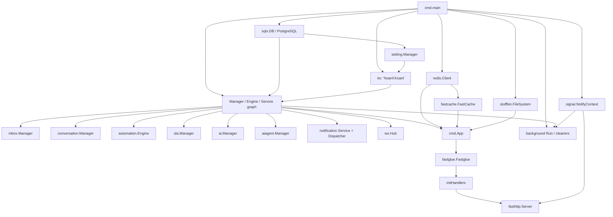
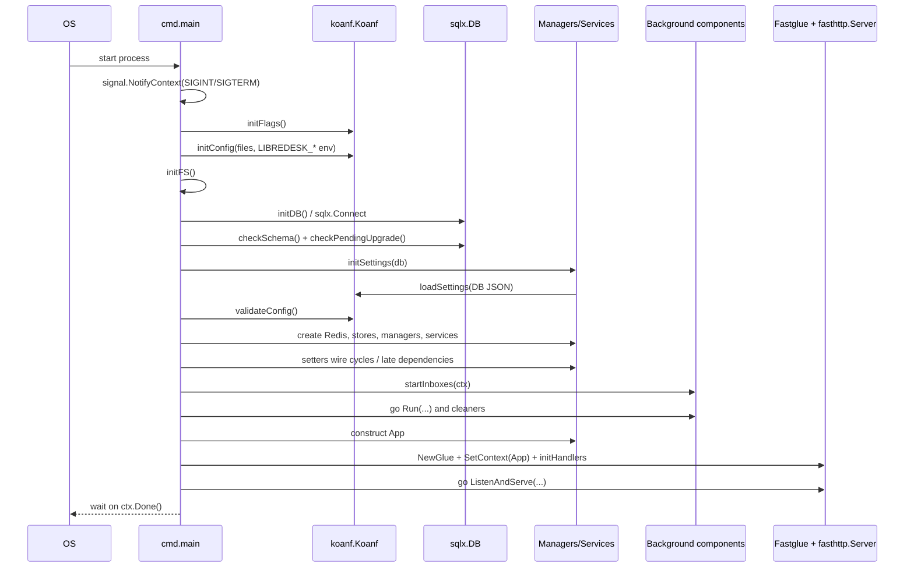
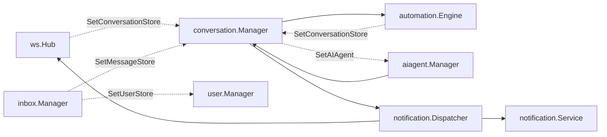
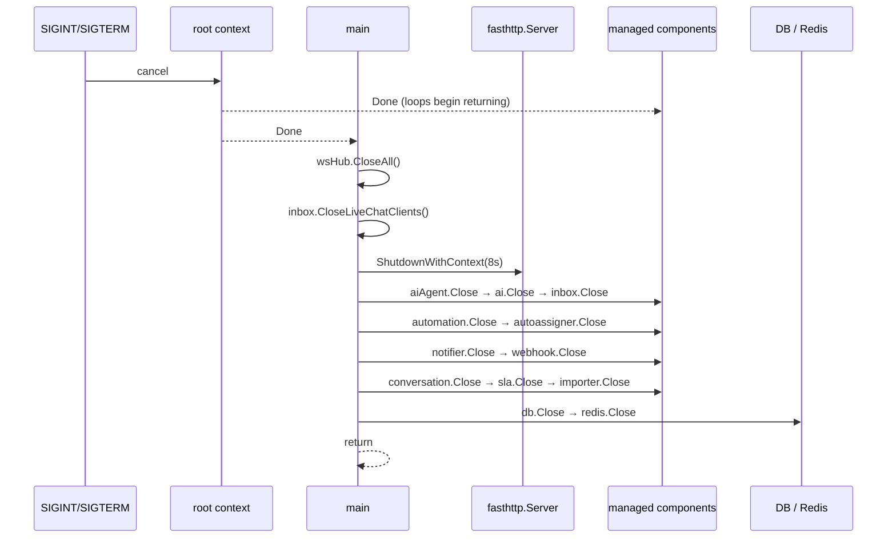

# LibreDesk 后端系统架构、模块边界与运行生命周期源码学习

## 1. 这个模块在 LibreDesk 中解决什么问题

这一章先建立整套教材的大局观：LibreDesk 如何把配置、PostgreSQL、Redis、Conversation、Inbox、WebSocket、Automation、SLA、通知与 AI 装配成一个可启动、可服务、可退出的 Go 进程。读完后进入[02：Conversation / Message 领域主线](02-domain-conversation-message-state-machine-l4.md)，后续章节再沿这条主线下沉到数据库、HTTP、安全、并发、实时通信和外部 I/O。

## 本章核心源码

| 优先级 | 文件 / Symbol | 为什么必须读 |
|---|---|---|
| P0 | [`main` → `cmd/main.go:146`](vscode://file/D:/codes/dev_proj/libredesk/cmd/main.go:146:1) | 组合根、启动顺序与退出顺序都在这里闭环 |
| P0 | [`App` → `cmd/main.go:96`](vscode://file/D:/codes/dev_proj/libredesk/cmd/main.go:96:1) | 看清 HTTP 请求共享哪些长生命周期依赖 |
| P0 | [`initConfig` → `cmd/init.go:90`](vscode://file/D:/codes/dev_proj/libredesk/cmd/init.go:90:1) | 配置文件、环境变量与数据库设置的合并入口 |
| P0 | [`initDB` → `cmd/init.go:950`](vscode://file/D:/codes/dev_proj/libredesk/cmd/init.go:950:1) | PostgreSQL 连接池与启动门禁入口 |
| P0 | [`initHandlers` → `cmd/handlers.go:20`](vscode://file/D:/codes/dev_proj/libredesk/cmd/handlers.go:20:1) | 组件装配如何进入 HTTP 路由 |
| P1 | [`conversation.Manager.Run` → `internal/conversation/message.go:55`](vscode://file/D:/codes/dev_proj/libredesk/internal/conversation/message.go:55:1) | 代表性后台 Scanner 与 Worker 的启动方式 |
| P1 | [`Hub.CloseAll` → `internal/ws/ws.go:67`](vscode://file/D:/codes/dev_proj/libredesk/internal/ws/ws.go:67:1) | 观察退出时实时连接如何停止 |

## 2. 一张图看懂整体机制

```text
配置文件 / 环境变量 / DB settings
              ↓
cmd.main 连接 PostgreSQL 并检查 schema / migration
              ↓
手工创建 Manager / Engine / Service，补齐环依赖
              ↓
启动 Inbox、Worker、Scanner、Cleaner 等后台组件
              ↓
构造 App → 注册 HTTP 路由 → fasthttp 开始监听
              ↓
SIGINT / SIGTERM → 停止入口 → 等待后台组件 → 关闭 DB / Redis
```

## 3. 必须先理解的核心概念

- **模块化单体（Modular Monolith）**：业务按 Go package 拆分，但 HTTP、后台 Worker、WebSocket 与多数业务 Manager 仍运行在同一进程中。
- **组合根（Composition Root）**：集中创建对象并连接依赖的位置；本项目的组合根是 `cmd.main`。
- **依赖注入（Dependency Injection，DI）**：由外部把 DB、Store、Manager 等协作者传给对象，而不是让对象自行创建；LibreDesk 主要使用构造参数和少量 setter。
- **优雅退出（Graceful Shutdown）**：收到退出信号后停止接收新工作，等待可管理任务收敛，再关闭底层连接。
- **排空（Drain）**：停止接收新任务后，继续处理已经进入队列或请求入口的工作，再释放依赖；LibreDesk 只有部分组件明确等待 Worker，且 HTTP drain 有独立超时。
- **仓储模式（Repository Pattern）**：用独立对象封装持久化操作；LibreDesk 多数模块没有统一 Repository，而是由 Manager 直接持有命名 SQL。
- **分发器（Dispatcher）**：接收一个领域通知并协调数据库、WebSocket、Email 等多个下游；它不等于持久消息代理。

## 4. 源码阅读路线

**启动与配置路线：** [`main`](vscode://file/D:/codes/dev_proj/libredesk/cmd/main.go:146:1) → [`initConfig`](vscode://file/D:/codes/dev_proj/libredesk/cmd/init.go:90:1) → [`initDB`](vscode://file/D:/codes/dev_proj/libredesk/cmd/init.go:950:1) → 各模块 `New` / `Run`。

**HTTP 装配路线：** [`App`](vscode://file/D:/codes/dev_proj/libredesk/cmd/main.go:96:1) → [`initHandlers`](vscode://file/D:/codes/dev_proj/libredesk/cmd/handlers.go:20:1) → `fastglue` Router → `fasthttp.Server`。

**退出路线：** [`main` 的信号等待与 shutdown](vscode://file/D:/codes/dev_proj/libredesk/cmd/main.go:369:1) → [`Hub.CloseAll`](vscode://file/D:/codes/dev_proj/libredesk/internal/ws/ws.go:67:1) → HTTP drain → 各组件 `Close` → DB / Redis `Close`。

本章只追踪后端进程如何启动、装配、提供 HTTP/后台服务并退出；Conversation SQL、Worker 算法和 WebSocket 并发分别由后续章节展开。

## 5. 从整体模块图理解单进程架构

### 真实进程结构



### 模块边界不是统一的四层模板

[`cmd.App`](vscode://file/D:/codes/dev_proj/libredesk/cmd/main.go:95:1) 持有 HTTP Handler 需要的绝大多数对象，包括认证、权限、业务 Manager、通知、Redis、缓存、Importer 和 WebSocket Hub。`g.SetContext(app)` 把同一个 `*App` 注入所有 Fastglue 请求；Handler 再以 `r.Context.(*App)` 获取依赖（例如 [`cmd/config.go:13`](vscode://file/D:/codes/dev_proj/libredesk/cmd/config.go:13:1)）。

**【代码分析】** 当前代码不能准确概括为严格的 `Handler → Service → Repository` 三层：

- `cmd/*.go` 是进程入口、装配、路由和 HTTP Handler 层。
- 多数 `internal/*/Manager` 同时持有预编译 SQL（Prepared SQL）和领域协作者，例如 [`conversation.Manager`](vscode://file/D:/codes/dev_proj/libredesk/internal/conversation/conversation.go:84:1) 同时持有 `queries`、`*sqlx.DB`、多个 store 接口、队列、`ws.Hub` 和通知 Dispatcher。
- `automation.Engine`、`autoassigner.Engine` 表达长生命周期业务执行器；`notification.Service`、`notification.Dispatcher` 分别表达异步出站队列和多通道协调；`inbox.Manager` 既是 inbox 配置/查询边界，也是运行中 channel receiver 的注册表。
- 数据访问没有独立的统一 Repository 对象；各 Manager 的 `New` 通常通过 `dbutil.ScanSQLFile("queries.sql", ...)` 把包内 SQL 装入自身 `queries` 字段。例：[`setting.New`](vscode://file/D:/codes/dev_proj/libredesk/internal/setting/setting.go:46:1)、[`conversation.New`](vscode://file/D:/codes/dev_proj/libredesk/internal/conversation/conversation.go:227:1)、[`inbox.New`](vscode://file/D:/codes/dev_proj/libredesk/internal/inbox/inbox.go:122:1)。

**【合理推断】** 这种形态更接近“按业务能力拆包的模块化单体 + 手写装配”，而不是为了遵循某个命名架构。源码未记录原作者选择它的原因。

### 基础依赖初始化

| 依赖 | 创建 Symbol | 实际输入与行为 | 主要消费者 |
|---|---|---|---|
| 静态/模板文件系统 | `initFS` | 优先读取打包进二进制的 stuffbin；开发模式退回本地 `i18n`、`static`、可选 frontend dist；`--static-dir` 可合并覆盖 | i18n、template、静态页面 |
| PostgreSQL | `initDB` | 由 `db.*` 拼 DSN，`sqlx.Connect("postgres", dsn)` 建连并验证，再设置 max open/idle/lifetime | 几乎所有业务 Manager |
| Redis | `initRedis` | 优先 `redis.url`，否则使用 address/user/password/db 创建 `redis.Client` | auth、rate limit、AI Agent、FastCache |
| 缓存 | `initFastCache` | `fastcache.New(goredis.New(..., rdb))`，后端仍是同一个 Redis client，prefix 为 `fastCachePrefix` | Help Center 页面缓存路径等 HTTP 逻辑 |
| 媒体 Store | `initMedia` | `upload.provider` 选择 `s3.New` 或 local `fs.New`，再注入 `media.New` | Conversation、AI Agent、媒体 Handler |
| 邮件通知客户端 | `initNotifier` | 从 `notification.email` 反序列化 SMTP 配置，创建 `emailnotifier.Email` 的 SMTP pools，再放入 `notification.Service` | `notification.Dispatcher`、AI Agent、SLA 等 |
| Inbox 外部通道 | `startInboxes` | 从 DB 读取 active inbox；email inbox 创建 SMTP pools，receiver 启动 IMAP 循环；livechat 创建 channel 对象 | `inbox.Manager`、Conversation |
| AI 外部 HTTP 客户端 | `initAI` → `ai.New` | 创建共享 SSRF（服务端请求伪造）受控 Transport，以及 20s/60s timeout 的三个 `http.Client` | AI completion、embedding、tools |

证据：[`cmd/init.go:171`](vscode://file/D:/codes/dev_proj/libredesk/cmd/init.go:171:1)、[`cmd/init.go:573`](vscode://file/D:/codes/dev_proj/libredesk/cmd/init.go:573:1)、[`cmd/init.go:926`](vscode://file/D:/codes/dev_proj/libredesk/cmd/init.go:926:1)、[`cmd/init.go:945`](vscode://file/D:/codes/dev_proj/libredesk/cmd/init.go:945:1)、[`cmd/init.go:950`](vscode://file/D:/codes/dev_proj/libredesk/cmd/init.go:950:1)、[`cmd/init.go:675`](vscode://file/D:/codes/dev_proj/libredesk/cmd/init.go:675:1)、[`cmd/init.go:697`](vscode://file/D:/codes/dev_proj/libredesk/cmd/init.go:697:1)、[`internal/ai/ai.go:131`](vscode://file/D:/codes/dev_proj/libredesk/internal/ai/ai.go:131:1)。

## 6. 核心链路一：进程如何启动并进入服务态

### 主服务路径



逐步展开：

1. **信号上下文先创建。** `signal.NotifyContext` 监听 `os.Interrupt`、`SIGINT`、`SIGTERM`，形成贯穿启动、后台任务和退出的根 context（[`cmd/main.go:146`](vscode://file/D:/codes/dev_proj/libredesk/cmd/main.go:146:1)）。
2. **CLI flags 先进入全局 `ko`。** `initFlags` 注册 `config/version/install/idempotent-install/yes/upgrade/set-system-user-password/static-dir`，解析后由 posflag provider Load（[`cmd/init.go:127`](vscode://file/D:/codes/dev_proj/libredesk/cmd/init.go:127:1)）。
3. **配置文件随后按 `config` 列表顺序加载，再加载 `LIBREDESK_` 环境变量。** 环境变量名去前缀、转小写、双下划线变点号，例如 `LIBREDESK_DB__HOST` → `db.host`（[`cmd/init.go:90`](vscode://file/D:/codes/dev_proj/libredesk/cmd/init.go:90:1)）。
4. `go.mod` 锁定 Koanf v2.1.1；该版本 `Load` 调 `merge`，默认 `maps.Merge(incoming, existing)`，相同非 map key 由 incoming value 覆盖。因此当前代码的有效覆盖顺序是：较晚配置文件 > 较早配置文件 > flags 中同名 key；环境变量 > 配置文件；稍后 DB settings > 前述来源。依赖证据在本机 module cache 的 `koanf.go:87-120,405-420` 与 `koanf/maps.go:114-137`。
5. **静态资源和 DB 先于业务组件。** `initFS` 后立刻 `initDB`。`sqlx.Connect` 失败会 `log.Fatalf`；连接成功后设置连接池参数（[`cmd/main.go:173`](vscode://file/D:/codes/dev_proj/libredesk/cmd/main.go:173:1)、[`cmd/init.go:950`](vscode://file/D:/codes/dev_proj/libredesk/cmd/init.go:950:1)）。
6. **存在三个短路命令模式。** `--install`、`--set-system-user-password`、`--upgrade` 分支执行后 `os.Exit(0)`，不会继续装配 HTTP 服务；`--version` 更早退出（[`cmd/main.go:154`](vscode://file/D:/codes/dev_proj/libredesk/cmd/main.go:154:1)、[`cmd/main.go:178`](vscode://file/D:/codes/dev_proj/libredesk/cmd/main.go:178:1)、[`cmd/main.go:198`](vscode://file/D:/codes/dev_proj/libredesk/cmd/main.go:198:1)）。
7. **正常服务有 schema/migration gate。** `checkSchema` 实际执行 `SELECT * FROM settings LIMIT 1`；缺表时提示安装并退出。`checkPendingUpgrade` 若发现待执行 migration 则 `log.Fatalf`，阻止旧 schema 与新二进制一起提供服务（[`cmd/install.go:75`](vscode://file/D:/codes/dev_proj/libredesk/cmd/install.go:75:1)、[`cmd/upgrade.go:145`](vscode://file/D:/codes/dev_proj/libredesk/cmd/upgrade.go:145:1)）。
8. **DB settings 最后合并回同一个 `ko`。** `setting.Manager.GetAllJSON` 通过 `SELECT JSON_OBJECT_AGG(key, value) ... FROM settings` 读取并解密，再由 `confmap.Provider` Load（[`cmd/init.go:243`](vscode://file/D:/codes/dev_proj/libredesk/cmd/init.go:243:1)、[`internal/setting/queries.sql:1`](vscode://file/D:/codes/dev_proj/libredesk/internal/setting/queries.sql:1:1)）。这意味着 DB 连接参数本身不可能由 DB settings 决定，因为 DB 已先连接；但 DB settings 可以覆盖其后读取的应用配置。
9. **`validateConfig` 当前只强制检查 encryption key 长度为 32，并警告 sample key；大量必填值由后续 `ko.Must*` 读取时约束（[`cmd/init.go:112`](vscode://file/D:/codes/dev_proj/libredesk/cmd/init.go:112:1)）。
10. **依赖按 `main` 中局部变量顺序手工创建。** Redis、常量、i18n、状态/优先级、认证、模板、媒体、Inbox、Team、Webhook、User、Hub、Notifier、Automation、AI、SLA、Conversation、AI Agent 等依次构造（[`cmd/main.go:223`](vscode://file/D:/codes/dev_proj/libredesk/cmd/main.go:223:1)）。构造器错误普遍由 `log.Fatalf` 终止启动。
11. **环依赖通过 late wiring（延迟接线）补齐。** `wsHub.SetConversationStore(conversation)`、`automation.SetConversationStore(conversation)`、`automation.SetSystemUserID(...)`、`conversation.SetAIAgent(aiAgent)` 在全部相关对象构造后执行（[`cmd/main.go:263`](vscode://file/D:/codes/dev_proj/libredesk/cmd/main.go:263:1)）。
12. **Inbox 先于通用后台 loops 启动。** `startInboxes` 先把 `conversation` 设为 MessageStore、`user` 设为 UserStore，再初始化 DB 中 active inbox 并启动每个 receiver（[`cmd/init.go:811`](vscode://file/D:/codes/dev_proj/libredesk/cmd/init.go:811:1)）。
13. **后台组件启动后才构造 `App`、注册路由、启动 HTTP。** 因而“开始监听 HTTP”不是进程初始化完成的唯一标志；大量后台 worker 在它之前已经可运行（[`cmd/main.go:272`](vscode://file/D:/codes/dev_proj/libredesk/cmd/main.go:272:1)、[`cmd/main.go:291`](vscode://file/D:/codes/dev_proj/libredesk/cmd/main.go:291:1)、[`cmd/main.go:337`](vscode://file/D:/codes/dev_proj/libredesk/cmd/main.go:337:1)）。

### 配置传递方式

**【代码分析】** 配置不是解析成一个不可变的总 `Config` struct 再逐层传递，而是：

- 全局 `ko` 作为可变配置注册表；`main`/`init*` 直接调用 `ko.String`、`ko.MustInt`、`ko.MustDuration`。
- 局部复杂配置用 `ko.UnmarshalWithConf` 转 struct，例如通知 SMTP 和 inbox JSON。
- 值在构造时复制到各 `Opts` 或 struct；只有少量回调在运行时重新查询 `setting.Manager`，例如 media `rootURL`。
- `App.consts` 用 `atomic.Value` 持有运行时常量快照，其他依赖以指针保存。

**【合理推断】** `initEmailInbox` 和 `initLiveChatInbox` 使用同一个全局 `ko.Load(rawbytes.Provider(inboxRecord.Config), ...)` 解析每个 inbox JSON（[`cmd/init.go:697`](vscode://file/D:/codes/dev_proj/libredesk/cmd/init.go:697:1)、[`cmd/init.go:761`](vscode://file/D:/codes/dev_proj/libredesk/cmd/init.go:761:1)）。按 Koanf 合并语义，这不是临时解析器，而会把 inbox key 合入全局配置。当前源码不能证明已有 key 冲突已经造成错误，但这是可测试的共享可变状态耦合，见 H.2。

## 7. 核心链路二：组件如何装配并进入 HTTP 请求

### 谁创建谁、谁持有谁

统一创建者是 `cmd.main` 配合 `cmd/init.go` 的 `init*` helper。没有读取到代码生成 DI（Dependency Injection，依赖注入）容器；注入方式是构造函数参数、`Opts`、接口参数和少量 setter。

| 组件 | 由谁创建 | 持有的关键依赖 | 生命周期角色 |
|---|---|---|---|
| `setting.Manager` | `initSettings` | DB prepared queries、logger、encryption key | 启动时把 DB settings 合入 Koanf；运行时管理设置 |
| `inbox.Manager` | `initInbox` | inbox map、receiver map、MessageStore/UserStore、WaitGroup、encryption key | 动态通道注册表和 receiver owner |
| `conversation.Manager` | `initConversations` | store 接口、DB、WS Hub、Automation、Template、Webhook、Dispatcher、双队列、WaitGroup | 核心会话协作器和消息 worker owner |
| `automation.Engine` | `initAutomationEngine` | rules、prepared queries、task queue、conversationStore、WaitGroup | 事件/定时规则执行器 |
| `notification.Service` | `initNotifier` | provider map、message channel、worker WaitGroup | 异步外发通知队列 |
| `notification.Dispatcher` | `initNotifDispatcher` | DB notification manager、outbound Service、WS Hub | 协调 DB/WS/email 多通道；自身无 Run/Close |
| `sla.Manager` | `initSLA` | DB、Team/Settings/BusinessHours/Template/User/Dispatcher、WaitGroup | 两个 SLA 评估 loop 和通知扫描 |
| `ai.Manager` | `initAI` | DB、HTTP clients、embedding index、context、WaitGroup | AI provider/tool/embedding 能力与 reconcile loop |
| `aiagent.Manager` | `initAIAgent` | AI、Conversation、Media、Settings、User、Notifier、Redis、queues、WaitGroup | 自主回复和 FAQ mining worker owner |
| `ws.Hub` | `initWS` | user store、连接/订阅映射 | Handler 与业务广播共享的进程内连接中心 |
| `cmd.App` | `main` struct literal | 上述对象及 auth/authz、cache、importer 等 | HTTP 层的统一 container（容器） |

关键结构证据：[`cmd.App`](vscode://file/D:/codes/dev_proj/libredesk/cmd/main.go:95:1)、[`conversation.Manager`](vscode://file/D:/codes/dev_proj/libredesk/internal/conversation/conversation.go:84:1)、[`inbox.Manager`](vscode://file/D:/codes/dev_proj/libredesk/internal/inbox/inbox.go:96:1)、[`automation.Engine`](vscode://file/D:/codes/dev_proj/libredesk/internal/automation/automation.go:49:1)、[`notification.Service`](vscode://file/D:/codes/dev_proj/libredesk/internal/notification/notification.go:44:1)、[`notification.Dispatcher`](vscode://file/D:/codes/dev_proj/libredesk/internal/notification/dispatcher.go:45:1)、[`aiagent.Manager`](vscode://file/D:/codes/dev_proj/libredesk/internal/aiagent/aiagent.go:64:1)。

### 显式 DI 与环依赖处理



**【代码分析】** 构造器注入是主方式，但 Conversation/Automation/AI Agent/WS/Inbox 构成双向关系，源码用包内小接口加 setter 打破构造顺序和 import cycle（导入环）。这使依赖可见，但“不完整对象在 setter 前暂时存在”成为启动不变量：这些对象不能在 late wiring 完成前接受相关事件。

当前 `main` 先完成 setter，再执行 `startInboxes` 和通用 worker 启动，因此正常主路径满足该不变量（[`cmd/main.go:263`](vscode://file/D:/codes/dev_proj/libredesk/cmd/main.go:263:1)）。

### HTTP Router、Server 与 Middleware 层次

HTTP 装配链是：

```text
fastglue.NewGlue()
→ g.SetContext(app)
→ initHandlers(g, wsHub)
→ g.Router.NotFound = helpCenterHostNotFound(app, g)
→ &fasthttp.Server{timeouts/body/buffer options}
→ g.ListenAndServe(address, socket, s)
```

见 [`cmd/main.go:337`](vscode://file/D:/codes/dev_proj/libredesk/cmd/main.go:337:1)。锁定的 Fastglue v1.8.0 `ListenAndServe` 会把 `f.Handler()` 设到传入的 `fasthttp.Server.Handler`，并且要求 TCP address 与 Unix socket 二选一；本机 module cache `fastglue.go:73-97` 已核对。

`initHandlers` 逐条注册 API、Widget、WebSocket、页面、静态资源、Help Center、CSAT 和 `/health` 路由（[`cmd/handlers.go:20`](vscode://file/D:/codes/dev_proj/libredesk/cmd/handlers.go:20:1)、[`cmd/handlers.go:360`](vscode://file/D:/codes/dev_proj/libredesk/cmd/handlers.go:360:1)）。没有统一 `g.Use(...)` 注册；中间件表现为路由注册时的函数包装：

- `auth(handler)`：API key 或 session 认证；session 写操作检查 CSRF（跨站请求伪造）token。
- `perm(handler, "object:action")`：认证后调用 `app.authz.Enforce`。
- `rateLimit(handler, rule)`：调用 Redis-backed limiter。
- `widgetAuth`、`validateWidgetInbox`：Widget 边界。
- `authOrSignedURL`：认证、签名 URL 或 public media 分支。
- `authPage`/`notAuthPage`：前端页面访问和跳转。
- Help Center cache/host 包装器位于公开页面与 NotFound 路径。

这里只确认其整体层次和包装顺序，不展开认证策略。核心证据：[`cmd/middlewares.go:27`](vscode://file/D:/codes/dev_proj/libredesk/cmd/middlewares.go:27:1)、[`cmd/middlewares.go:110`](vscode://file/D:/codes/dev_proj/libredesk/cmd/middlewares.go:110:1)、[`cmd/middlewares.go:140`](vscode://file/D:/codes/dev_proj/libredesk/cmd/middlewares.go:140:1)、[`cmd/middlewares.go:241`](vscode://file/D:/codes/dev_proj/libredesk/cmd/middlewares.go:241:1)。

`/health` 只返回 `true`，不探测 PostgreSQL、Redis、Inbox 或后台 worker（[`cmd/handlers.go:574`](vscode://file/D:/codes/dev_proj/libredesk/cmd/handlers.go:574:1)）。因此它是“HTTP 进程可响应”检查，不是完整 dependency readiness（依赖就绪）证明。

## 8. 后台组件如何启动与持有资源

### 构造时立即启动

| 组件 | 创建 | 启动 | 持有/等待 | 停止 |
|---|---|---|---|---|
| `ai.Manager` 初始索引加载 | `ai.New` | 构造函数内 `go func(){ loadIndex(); close(indexReady) }` | 以 `indexReady` 表示完成；该 goroutine未加入 `m.wg` | 没有单独 cancel/join；进程根 ctx 存在于 Manager，但 `loadIndex` 本身的这次启动未由 `Close` 明确等待 |
| `importer.Importer` 清理器 | `importer.New` | 构造函数内 `go i.cleanUp()` | 自有 context + `WaitGroup` | `Importer.Close` 调 cancel 并 Wait |

证据：[`internal/ai/ai.go:131`](vscode://file/D:/codes/dev_proj/libredesk/internal/ai/ai.go:131:1)、[`internal/importer/importer.go:42`](vscode://file/D:/codes/dev_proj/libredesk/internal/importer/importer.go:42:1)、[`internal/importer/importer.go:149`](vscode://file/D:/codes/dev_proj/libredesk/internal/importer/importer.go:149:1)。

### `main` 显式启动

[`cmd/main.go:272-289`](vscode://file/D:/codes/dev_proj/libredesk/cmd/main.go:272:1) 的完整启动集合如下。

| 后台入口 | 内部创建 | context 退出 | 显式 Close/Wait |
|---|---|---|---|
| `inbox.Manager.Start` | 每个 active inbox 一个 receiver；email receiver 内每个 IMAP config 再起 goroutine | receiver 使用根 ctx 派生 context | `inbox.Close` cancel receivers、关闭 channel、Wait |
| `automation.Engine.Run` | N 个 worker + 当前 Run 中的 hourly ticker | worker/Run 监听根 ctx | `Close` 关闭 taskQueue、Wait worker |
| `autoassigner.Engine.Run` | 当前 goroutine ticker loop | 监听根 ctx | `Close` 设 closed、Wait Run |
| `conversation.Manager.Run` | incoming/outgoing worker pools + DB scanner loop | 都监听根 ctx | `Close` 关双队列、Wait worker |
| `RunUnsnoozer` / `RunContinuity` / `RunDraftCleaner` | 各自 ticker loop | 监听根 ctx | 无单独 Wait；`conversation.Close` 的 WaitGroup 只覆盖消息 workers |
| `webhook.Manager.Run` | 配置数量的 delivery workers | worker 监听根 ctx | `Close` 关 queue、Wait |
| `notification.Service.Run` | 配置并发数 workers | Run 等 ctx 后自行 `Close` | `Close` 幂等标志、关 channel、Wait |
| `sla.Manager.Run` | 两个评估 goroutine | 监听根 ctx | `sla.Close` Wait 这两个 goroutine |
| `sla.SendNotifications` | 当前 ticker loop | 监听根 ctx | 未加入 SLA WaitGroup |
| `media.DeleteUnlinkedMedia` | 当前 timer loop | 监听根 ctx | 无 Wait |
| `user.MonitorUserAvailability` | 当前 ticker loop | 监听根 ctx | 无 Wait |
| notification/helpcenter cleaners | 当前 timer/ticker loop | 监听根 ctx | 无 Wait |
| `aiagent.Manager.Run` | N response workers + `min(N,2)` mining workers | workers主要通过关闭 queue drain，并检查 ctx | `Close` 关 queues、Wait |
| `ai.Manager.Run` | 一个 reconcile goroutine | 监听根 ctx | `Close` Wait `m.wg` 中 reconcile/embedding jobs |

主要实现证据：[`internal/inbox/inbox.go:531`](vscode://file/D:/codes/dev_proj/libredesk/internal/inbox/inbox.go:531:1)、[`internal/automation/automation.go:126`](vscode://file/D:/codes/dev_proj/libredesk/internal/automation/automation.go:126:1)、[`internal/conversation/message.go:53`](vscode://file/D:/codes/dev_proj/libredesk/internal/conversation/message.go:53:1)、[`internal/webhook/webhook.go:298`](vscode://file/D:/codes/dev_proj/libredesk/internal/webhook/webhook.go:298:1)、[`internal/notification/notification.go:91`](vscode://file/D:/codes/dev_proj/libredesk/internal/notification/notification.go:91:1)、[`internal/sla/sla.go:516`](vscode://file/D:/codes/dev_proj/libredesk/internal/sla/sla.go:516:1)、[`internal/aiagent/worker.go:52`](vscode://file/D:/codes/dev_proj/libredesk/internal/aiagent/worker.go:52:1)、[`internal/ai/embedding.go:289`](vscode://file/D:/codes/dev_proj/libredesk/internal/ai/embedding.go:289:1)。

### HTTP 后启动的常驻任务

HTTP listener goroutine 创建后，若 `app.check_updates` 为真，`checkUpdates` 在独立 goroutine 中启动。它先无条件 `time.Sleep(5m)`，之后每小时检查；函数没有 context 参数和 stop channel（[`cmd/updates.go:42`](vscode://file/D:/codes/dev_proj/libredesk/cmd/updates.go:42:1)）。

`startPprof` 若启用，会在业务组件构造前创建独立 `net.Listener` 并 `go http.Serve(ln, mux)`；函数不返回 server/listener handle，shutdown 路径没有关闭它（[`cmd/pprof.go:12`](vscode://file/D:/codes/dev_proj/libredesk/cmd/pprof.go:12:1)）。

## 9. 核心链路三：进程如何优雅退出

### 实际退出顺序



`main` 在 `<-ctx.Done()` 后先给 agent WebSocket 发送 going-away close，并关闭 livechat inbox clients，然后用独立的 8 秒 timeout context 调用 `s.ShutdownWithContext`（[`cmd/main.go:369`](vscode://file/D:/codes/dev_proj/libredesk/cmd/main.go:369:1)、[`Hub.CloseAll`](vscode://file/D:/codes/dev_proj/libredesk/internal/ws/ws.go:67:1)）。

**【代码分析】** 这个顺序先阻止现有实时连接继续生产请求，再 drain HTTP，随后关闭业务 worker，最后关闭 DB/Redis，基本符合“停止入口 → 收敛执行 → 释放底层依赖”的资源逆序原则。

组件级协调方式并不统一：

- 根 `context`：通知所有监听它的 loop 停止。
- 私有 cancel：Inbox 每个 receiver、Importer 自有生命周期。
- channel close + `WaitGroup`：Conversation、Automation、Notifier、Webhook、AI Agent。
- 仅 `WaitGroup`：SLA 两个评估 loop、AI reconcile/embedding jobs。
- 没有显式 join：Unsnoozer、Continuity、Draft cleaner、Media cleaner、User availability、User notification cleaner、Help Center cleaner、SLA notification scanner。

### 连接关闭覆盖面

| 资源 | 当前 shutdown 证据 | 判断 |
|---|---|---|
| HTTP 主 Server | `ShutdownWithContext(8s)` | 有超时 drain |
| Agent WebSocket | `wsHub.CloseAll()` | 主动发 close frame |
| Livechat clients / inbox channels | `CloseLiveChatClients()`，随后 `inbox.Close()` | 关闭并等待 receiver |
| Inbox SMTP pools | `email.Inbox.Close` → `closeSMTPPool` | 由 Inbox manager 间接关闭 |
| PostgreSQL | `db.Close()` | 显式关闭 |
| Redis | `rdb.Close()` | 显式关闭；FastCache 共用该 client，无另一个连接句柄 |
| 通知专用 SMTP pools | `notification.Service.Close` 只关闭队列和 worker | 当前 Service、Email provider 的直接关闭链中未发现显式关闭 provider SMTP pools 的实现 |
| AI HTTP transports | `ai.Close` 只 Wait；未调 `CloseIdleConnections` | 当前 `ai.Close` 及其直接依赖中未发现显式清理 idle connections 的实现；进程退出会由 OS 回收，但这不等于应用层优雅关闭 |
| pprof listener | handle 未保存 | **【代码分析】**读取 `cmd/pprof.go` 和 `cmd/main.go` shutdown 后未找到关闭证据 |
| update checker | 无 ctx/stop | 不会被应用逻辑主动停止；`main` 返回后随进程结束 |

### 异常启动路径

多数初始化错误、migration 不匹配和 HTTP listen 错误走 `log.Fatalf`。HTTP listener 在 goroutine 内调用 `log.Fatalf`（[`cmd/main.go:354`](vscode://file/D:/codes/dev_proj/libredesk/cmd/main.go:354:1)），这会直接 `os.Exit(1)`，不会走上述正常 shutdown 链。

**【代码分析】** 所以当前系统只有“收到根 context 取消”的路径具备显式资源收敛；启动中后段失败并没有统一 rollback/cleanup stack。

## 10. 已确认的工程限制与待实验验证

### 未统一 join 的 goroutine 是否会与 DB/Redis Close 竞态

若干周期 loop 会监听根 context，但没有被 `main` 或组件 `Close` 显式等待。

**【合理推断】** 信号到达时，某个无 join loop 可能已经进入不带 context 的 DB/外部调用；主 shutdown 继续关闭 DB/Redis，而该调用尚未返回。源码能证明“缺少统一等待”，不能证明线上一定发生资源竞态。

**最小实验**：

1. 给其中一个 cleaner 的实际 I/O 注入可控阻塞（测试 fake 或本地 DB `pg_sleep`）。
2. 进入 I/O 后向子进程发送 SIGINT。
3. 记录 goroutine 返回、`db.Close`、进程退出的先后，并用 `go test -race` 运行仅该生命周期测试。
4. 验收点不是吞吐，而是 `db.Close` 前所有需要 DB 的任务都已返回。

### 全局 Koanf 被 inbox JSON 污染或覆盖的可能性

`initEmailInbox`/`initLiveChatInbox` 对全局 `ko` 调 `Load`；Koanf v2.1.1 默认后载入 key 覆盖先前 key。

**最小实验**：构造一个测试 inbox config，包含与全局配置相同的无害 key（例如测试专用 `app.site_name`），调用 initializer 前后比较 `ko.Get`；测试结束恢复全局 `ko`。若值变化，即证明存在跨配置域写入，而不需要启动真实 SMTP/IMAP。

### Redis 启动可用性与 `/health` 语义

**【代码分析】** [`initRedis`](vscode://file/D:/codes/dev_proj/libredesk/cmd/init.go:926:1) 构造 Client 时没有执行 Redis Ping；[`handleHealthCheck`](vscode://file/D:/codes/dev_proj/libredesk/cmd/handlers.go:575:1) 只返回 `true`。因此当前源码没有显示启动时验证 Redis 可用，也没有在 `/health` 检查下游依赖。

**最小实验**：使用不可达 Redis 地址启动，分别观察进程能否进入 HTTP listen、`/health` 是否仍为成功、首次 session/rate-limit/cache 操作何时失败。记录阶段和错误，不做完整压测。

### HTTP ready 与后台 ready 的边界

AI 初始索引在 `ai.New` 内异步加载；HTTP listener 不等待 `indexReady`。Inbox 初始化失败则会在 HTTP 启动前 fatal。不同子系统的 ready 语义不一致。

**最小实验**：让 AI `loadIndex` 可控延迟，启动后立即请求 `/health` 和一个依赖 embedding index 的最小 API，比较可用时间点。该实验用于定义 readiness，不用于提前断言这是缺陷。

### Shutdown 超时边界

只有 HTTP drain 有固定 8 秒 timeout；后续各 `Close().Wait()` 没有共同总 deadline。

**最小实验**：分别让 HTTP Handler、Webhook/Notification sender、AI Agent job 阻塞，发送 SIGTERM，测量每个阶段是否退出以及总时长。验收应明确“允许丢弃、必须 drain、最大等待”三类策略。

### 外部连接是否完整关闭

**【代码分析】** Inbox SMTP pools 有明确关闭路径；通知专用 SMTP pools、pprof listener、AI HTTP idle connections 与 update checker 没有相应的应用层显式关闭路径。

**设计建议**：为进程级资源建立统一 `App.Close(ctx)` 或按创建逆序登记 cleanup callbacks；所有常驻 goroutine 纳入同一个 `errgroup`/WaitGroup；给 HTTP 与后台 drain 共用总 shutdown deadline；让 pprof/update checker 也接收根 context。这里是替代设计，不是当前实现事实。

## 11. 面试表达

> LibreDesk 后端是一个按业务 package 拆分的模块化单体。`cmd.main` 作为组合根，先合并配置并连接 PostgreSQL，在 schema 与 migration 检查通过后手工创建各 Manager、Engine 和 Service，再补齐少量环依赖。Inbox receiver 和后台 Worker 先启动，随后统一的 `App` 被放入 HTTP 请求上下文。退出时根 context 取消，进程先停止实时连接与 HTTP 接入，再等待可管理的后台组件，最后关闭 PostgreSQL 和 Redis。这种集中装配便于追踪依赖，但当前部分常驻 goroutine 没有统一 join，优雅退出的完整性仍依赖各组件自己的生命周期实现。

## 本章必须记住的源码锚点

### [`main`](vscode://file/D:/codes/dev_proj/libredesk/cmd/main.go:146:1)
**为什么必须记住：** 启动、装配、运行和退出的总控制流。  
**面试关联：** 为什么它是 LibreDesk 的组合根？

### [`initConfig`](vscode://file/D:/codes/dev_proj/libredesk/cmd/init.go:90:1)
**为什么必须记住：** 多配置来源在这里形成最终运行参数。  
**面试关联：** 配置覆盖顺序怎样影响可预测性？

### [`initDB`](vscode://file/D:/codes/dev_proj/libredesk/cmd/init.go:950:1)
**为什么必须记住：** 连接池和数据库启动门禁的入口。  
**面试关联：** 进程何时才具备访问业务数据的条件？

### [`App`](vscode://file/D:/codes/dev_proj/libredesk/cmd/main.go:96:1)
**为什么必须记住：** 汇集 Handler 所需长生命周期依赖。  
**面试关联：** 这种显式依赖容器的收益与代价是什么？

### [`initHandlers`](vscode://file/D:/codes/dev_proj/libredesk/cmd/handlers.go:20:1)
**为什么必须记住：** 从组件图进入 HTTP API 的装配点。  
**面试关联：** 路由、中间件和业务 Manager 如何连接？

### [`main` shutdown](vscode://file/D:/codes/dev_proj/libredesk/cmd/main.go:369:1)
**为什么必须记住：** 入口停止、Worker 收敛和底层连接关闭的顺序。  
**面试关联：** 当前优雅退出的数据库一致性与 goroutine 边界在哪里？

## 12. 面试追问

1. 为什么 `cmd.main` 可以称为组合根？
2. LibreDesk 为什么不是严格的 Controller-Service-Repository 三层？
3. schema / migration gate 解决了什么启动风险？
4. 当前优雅退出中，哪些 goroutine 尚未统一 join？
