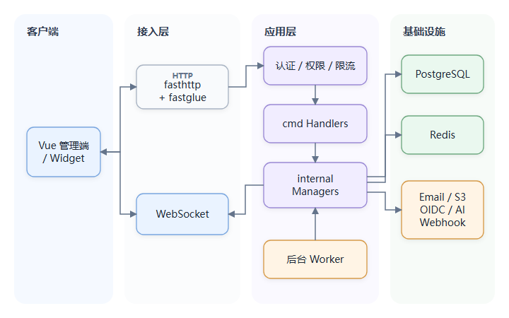

# Day 1：架构、启动与依赖装配

## 1. 项目是什么架构

LibreDesk 是一个**模块化单体应用**（按业务模块组织、但整体仍作为一个进程部署）：

- 一个 Go 进程承载 HTTP API（基于超文本传输协议的应用接口）、页面服务、后台 Worker（工作协程）和 WebSocket（全双工长连接协议）。
- PostgreSQL 保存核心业务状态。
- Redis 保存 Session（服务端登录会话），并承载缓存、限流和部分临时状态。
- Email、S3（对象存储服务）、OIDC（OpenID Connect，身份认证协议）、AI Provider（人工智能模型提供方）、Webhook（事件回调）地址属于外部依赖。
- Vue 主应用和聊天 Widget（嵌入式聊天组件）构建后随 Go 二进制一起分发。

源码证据：

- [`cmd/main.go`](../../cmd/main.go#L96) 中的 `App` 聚合各领域 Manager（领域业务管理器）。
- [`cmd/main.go`](../../cmd/main.go#L146) 中的 `main()` 完成所有初始化和生命周期管理。
- [`Makefile`](../../Makefile) 使用 `stuffbin` 把前端产物、i18n（国际化资源）、schema（数据库结构定义）和静态资源塞进单个二进制。
- [`docker-compose.yml`](../../docker-compose.yml) 只启动 app、PostgreSQL、Redis 三类服务。

这不是传统的严格三层架构。更准确的结构是：



`cmd` 层不仅是入口，还承担 HTTP 适配：解析请求、取当前用户、调用领域 Manager、转换错误。`internal/<module>` 负责业务规则、数据访问和外部协作。每个模块通常包含：

```text
internal/<module>/
  <module>.go       Manager、接口和业务方法
  models/models.go  数据模型
  queries.sql       命名 SQL
  *_test.go         单元或集成测试
```

## 2. `main()` 的启动顺序

从 [`main()`](../../cmd/main.go#L146-L408) 顺序阅读，不要跳着看。它既是进程入口，也是所有运行时依赖和后台任务的 Composition Root（组合根）。

关键调用顺序可以直接和源码对照：

```text
signal.NotifyContext
  -> initFlags / initConfig
  -> initFS -> initDB
  -> install / upgrade 等特殊分支
  -> initSettings / loadSettings -> validateConfig
  -> 构造 Redis 与各领域 Manager
  -> 回填循环依赖 -> startInboxes -> 启动 Worker
  -> App -> fastglue -> initHandlers -> fasthttp.Server
```

### 2.1 进程级生命周期

```go
ctx, stop := signal.NotifyContext(
    context.Background(),
    os.Interrupt, syscall.SIGINT, syscall.SIGTERM,
)
```

根 `context`（Go 中传递取消信号、超时和请求范围数据的上下文对象）把操作系统退出信号传给 HTTP Server 和后台 Worker。这是 Go 服务常见的结构化关闭方式：组件不应各自监听信号，而应共同响应一个生命周期上下文。

### 2.2 配置优先级

[`cmd/init.go`](../../cmd/init.go) 的配置过程大致为：

```text
命令行参数指定配置文件
  -> TOML 文件
  -> LIBREDESK_ 前缀环境变量
  -> 数据库 settings
  -> validateConfig
```

环境变量用双下划线表达层级。例如：

```text
LIBREDESK_DB__HOST       -> db.host
LIBREDESK_APP__ROOT_URL  -> app.root_url
```

注意数据库 settings 在建立数据库连接之后才加载，因此数据库连接自身不能依赖数据库内的 settings。

还要注意一个容易说反的事实：`koanf.Load` 后加载的值覆盖先加载的值，所以数据库 settings 的优先级高于环境变量。环境变量并不是最终覆盖层。生产系统通常希望不可变部署配置或密钥不被业务数据库反向覆盖，因此二次开发前应先按 key 分类：哪些允许后台热更新，哪些只能来自文件/环境变量。

### 2.3 安装和升级是进程的特殊模式

主程序支持：

- `--install`：安装初始 schema。
- `--idempotent-install`：schema 已存在时跳过。
- `--upgrade`：执行版本迁移。
- `--set-system-user-password`：设置系统用户密码。

这些模式完成操作后立即退出，不进入正常服务阶段。容器启动命令会先 install，再 upgrade，最后启动服务。

### 2.4 依赖装配

`main()` 依次创建 Manager，并把较底层依赖传给较高层。例如 Conversation 依赖：

- Database 和 Logger
- Inbox、User、Team、Media
- SLA（服务等级协议）、Automation（自动化）、Template（消息模板）
- Webhook、Notification、WebSocket

Manager 之间主要依靠小接口连接，例如 Conversation 只要求 `webhookStore` 实现 `TriggerEvent`，而不是依赖 Webhook 的全部实现。这种方式有三个好处：

1. 降低模块耦合。
2. 便于用 mock（模拟依赖）做单元测试。
3. 接口靠近使用者定义，能表达真正需要的能力。

但 `main()` 中手工装配非常长，也说明应用已经接近模块化单体手工依赖注入的复杂度上限。

构造完成后，[`main()` 回填三处依赖](../../cmd/main.go#L263-L270)：

```go
wsHub.SetConversationStore(conversation)
automation.SetConversationStore(conversation)
conversation.SetAIAgent(aiAgent)
```

这说明对象关系不是纯树：WebSocket 依赖 Conversation 做订阅授权，Automation 依赖 Conversation 执行动作，Conversation 又需要通知 AI Agent。二次开发若继续增加 setter 回填，应先把依赖缩成调用方定义的小接口，避免演变成难以隔离测试的全局对象网。

## 3. 后台任务是怎样启动的

[`main()` 的 Worker 启动段](../../cmd/main.go#L272-L289) 会启动：

- Automation Worker Pool（自动化工作协程池）
- 自动分配器
- 消息收发 Worker Pool
- 会话自动取消 Snooze
- Live Chat 连续性邮件
- Webhook Worker
- Notification Worker
- SLA 评估和提醒
- 无主媒体清理
- 用户在线状态监控
- 草稿清理
- AI Agent 和 Embedding 后台任务
- 用户通知清理与 Help Center 搜索日志清理
- 可选的应用版本更新检查

这些 Worker 与 HTTP Server 同进程运行，部署简单、函数调用直接，但也带来几个工程问题：

- HTTP 流量和后台任务争抢 CPU、内存、数据库连接。
- 单个进程退出会同时影响所有能力。
- 多实例部署时，定时扫描任务可能被每个实例重复执行。
- 需要逐项检查任务是否具备分布式锁、数据库抢占或幂等性。

这里应形成一个重要判断：**模块化单体并不等于不能扩展，但横向扩容前必须审计后台任务的多实例语义。**

源码还有一个值得单独核对的类型细节：[`main()`](../../cmd/main.go#L228-L230) 用 `MustDuration` 读取 incoming/outgoing Worker 数，而 [`Conversation.Run`](../../internal/conversation/message.go#L55-L72) 用整数 `range` 创建 Worker。`time.Duration` 底层是整数，所以能编译，但配置语义不清晰。学习时应打印实际值确认 `10` 最终创建 10 个 Worker；二次开发可统一改为 `MustInt` 和 `int`。

## 4. HTTP Server 与静态资源

[`cmd/main.go`](../../cmd/main.go#L337) 创建 `fastglue`，注入全局 `App`，注册路由；随后构造 `fasthttp.Server`。

服务端参数来自配置：

- Read/Write Timeout
- 最大请求体
- Read Buffer
- Keepalive Timeout

静态资源有两种模式：

- 开发模式：`stuffbin` 解包失败时回退到本地目录。
- 发布模式：构建阶段把前端和静态资源写入二进制。

这解释了 README 中“single binary”的来源：不是前端消失了，而是前端构建产物被嵌入 Go 可执行文件。

## 5. 优雅关闭

收到退出信号后，主程序大致执行：

1. 关闭 WebSocket 连接和 Live Chat Inbox。
2. 给 HTTP Server 最多 8 秒排空请求。
3. 关闭 AI、Inbox、Automation、Notifier、Webhook 等组件。
4. 关闭 Conversation Worker。
5. 关闭 PostgreSQL 和 Redis。

多数 Worker 使用 `context`、关闭 channel 和 `WaitGroup` 协作退出。正确顺序很重要：如果先关闭数据库，再等待 Worker，Worker 可能仍在访问一个已关闭的连接池。

当前实现更接近“尽快中断”，不是“可靠排空”：根 `ctx` 已经取消，Worker 的 `select` 可以直接走 `ctx.Done()`，缓冲任务可能留在内存中。`Conversation.Run` 把扫描结果写入 `outgoingMessageQueue` 时还是无 context 的阻塞发送；而 `Close()` 会直接关闭该 channel，扫描 goroutine 又不在同一个 `WaitGroup` 中，因此关停期间存在阻塞和 send-on-closed-channel 的竞态窗口。Automation 的定时任务发送与若干 `Close()` 也要按同样方法逐个审计，不能只看到 `WaitGroup` 就断言安全排空。

对应源码是 [`Conversation.Run`](../../internal/conversation/message.go#L55-L103) 的扫描生产者与 [`Conversation.Close`](../../internal/conversation/message.go#L105-L113) 的消费者关闭逻辑。应构造“查询结果超过 channel 容量、扫描器正在阻塞发送、根 context 取消、同时调用 Close”这一组合测试；只有没有阻塞和 `send on closed channel`，才能说关闭安全。

## 6. 为什么目前不需要微服务化

从业务边界看，Conversation、Inbox、User、SLA、Automation 高度协作，一次消息会同时更新多个状态并触发多个动作。拆成微服务会立即引入：

- 分布式事务或最终一致性
- 消息中间件
- 跨服务鉴权
- 可观测性和部署复杂度
- 事件版本管理

当前单体通过进程内接口即可完成协作，更适合自托管产品。只有当团队边界、独立扩缩容或故障隔离收益明确超过复杂度时，才值得拆分。

## 7. 当天必须完成的实践

### 实践 A：画启动时序

至少包含：Config、PostgreSQL、Redis、Manager、Worker、Router、HTTP Server、Shutdown。

### 实践 B：验证配置覆盖

临时用环境变量覆盖一个无风险配置项，观察日志是否反映变化。不要把密钥提交到仓库。

### 实践 C：口述下面的问题

1. `App` 是 Service Locator 还是依赖注入容器？优缺点是什么？
2. 为什么 Manager 的接口常常定义在调用方包中？
3. 将 Worker 和 HTTP Server 放在一个进程的利弊是什么？
4. 静态资源如何进入单个二进制？
5. 当前关闭过程是否保证所有队列任务被消费？应如何验证？
6. 为什么“数据库 settings 最后加载”会影响配置治理和密钥管理？

## 8. 面试表达

可以这样概括：

> LibreDesk 采用 Go 模块化单体架构。启动阶段手工完成配置加载和领域 Manager 的依赖装配，然后在同一进程启动 HTTP、WebSocket 以及消息、自动化、SLA、Webhook 等 Worker。它用接口隔离领域依赖，用统一 context 和 WaitGroup 管理生命周期，并将 Vue 构建产物嵌入二进制，适合自托管交付。进一步横向扩容前，需要审计定时扫描任务和内存队列的多实例一致性。
