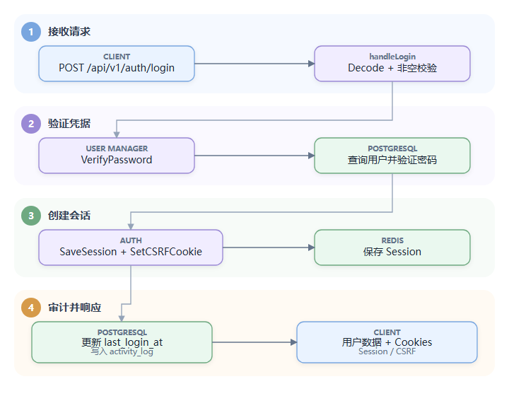

# Day 2：HTTP、认证、CSRF（跨站请求伪造防护）与 RBAC（基于角色的访问控制）

## 1. 从路由表建立 API（应用程序编程接口）全貌

所有主要路由集中在 [`cmd/handlers.go`](../../cmd/handlers.go#L20) 的 `initHandlers()`。当前文件约有 274 个路由注册点，按业务模块分组。

典型形式：

```go
g.POST("/api/v1/auth/login", rateLimit(handleLogin, "auth"))
g.GET("/api/v1/conversations/{uuid}",
    perm(handleGetConversation, "conversations:read"))
```

读法是从内向外：

```text
handleGetConversation
  -> perm 中间件（请求进入业务处理前执行的通用逻辑）先认证用户
  -> 检查 conversations:read
  -> Handler 内再做具体 Conversation 的资源级授权
```

这里有两个不同层级的权限：

- **动作权限**：用户是否具有 `conversations:read`。
- **资源权限**：这个用户能否读取某个具体 Conversation。

只做第一层会产生典型的 IDOR（Insecure Direct Object Reference，不安全的直接对象引用）漏洞，即攻击者修改资源 ID 后访问到无权查看的数据。

## 2. 登录调用链

入口是 [`handleLogin`](../../cmd/login.go#L17-L68)，路由注册在 [`initHandlers`](../../cmd/handlers.go#L20-L23)：

```text
POST /api/v1/auth/login
  -> rateLimit(handleLogin, "auth")
  -> auth.Login
  -> auth.NewSession
  -> auth.SetSessionCookie
  -> auth.SetCSRFCookie
```



这套设计将 Session（服务端登录会话）状态存入 Redis，而不是把全部身份信息签进客户端 Token（令牌）。优点是服务端可以立即销毁 Session、控制 TTL（生存时间）；代价是每次认证依赖 Redis。

跟读时分别制造密码错误、用户禁用、Redis 不可用和成功登录，观察 Session 是否写入、Cookie 的 `HttpOnly/SameSite/Secure/MaxAge` 以及失败路径是否残留 Cookie。这样能把“认证逻辑”和“浏览器持久化行为”对应起来。

## 3. `authenticateUser` 的两条认证路径

[`authenticateUser`](../../cmd/middlewares.go#L30-L83) 支持：

### 3.1 API Key（接口访问密钥）

先解析 Authorization Header（认证请求头），验证 `api_key + api_secret`。成功后设置：

```text
auth_method = api_key
```

API Key 适合系统集成，不走浏览器 Cookie，因此不需要用 Cookie 对抗 CSRF。

### 3.2 Session Cookie

如果没有有效 API Key，则走 Session：

1. 对 POST、PUT、DELETE 检查 CSRF Cookie 与 `X-CSRFTOKEN` Header。
2. 从 Redis 验证 Session。
3. 从缓存或数据库加载 Agent。
4. 用户已禁用则销毁 Session。
5. 把精简用户写入 Request Context。

项目采用 Double Submit Cookie（双重提交 Cookie）风格的 CSRF 校验。攻击者虽然能诱导浏览器带上 Session Cookie，却通常不能读取 CSRF Cookie 并构造同值 Header。

源码没有在这段判断中包含 PATCH；目前路由表也没有 PATCH 注册。如果未来加入 PATCH，必须同步更新 CSRF 校验，否则会出现保护遗漏。

这里适合增加表驱动测试：枚举所有修改状态的 HTTP 方法，验证 Session 缺失或错配 Token 时拒绝、正确 Token 时放行，同时确认 API Key 路径不依赖 Cookie CSRF。这样新增 PATCH 时会由测试暴露遗漏，而不是依靠评审者记忆。

## 4. `auth`、`tryAuth`、`perm` 的区别

| 中间件 | 是否要求登录 | 是否检查动作权限 | 用途 |
|---|---:|---:|---|
| `tryAuth` | 否 | 否 | 同时支持匿名与登录用户的接口 |
| `auth` | 是 | 否 | 只要求有效身份 |
| `perm(handler, "obj:act")` | 是 | 是 | 管理端业务接口 |
| `authOrSignedURL` | 条件式 | 视资源而定 | 媒体文件：登录、签名 URL 或公开访问 |
| `rateLimit` | 否 | 否 | Redis 维度的公开接口限流 |

`perm` 将 `obj:act` 拆分后调用 `authz.Enforce`。当前 Enforcer 的动作授权本质上是检查用户权限字符串数组是否包含目标权限。

这是一种轻量 RBAC：

```text
User -> UserRole -> Role.permissions[] -> "conversations:read"
```

角色存在于数据库，但运行时判定使用聚合到 User 上的权限列表。

## 5. Conversation 的资源级授权

[`internal/authz/authz.go`](../../internal/authz/authz.go#L36) 的 `CanReadAssignment` 表达了会话可见性：

```text
必须先有 conversations:read
并且满足下列之一：
  - 有 read_all
  - 有 read_assigned，且会话分配给本人
  - 属于对应团队，并有 read_team_all
  - 属于对应团队，会话尚未分给具体用户，并有 read_team_inbox
  - 会话未分给任何用户/团队，并有 read_unassigned
```

[`enforceConversationAccess`](../../cmd/conversation.go#L720-L735) 会先加载会话，再调用上述规则。WebSocket 订阅不能复用 HTTP 中间件，因此 [`FilterAuthorizedListUUIDs`](../../internal/conversation/conversation.go#L2164-L2189) 用 SQL 批量过滤允许订阅的 UUID。

这展示了一个重要原则：**所有能泄漏资源内容的入口都必须执行一致的资源授权，包括 HTTP、搜索、WebSocket 和 AI 工具。**

## 6. 统一错误模型

[`internal/envelope/envelope.go`](../../internal/envelope/envelope.go) 定义业务错误类型与 HTTP 状态映射：

- Input -> 400
- Unauthorized -> 401
- Permission -> 403
- Not Found -> 404
- Conflict -> 409
- Data -> 422
- Rate Limit -> 429
- Network -> 504
- General -> 500

Handler 通常通过 `sendErrorEnvelope` 或 `Request.SendErrorEnvelope` 返回统一 JSON。这样前端不需要解析每个模块的自定义错误格式。

阅读时要区分：

- 日志里的底层错误：给开发者排障。
- 返回给客户端的错误：不能泄漏 SQL、密钥或内部地址。
- i18n 消息：面向最终用户。

## 7. 以“发送消息接口”为例

路由：

```text
POST /api/v1/conversations/{cuuid}/messages
  -> perm(..., "messages:write")
  -> handleSendMessage
```

[`cmd/messages.go`](../../cmd/messages.go) 中还会进行：

1. 获取完整 Agent。
2. 对目标 Conversation 做资源授权。
3. 解析请求体。
4. 检查 Inbox 是否启用。
5. 校验发送者类型和私有消息规则。
6. 如果“模拟联系人发送”，额外检查 `messages:write_as_contact`。
7. 获取尚未关联的附件。
8. 分流到联系人消息、私有备注或正常客服回复。

说明一个接口的安全不是由某一个 `auth()` 完成，而是认证、动作授权、资源授权、业务规则和数据约束共同构成。

把上面的门禁按真实源码展开，就是：

```text
perm("messages:write")
  -> handleSendMessage
  -> enforceConversationAccess
  -> authz.EnforceConversationAccess / CanReadAssignment
  -> Inbox enabled、sender/private 等业务校验
  -> QueueReply / InsertPrivateNote / ProcessIncomingMessage
```

建议用同一个无权 UUID 同时访问 HTTP 详情、搜索和 WebSocket `conversation_subscribe`。三者不必返回相同错误形式，但必须都不泄漏主题、消息、联系人和后续实时事件。这个实验比只阅读 `CanReadAssignment` 更能证明没有授权旁路。

## 8. 安全设计亮点与审查点

### 已体现的设计

- Session Cookie 使用 HttpOnly、SameSite，并根据环境设置 Secure。
- 状态修改请求进行 CSRF 校验。
- API Key 与 Session 明确区分认证方式。
- OIDC（OpenID Connect，身份认证协议）外部请求有超时与 SSRF Guard（服务端请求伪造防护器）。
- Agent WebSocket 要求同源或本机开发源。
- 媒体使用签名 URL，并校验过期时间。
- 登录等公开接口有独立限流规则。
- API Secret 是 64 字符随机串，生成后只展示一次，数据库保存其 SHA-256；代码还兼容旧 bcrypt 值并在验证成功后迁移。这里使用快速哈希的前提是 Secret 本身具有足够熵，不能照搬到用户密码。
- 角色权限变化会清空 Agent cache；移除权限时还会踢掉相关 WebSocket 连接，缩短旧权限继续生效的窗口。

### 继续审查的问题

- `authenticateUser` 在 CSRF 校验失败时把 cookie token 和 header token 写入 error 日志；Token 不应进入日志，应只记录 method、path、request ID 等非敏感上下文。
- `tryAuth` 会吞掉 Redis、数据库等所有认证错误并按匿名请求继续，哪些路由允许这种 fail-open（故障时放行）语义必须逐个确认。
- Redis 限流器发生错误时直接放行，而且“清理、写入、计数”使用 pipeline 而非原子 Lua/事务；它适合作为保护层，不应被描述成严格配额。
- `realip.FromRequest` 决定限流 IP 与审计 IP，反向代理的可信边界和伪造 Header 风险需要结合部署拓扑验证。
- 自定义属性更新路由只用 `auth`，Handler 再检查 Conversation 可读权限，但没有独立的 update-custom-attributes 动作权限；这是产品授权策略，需要确认“可读即能改”是否符合业务预期。
- 登录失败是否产生足够的审计日志，但又不会记录密码？
- 每个通过 UUID/ID 访问资源的接口是否都有资源级授权？
- 密码重置 Token 的存储、过期、单次消费、暴力尝试限制和日志脱敏是否完整？

## 9. 当天实践

1. 浏览器登录一次，查看 Session 和 CSRF Cookie 的属性。
2. 不带 `X-CSRFTOKEN` 调用一个 PUT 接口，确认返回 403。
3. 从路由开始，完整追踪 `GET /api/v1/conversations/{uuid}`。
4. 构造一个只有 `conversations:read`、没有 `read_all` 的角色，验证资源级权限。
5. 解释 401 与 403 的区别，并找出源码中的对应返回点。
6. 模拟 Redis 故障，分别观察 Session 认证、公开限流和 `tryAuth` 路由是 fail-open 还是 fail-closed。

## 10. 面试表达

> 项目同时支持 Redis Session 和 API Key。浏览器写请求使用 Session Cookie 加 CSRF 双提交校验；路由层用 `obj:act` 权限做动作授权，业务层再根据会话的个人、团队和未分配状态做资源级授权。WebSocket 和搜索入口也分别执行批量授权，避免只保护 HTTP Handler 导致旁路越权。
