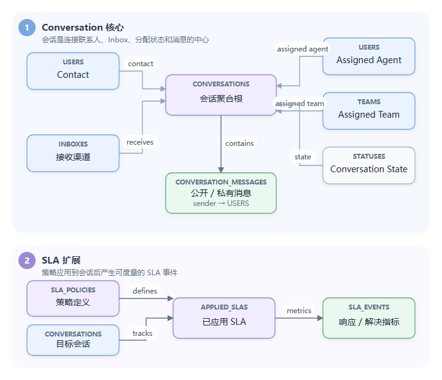

# Day 3：领域模型、PostgreSQL（关系型数据库）与事务

## 1. 核心领域不是“工单表”，而是消息驱动的会话

最重要的聚合可以理解为：



核心表位于 [`schema.sql`](../../schema.sql#L150)，即数据库结构定义文件：

- `users` 同时容纳 agent、contact、visitor、AI assistant 等类型。
- `inboxes` 抽象消息渠道，例如 Email 和 Live Chat。
- `conversations` 保存会话当前快照。
- `conversation_messages` 保存消息和活动时间线。
- `roles`、`user_roles` 保存 RBAC（基于角色的访问控制）关系。
- `applied_slas`、`sla_events` 保存 SLA（服务等级协议）实例和指标事件。

## 2. 为什么 Conversation 保存 `last_message`

`conversations` 中冗余保存：

- `last_message`
- `last_message_at`
- `last_message_sender`
- `last_interaction*`
- `waiting_since`
- `first_reply_at`、`last_reply_at`
- `next_sla_deadline_at`

这些信息原则上可以从消息表计算，但会话列表是高频接口。如果每次列表查询都聚合整张消息表，成本很高。写入消息时同步更新 Conversation 快照，是典型的“以写换读”。

代价是必须维护一致性：消息已插入但快照更新失败时，详情和列表可能短暂不一致。阅读 [`InsertMessage`](../../internal/conversation/message.go) 时要特别观察事务边界。

## 3. 数据库约束不只是兜底

Schema 使用了多种 PostgreSQL 能力：

- Enum（枚举类型）：消息类型、状态、发送者类型等有限状态。
- Foreign Key（外键）：表达归属关系及删除策略。
- Check Constraint（检查约束）：限制长度、评分范围、规则类型。
- Partial Unique Index（部分唯一索引）：只对满足条件的行保证唯一。
- GIN（广义倒排索引）+ `pg_trgm`（三元组文本匹配扩展）：用于邮件和消息文本模糊搜索。
- JSONB（二进制 JSON 类型）：保存自定义属性、规则、消息 meta（元数据）、Provider（提供方）配置。
- Array（数组类型）：保存权限、事件、收件人等集合。
- `TIMESTAMPTZ`：跨时区时间。

例如 Agent 邮箱唯一，但 Contact 是否唯一取决于 `external_user_id`，因此使用多个部分唯一索引表达业务语义。相比只在 Go 中校验，数据库约束能抵御并发请求绕过“先查再写”。

## 4. SQL 如何映射到 Go

同一个 Message 领域对象要同时对照四处源码：

| 证据 | 重点回答 |
|---|---|
| [`conversation/models/models.go`](../../internal/conversation/models/models.go) | 字段、枚举、JSON 映射和辅助判断 |
| [`conversation/queries.sql`](../../internal/conversation/queries.sql) | WHERE、JOIN、排序、分页和条件更新 |
| [`schema.sql`](../../schema.sql#L302-L324) | NOT NULL、外键、删除策略、唯一性和索引 |
| [`conversation` 测试](../../internal/conversation) | 哪些边界已有自动化证据 |

每个模块通常把 SQL 放在嵌入文件 `queries.sql` 中，用注释命名：

```sql
-- name: get-message
SELECT ...
```

模块的 `queries` 结构体用 tag 绑定：

```go
type queries struct {
    GetMessage *sqlx.Stmt `query:"get-message"`
    GetMessages string    `query:"get-messages"`
}
```

[`dbutil.ScanSQLFile`](../../internal/dbutil) 在 Manager 创建时加载 SQL。固定 SQL 会预编译为 `*sqlx.Stmt`；需要动态拼接过滤和分页的查询保留为字符串。

这不是 ORM（对象关系映射，即用对象抽象数据库表）。优点是 SQL 可控、能使用 PostgreSQL 特性、性能行为显式；代价是字段映射、动态条件和迁移需要开发者自己维护。

例如 `source_id` 在模型中表达外部消息标识，由 [`message-exists-by-source-id`](../../internal/conversation/queries.sql#L851-L854) 查询，但 schema 只建立普通索引。三处证据合起来只能证明“存在应用层去重”，不能推出“并发插入也保证幂等”。

## 5. Message 插入事务

[`InsertMessage`](../../internal/conversation/message.go#L579-L668) 的核心步骤：

```text
规范化 meta/content type
  -> 找出 HTML 内联图片并改写为 cid
  -> HTML 转纯文本，便于搜索
  -> BEGIN
       INSERT conversation_messages
       关联 media 到 message
     COMMIT
  -> 添加 participant
  -> 更新 conversations.last_message
  -> WebSocket（全双工长连接协议）广播
  -> 重新查询完整 Message
  -> 触发 Webhook
```

事务只覆盖“消息插入 + 附件关联”。后面的 participant（参与者关系）、会话快照、广播和 Webhook（事件回调）不在同一事务内。

这是合理但重要的权衡：

- 外部副作用不能简单放进数据库事务，否则事务会长时间持锁。
- 但 commit 后任一步骤失败都会产生部分成功。
- 当前代码主要靠日志和后续操作容忍，而不是 Outbox（发件箱：与业务数据一起写入、供后台可靠发布的事件表）统一驱动副作用。

更精确地说，`InsertMessage` 对 commit（事务提交）后若干步骤采用 best-effort（尽力而为，不保证全部成功）：`addConversationParticipant` 与 `UpdateConversationLastMessage` 的返回值没有向上传播，重查完整 Message 失败也仍返回成功，Webhook 入队本身也不向调用方报告队列已满。因此 HTTP 成功只能证明核心消息和附件关联已经提交，不能证明列表快照、参与者、实时广播和 Webhook 全部成功。

继续对照 [`insert-message`](../../internal/conversation/queries.sql#L828-L849)：SQL 先通过 CTE 按 `conversation_id` 或 `conversation_uuid` 找会话，再插入消息。跟读时应把 12 个位置参数逐一映射到 Message 字段，并观察 `content_type` 默认值、HTML 到 `text_content`、空 `meta` 和 inline image CID 改写发生在事务的哪一侧。

可以在 commit 后暂停并让 `UpdateConversationLastMessage` 失败，然后同时查询 Message 和 Conversation 快照。若前者存在而 `last_message*` 仍旧，就能直接看到当前事务边界的部分成功，而不是只在概念上讨论最终一致性。

可以把“是否引入 Transactional Outbox（事务发件箱）”作为一个二次开发设计题。

### 5.1 读事务创建失败时的 `defer` 顺序

[`GetConversationMessages`](../../internal/conversation/message.go#L350-L356) 和 [`GetConversations`](../../internal/conversation/conversation.go#L663-L669) 当前都先执行 `defer tx.Rollback()`，再检查 `BeginTxx` 返回的 `err`：

```go
tx, err := db.BeginTxx(...)
defer tx.Rollback()
if err != nil {
    return err
}
```

当数据库不可达、连接池耗尽或 Context 失败时，`BeginTxx` 可以返回 `tx == nil`。函数准备返回原始错误时，延迟调用又会在 nil Transaction 上执行 `Rollback`，把一个可处理的数据库错误升级成 panic（运行时崩溃）。这是当前源码事实，不只是容量推演。

正确顺序是先检查 `err`，确认 `tx` 非 nil 后再注册 `defer tx.Rollback()`。修复时应给两个列表路径增加“Begin 失败返回统一 500、进程不 panic”的回归测试，并顺手检索所有 `Begin/Beginx/BeginTxx`，避免只修一个入口。

## 6. 待发送消息为什么能恢复

客服回复先以 `status = pending` 写进 `conversation_messages`。后台 Worker 周期扫描：

```sql
WHERE m.status = 'pending'
  AND m.type = 'outgoing'
  AND m.private = false
```

因此进程在“写入后、发送前”崩溃，重启后仍能重新发现 pending 消息。数据库承担了一个简化版持久化队列的角色。

但是“可重新发现”不等于严格 exactly-once（恰好一次交付）：如果外部渠道发送成功后，进程在更新 `sent` 前崩溃，重启后可能再次发送。互联网系统更常见的目标是 at-least-once（至少一次交付）+ 幂等，而不是幻想分布式 exactly-once。

从 [`conversation_messages` schema](../../schema.sql#L302-L324) 还可以反推当前没有 `processing`、`lease_owner/lease_until`、`attempt/next_retry_at/last_error` 字段，也没有按 Inbox 作用域的 `source_id` 唯一约束。因此改造任务租约必须同时更新 enum/schema、migration、models、命名 SQL、Worker、指标和恢复测试，不能只增加一个索引。

## 7. 索引阅读方法

不要逐个背索引。用“查询条件 + 排序 + 返回规模”反推。

### 会话消息列表

条件通常是：

```sql
WHERE conversation_id = ?
ORDER BY created_at DESC
```

Schema 提供复合索引：

```sql
(conversation_id, created_at)
```

复合索引通常比两个独立单列索引更适合同时过滤和排序。

### Pending 扫描

查询按 `status` 过滤，现有 schema 有 status 单列索引。但当前 SQL 没有 `ORDER BY` 和 `LIMIT`，扫描器可能一次读出全部 pending 行；随后向固定容量 channel 阻塞写入。这会把背压传回扫描 goroutine，却仍产生大结果集和内存/数据库压力。继续优化时应把“批量 claim + 有界 LIMIT + 稳定排序”作为一个整体，而不是只加索引：

```sql
CREATE INDEX ... ON conversation_messages(id)
WHERE status = 'pending' AND type = 'outgoing' AND private = false;
```

是否值得必须用真实数据和 `EXPLAIN (ANALYZE, BUFFERS)` 验证，不能只凭直觉加索引。

还要验证 offset pagination 的深页成本、统计查询与列表查询是否共享相同过滤语义、连接池上限 30 在 HTTP 与全部 Worker 竞争下是否足够。

## 8. 并发一致性的源码例子

### 原子认领会话

`claim-unassigned-conversation` 使用：

```sql
UPDATE conversations
SET assigned_user_id = $2
WHERE uuid = $1
  AND assigned_user_id IS NULL
  AND assigned_team_id = $3;
```

条件写入比“先 SELECT 未分配，再 UPDATE”更能抵御两个 Agent 同时认领。

### Upsert Last Seen

`conversation_last_seen` 使用唯一约束和 `ON CONFLICT DO UPDATE`，把插入与更新合成一个原子操作。

### 限制 Contact 创建会话数量

`insert-conversation` 把计数条件和 INSERT 放在一条 SQL 中，比 Go 层先计数更好。但在默认隔离级别下，并发事务仍可能同时看到旧计数；是否要求严格上限决定是否需要锁或更强隔离级别。

## 9. JSONB 的使用边界

适合 JSONB 的字段：

- 不同 Inbox 渠道各自的配置。
- 自定义属性。
- Automation 条件和动作。
- Message 的低频扩展 meta。

不适合盲目放 JSONB 的字段：

- 高频过滤、排序、关联的稳定业务字段。
- 需要强类型约束和外键的字段。
- 经常局部更新且存在并发写冲突的巨大对象。

LibreDesk 将核心关系保留为规范列，把扩展能力放进 JSONB，是一个值得学习的折中。

## 10. 当天实践

1. 根据 schema 手画 User、Inbox、Conversation、Message、SLA 的 ER 图。
2. 发送消息前后查询两张核心表，对比字段变化。
3. 对“消息列表”和“pending 扫描”执行 `EXPLAIN (ANALYZE, BUFFERS)`。
4. 找出三个 partial unique index，解释它们对应的业务规则。
5. 列出 `InsertMessage` commit 后的所有副作用，并说明每步失败的结果。
6. 制造 5000 条 pending 消息，观察一次扫描的行数、channel 阻塞、连接占用和 shutdown 行为。

## 11. 面试表达

> 项目直接使用 sqlx 和命名 SQL，充分利用 PostgreSQL 的部分唯一索引、GIN/trigram、JSONB、数组和约束。Conversation 表维护列表所需的消息与 SLA 快照，以写放大换取高频读取性能。消息与附件在事务内提交，而 WebSocket、Webhook 等副作用在事务外执行；这降低了锁持有时间，但也带来部分成功问题，可以进一步用 Outbox 和幂等消费改进。
