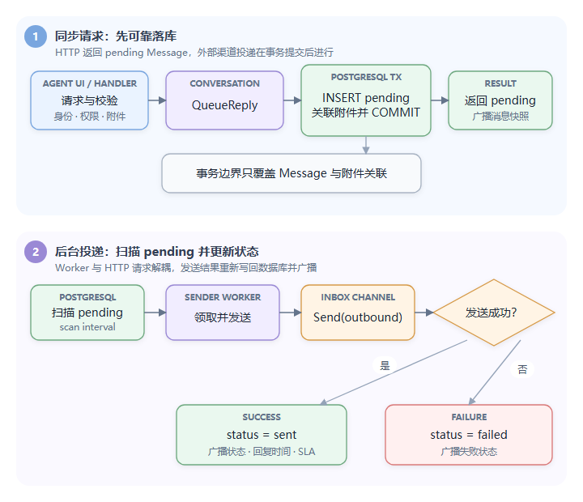

# Day 4：消息收发主链路

这一天是整套学习的核心。目标不是记函数，而是能解释一条消息从 HTTP 请求到外部渠道的完整状态变化。

## 1. Inbox 是渠道抽象

[`internal/inbox/inbox.go`](../../internal/inbox/inbox.go) 管理数据库中的 Inbox（收件渠道）配置和运行时渠道对象。Conversation（会话）模块不直接依赖 SMTP（简单邮件传输协议）或某个 WebSocket Client（长连接客户端），而是通过 Inbox 接口发送统一的 Outbound Message（出站消息）。

当前主要渠道：

- Email：SMTP 发送、IMAP（互联网邮件访问协议）接收。
- Live Chat：向 Widget（嵌入式聊天组件）WebSocket Client 投递。

渠道抽象的价值是核心 Conversation 逻辑不需要为每个渠道复制一套会话、消息、SLA（服务等级协议）、Automation（自动化）流程。

## 2. 客服发送消息：同步落库，异步投递

路由位于 [`cmd/handlers.go`](../../cmd/handlers.go#L51)，Handler（请求处理函数）位于 [`cmd/messages.go`](../../cmd/messages.go)。

按真实函数和状态回写顺序跟读：

```text
POST /api/v1/conversations/{cuuid}/messages
  -> handleSendMessage
  -> QueueReply -> InsertMessage -> SQL insert-message
  -> HTTP 返回 pending Message
  -> Conversation.Run 扫描 get-outgoing-pending-messages
  -> MessageSenderWorker -> sendOutgoingMessage
  -> Inbox.Send -> SQL update-message-status
```

对应源码入口是 [`handleSendMessage`](../../cmd/messages.go#L177-L269)、[`QueueReply`](../../internal/conversation/message.go#L504-L577)、[`InsertMessage`](../../internal/conversation/message.go#L579-L668) 和 [`sendOutgoingMessage`](../../internal/conversation/message.go#L147-L224)。



为什么不在 Handler 中直接 SMTP 发送？

- 外部网络延迟不会长期占用 HTTP 请求。
- 用户可以先看到 pending 消息，获得即时反馈。
- 进程崩溃后，pending 状态仍保存在数据库。
- Worker 数量可以独立配置。

代价是接口返回“已入队”而不是“对方已收到”，前端必须理解 pending/sent/failed（待处理/已发送/失败）状态。

## 3. `QueueReply`

[`QueueReply`](../../internal/conversation/message.go#L504-L577) 主要负责：

1. 加载并检查 Inbox。
2. Email 渠道整理 To/CC/BCC，生成 Message-ID。
3. 将扩展信息写入 `meta` JSON。
4. 尽力渲染模板变量，让 Agent 立即看到渲染后内容。
5. 构造 `type=outgoing, status=pending` 的 Message。
6. 调用 `InsertMessage`。

这里的“Queue”不是直接向 channel 写入，而是先写数据库；真正的内存队列由扫描器填充。这使数据库成为事实来源。

`InsertMessage` 中真正的事务只有 `insert-message + LinkMessageMediaTx`；commit 后才执行 participant、Conversation 快照、WebSocket、重查完整 Message 和 Webhook。这些副作用并非原子完成，部分错误只记录日志。调试时应在 commit 后逐步注入失败，观察 HTTP 返回与各派生状态，才能准确回答“接口成功保证了什么”。

## 4. `Run` 与 Worker Pool（工作协程池）

[`Conversation.Run`](../../internal/conversation/message.go#L55-L103)：

- 创建指定数量的 incoming workers。
- 创建指定数量的 outgoing workers。
- 每隔 `message_outgoing_scan_interval` 查询 pending 消息。
- 用 `sync.Map` 排除本进程正在处理的 ID。
- 将记录写入有缓冲的 `outgoingMessageQueue`。

源码里的扫描查询没有 `LIMIT`、`ORDER BY` 或数据库 claim（任务领取）状态；向队列发送也没有 `select { case <-ctx.Done(): ... }`。所以它限制的是并发发送数，不是单次 DB（数据库）取数和内存驻留量，队列满时扫描 goroutine（Go 轻量级并发执行单元）会阻塞。这是容量评估和优雅关闭都必须覆盖的实现细节。

具体 SQL 是 [`get-outgoing-pending-messages`](../../internal/conversation/queries.sql#L697-L738)。它只排除本进程 `sync.Map` 中的 ID，没有行锁或 processing 状态；两个实例可以同时读取同一 pending 行。

开发配置的关键值：

```toml
outgoing_queue_workers = 10
incoming_queue_workers = 10
message_outgoing_scan_interval = "50ms"
incoming_queue_size = 5000
outgoing_queue_size = 5000
```

技术解释：

- Worker Pool 限制并发，避免每条消息无限创建 goroutine。
- Buffered Channel 吸收短时流量峰值。
- 扫描间隔决定平均排队延迟和数据库查询压力。
- `sync.Map` 只解决一个进程内的重复入队。

## 5. `sendOutgoingMessage`

发送 Worker 的步骤：

```text
取得 Inbox
  -> 渲染渠道模板
  -> 加载附件
  -> 转成 OutboundMessage
  -> Email 增加 From、References、In-Reply-To
  -> Inbox.Send
  -> 更新 sent/failed
  -> 更新 first_reply_at、last_reply_at、waiting_since
  -> 更新 SLA
  -> 广播 Conversation Update
  -> 触发 outgoing message Automation
```

失败处理当前比较直接：任一步骤失败时记录日志并尝试把 Message 标为 `failed`。这里 `UpdateMessageStatus` 的错误没有继续处理；若状态更新也失败，消息可能仍是 pending 并被扫描器自动再次发送。HTTP 层另提供 Retry 接口，只允许原发送者重试属于同一会话的 failed outgoing Agent 消息。

同样地，渠道成功后的 sent 回写也没有检查错误。可以在 `Inbox.Send` 成功返回后、[`UpdateMessageStatus`](../../internal/conversation/message.go#L416-L422) 前终止进程，再观察重启后的重复扫描，用运行证据验证故障窗口。

渠道可能有自己的重试，例如 SMTP Pool；但 Conversation 层没有统一的自动指数退避和最大重试次数字段。这是一个可讨论的改进点。

Live Chat 的 `ErrClientNotConnected` 不被当作发送失败，消息仍标记 sent。原因是“当前没有在线 Widget 连接”不代表业务消息无效；数据已经落库，访客重连后仍可获取，而且 Continuity Email 可能补发未读内容。

## 6. 外部投递的语义

当前流程可近似理解为：

- 数据库入队：至少一次被扫描。
- 外部渠道投递：可能出现重复。
- 状态更新：最终写成 sent 或 failed。

经典故障窗口：

```text
Inbox.Send 已成功
  -> 进程崩溃
  -> 尚未来得及把 status 更新为 sent
  -> 重启后再次扫描 pending
  -> 对方收到重复消息
```

解决思路不是跨 SMTP 和 PostgreSQL 做分布式事务，而是：

- 使用稳定的 `source_id` / Message-ID。
- 渠道支持时传幂等键。
- 消费端去重。
- 记录 attempt、next_retry_at、last_error。
- 把“已请求外部发送”和“已被外部接受”定义清楚。

## 7. Incoming Email 主链路

Email/渠道接收到外部消息后构造 `IncomingMessage`，调用 `EnqueueIncoming`。Incoming Worker 执行 `ProcessIncomingMessage`：

```text
检查 source_id 是否已存在
  -> 解析/查找发送者
  -> 查找或创建 Conversation
  -> 插入 incoming Message
  -> 执行 ProcessIncomingMessageHooks
```

`source_id` 是实现幂等性（同一操作重复执行仍得到等价结果）、防止同一封外部邮件被重复插入的重要线索。应继续检查它是否有数据库唯一约束；当前 schema 只有普通索引，主要依靠应用层查询去重，竞争条件下仍可能重复。

对应实现是 [`EnqueueIncoming`](../../internal/conversation/message.go#L1019-L1035)、[`ProcessIncomingMessage`](../../internal/conversation/message.go#L794-L1017) 和 [`ProcessIncomingMessageHooks`](../../internal/conversation/message.go#L1369-L1435)。逐步记录 source ID 查询、Contact 解析、Conversation 创建、附件上传、Message 插入和 hooks，尤其要区分对象存储写入与数据库事务。

Incoming 附件会先上传，再插入 Message；新建 Conversation 的失败路径会尝试删除 Conversation，但对象存储与数据库并非一个事务。未关联媒体依赖后台清理，因此还要推演“上传成功、DB 失败、清理进程未及时运行”的空间泄漏窗口。`EnqueueIncoming` 在内存队列满时返回错误，是否会重试取决于具体接收渠道，不能笼统说 incoming 一定持久化。

`ProcessIncomingMessageHooks` 会处理：

- 重新打开会话。
- 更新 waiting 状态。
- Automation。
- SLA 的 next response 事件。
- 其他通知或分配逻辑。

这表明“插入消息”和“处理业务副作用”被有意分开，以便其他渠道先自己落库，再复用 hooks。

## 8. Live Chat 主链路

Widget 通过公开初始化接口获得 Session（访客会话），再通过 Widget WebSocket 加入 Inbox。访客消息由 Widget HTTP API（基于超文本传输协议的应用接口）写入；客服消息通过相同 outgoing pipeline（出站处理流水线）处理，最终由 LiveChat Inbox 发给对应 Client Channel（客户端通道）。

Live Chat 的特点：

- 实时连接是临时状态，消息历史仍以 PostgreSQL 为准。
- 一个用户可以有有限数量的多个连接。
- 每个 Client 使用带缓冲 channel。
- Widget 断线不会删除会话或消息。
- 访客离线后可由 Continuity Email 发送未读回复。

不要把 WebSocket 当数据库。WebSocket 只负责低延迟推送，断线恢复必须回到 HTTP/数据库事实来源。

## 9. 消息副作用为什么容易失控

一次 Message 可能触发：

- Conversation 列表快照更新
- Agent/Widget WebSocket 广播
- Webhook
- Automation
- SLA
- 通知
- Auto Assignment
- AI Agent

如果没有明确事件边界，很容易发生循环。例如自动化发送消息后，又触发“消息发出”规则。源码用 Message `meta.is_automated`、System User 和 Automation suppression 降低循环风险。

面试中可以把它归纳为：核心状态改变后存在多个最终一致的消费者，必须关心幂等、顺序、重入和失败隔离。

## 10. 当天实践

1. 在六个关键函数打断点，发送一条 Live Chat 回复。
2. 观察 HTTP 返回时 Message 是 pending 还是 sent。
3. 暂停 Worker 或把渠道配置改为不可达，观察 failed 和 Retry 流程。
4. 查询 Message 与 Conversation，记录每一步字段变化。
5. 画 outgoing 和 incoming 两张时序图。
6. 回答：数据库队列与 Kafka/RabbitMQ 相比有什么优缺点？
7. 设计 `source_id` 唯一约束时，说明空值、不同 Inbox、邮件 Message-ID 复用和历史重复数据如何迁移。

## 11. 面试表达

> 客服回复采用“数据库持久化队列 + Worker Pool”模式。HTTP 请求先在事务中写入 pending Message 并关联附件，随后后台扫描器将 pending 记录投入内存 channel，由固定数量 Worker 调用 Email 或 Live Chat 渠道；结果再更新为 sent/failed，并触发 WebSocket、SLA 和 Automation。该设计部署简单且具备崩溃后重新发现能力，但多实例抢占和外部发送成功后的崩溃窗口可能造成重复，进一步可用数据库租约、`FOR UPDATE SKIP LOCKED`、幂等键和 Outbox 改进。
