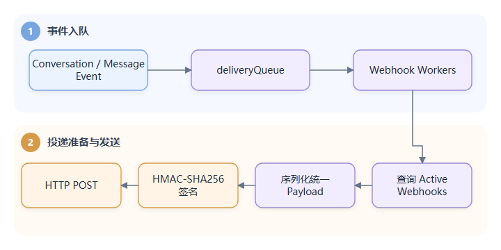

# Day 6：Automation（自动化）、SLA（服务等级协议）、Webhook（事件回调）与 AI（人工智能）/RAG（检索增强生成）

今天不追求读完四个模块，而是学习它们如何挂接到 Conversation 主链路，以及各自代表的通用后端模式。

## 1. 扩展模块共同遵循的模式

```text
核心领域发生事件
  -> 创建任务或写入状态
  -> 后台 Worker 异步处理
  -> 通过小接口回调 Conversation
  -> 结果再次广播/通知/持久化
```

这些模块与微服务中的事件消费者很相似，只是事件总线主要是进程内 channel（Go 协程间通信通道）和函数调用。

## 2. Automation：规则引擎

入口是 [`Automation.Engine`](../../internal/automation/automation.go#L49-L75) 和 [`evaluator.go`](../../internal/automation/evaluator.go)。Conversation 事件通过 [`EvaluateConversationUpdateRules`](../../internal/automation/automation.go#L306-L332) 或 [`EvaluateConversationUpdateRulesByID`](../../internal/automation/automation.go#L334-L345) 进入规则引擎。

### 2.1 数据模型

`automation_rules` 保存：

- type：新会话、会话更新、时间触发。
- events：关心的事件类型。
- rules：JSONB（PostgreSQL 的二进制 JSON 类型）条件组和动作。
- weight：执行顺序。
- execution_mode：全部匹配规则或首个匹配。
- enabled。

规则先按组求值，每组内部支持 AND/OR（逻辑与/逻辑或），组之间再用 Group Operator（组运算符）聚合。匹配后调用 Conversation 的 `ApplyAction`，执行改状态、优先级、分配、标签、私有备注、回复或通知等动作。

### 2.2 Worker 与背压

Engine（规则执行引擎）有容量 10000 的 `taskQueue` 和可配置 Worker Pool（工作协程池）。事件入队使用非阻塞 select；队列满时记录警告并丢弃任务。

这适用于“自动化是增强能力，不能拖垮主消息请求”的优先级。如果规则绝不能丢，就需要把任务持久化，并增加重试和死信状态。

[`Engine.worker`](../../internal/automation/automation.go#L148-L173) 按 NewConversation、UpdateConversation、TimeTrigger 分派任务。普通业务事件非阻塞入队，但 [`Engine.Run`](../../internal/automation/automation.go#L127-L146) 每小时产生的 TimeTrigger 使用阻塞发送，两者背压语义不同；还应联合审查 ticker producer、[`Close`](../../internal/automation/automation.go#L175-L186) 持锁等待和规则动作重入。

### 2.3 防止规则循环

自动化动作会再次修改 Conversation，从而可能再次产生 Automation 事件。源码使用：

- System User 标识机器动作。
- Conversation UUID suppression 计数。
- Message `meta.is_automated`。
- `ShouldEvaluateAutomation` 跳过系统和自动消息。

这叫防重入（避免同一逻辑在尚未完成时再次进入）/防反馈循环。复杂规则系统还应设置最大动作深度、事件因果 ID 和执行日志。

## 3. SLA：时间规则状态机

入口：[`internal/sla/sla.go`](../../internal/sla/sla.go)。

SLA 不是一个简单 deadline（截止时间）字段，而是三层数据：

```text
sla_policies
  -> applied_slas：某策略在某 Conversation 上的一次应用
       -> sla_events：可重复出现的 next_response 等指标事件
       -> scheduled_sla_notifications：待发送提醒
```

主要指标：

- First Response
- Resolution
- Next Response

计算 deadline 时考虑团队时区和 Business Hours。应用 SLA 后写入截止时间；定时任务扫描 pending SLA，标记 met/breached；客服回复时也会立即调用评估，降低只靠周期扫描带来的延迟。

`RecomputeConversationNextSLADeadline` 在事务中先锁 Conversation 行，再重算快照，避免两个并发重算从旧快照写回。这是“先锁定被汇总实体，再更新派生状态”的典型例子。

SLA 学习重点：

- 时间状态机。
- 周期扫描与事件即时更新的结合。
- 时区、工作时间、节假日边界。
- 通知的 exactly-once/at-least-once（恰好一次/至少一次交付）语义。
- 可重算的派生字段。

源码跟读应从 [`Run`](../../internal/sla/sla.go#L517-L558)、[`SendNotifications`](../../internal/sla/sla.go#L560-L633) 和 [`RecomputeConversationNextSLADeadline`](../../internal/sla/sla.go#L380-L418) 交叉进入，区分业务 deadline、实际 `met_at/breached_at`、通知计划时间和 Ticker 扫描时间。扫描时刻不是违约发生时刻；数据库状态机的主要自动化证据在 [`sla_test.go`](../../internal/sla/sla_test.go)。

## 4. Webhook：外部事件投递

入口：[`internal/webhook/webhook.go`](../../internal/webhook/webhook.go)。

流程：



安全设计：

- Secret 加密保存，使用时解密。
- Payload 用 HMAC-SHA256 签名，Header 为 `X-Libredesk-Signature`。
- HTTP Client 有 Timeout。
- URL 经过 SSRF（服务端请求伪造）控制，适应自托管/多租户不同策略。

当前可靠性边界：

- Queue 在内存中。
- Queue 满会丢投递。
- 进程崩溃会丢未处理任务。
- 非 2xx 或网络失败只记日志，没有统一持久化重试记录。
- Response Body 当前直接读取，应关注恶意服务返回超大响应的内存风险。
- 请求 payload、URL、headers 和失败响应会进入日志；payload 可能含联系人和消息正文，debug 日志需要脱敏、分级和保留期控制。
- SSRF transport 已接入，但 `config.sample.toml` 中 `ssrf.enabled=false`；在多租户/托管部署中必须显式开启并配置 allowlist，不能只因代码里存在 Guard 就认为已防护。

生产级增强通常增加：delivery 表、attempt、next_retry_at、指数退避、最大次数、死信、手工重放、响应大小限制和指标。

完整实现链是 [`TriggerEvent`](../../internal/webhook/webhook.go#L256-L273) → [`worker`](../../internal/webhook/webhook.go#L323-L338) → `deliverWebhook` → [`deliverSingleWebhook`](../../internal/webhook/webhook.go#L364-L430)。最后一步记录 payload/header 并用 `io.ReadAll` 读取响应体，所以安全分析必须同时覆盖日志敏感数据和响应体上限。

## 5. AI/RAG：应用内向量检索

本节只用于把 AI 与 Automation、SLA、Webhook 放在同一平台视角比较，不承担完整 Agent 教程。Provider、Copilot、自主 Assistant、Prompt/History、ToolContext、OTP、图片、FAQ、API/RBAC、测试和生产边界统一在下一篇 [AI、RAG、Copilot 与自主 Agent 深入](07-ai-agent-deep-dive.md)展开。

入口：

- [`internal/ai/ai.go`](../../internal/ai/ai.go)：Provider、知识库、Copilot。
- [`internal/ai/embedding.go`](../../internal/ai/embedding.go)：向量索引与检索。
- [`internal/ai/agent.go`](../../internal/ai/agent.go)：工具调用循环。
- [`internal/aiagent/worker.go`](../../internal/aiagent/worker.go)：自动客服 Worker。

### 5.1 Embedding 与索引

向量索引包含手工知识条目、Help Center Article 和 Tag；但通用 RAG `Search` 只检索前两者，Tag 向量由标签建议单独使用。大致过程：

```text
内容规范化/分块
  -> 调 Embedding Provider
  -> float32 向量编码为 BYTEA 保存到 PostgreSQL
  -> 启动时加载到内存 embeddingIndex
  -> Query Embedding
  -> 内存暴力计算 cosine similarity
  -> Top-K 结果进入 LLM 上下文
```

当前不是 pgvector 或外部 Vector DB，而是 PostgreSQL 持久化 + 内存暴力检索。优点是部署简单，适合中小知识库；规模增长后内存占用和 O(N) 搜索会成为瓶颈。

Index（向量索引）使用 RWMutex（读写互斥锁），重建过程还有 generation（重建代次）控制，避免旧的并发 reindex（重新索引）结果覆盖更新内容。Embedding Provider 的模型、维度或 Base URL 改变时会触发全量重建，因为不同模型向量不可直接比较。

检索会对所有候选计算分数后整体排序，时间复杂度更准确地说是 O(N·D + N log N)，其中 D 是向量维度；只说 O(N) 会忽略点积维度和全排序成本。规模化改造前先量化 chunk 数、向量维度、内存副本、启动加载时间、查询 P95 和 Provider 费用。

### 5.2 Tool Calling Loop

`RunAgentWithTools` 最多执行 `maxSteps` 轮：

```text
system prompt + history + tool definitions
  -> LLM completion
  -> 无 tool_calls：返回答案
  -> 有 tool_calls：逐个执行工具
  -> 追加 assistant/tool message
  -> 下一轮
  -> 超预算：移除工具并强制生成最终答案
```

工具包括知识库搜索、转人工、解决会话、历史会话，以及管理员配置的 HTTP Tool。

从 [`RunAgentWithTools`](../../internal/ai/agent.go#L19-L94) 可以逐步看到 Provider 配置、Tool Registry、模型返回、Tool Result 追加历史，以及步数耗尽后的强制最终回答。Registry 保存服务端执行实现，模型只收到名称、描述和 JSON Schema；可信 Conversation/Contact 身份仍由服务器通过 `ToolContext` 注入。

### 5.3 AI Agent 的业务安全

自动客服不仅“调用模型”，还处理：

- 每个 Conversation 去重，运行中收到新消息则 pending 再跑一次。
- Queue 满时转人工，避免客户被卡在 AI 名下。
- 限制历史消息和最大轮次。
- Email 与 Live Chat 设置不同总超时。
- 执行结束前重新加载 Conversation，若人工已接管则丢弃 AI 回复。
- 只有主 Contact 的消息可以驱动身份敏感工具。
- OTP（一次性密码）/可信会话决定能否调用需要验证身份的工具。
- 用户可控 Contact 信息放在 user-role 内容中，而不是提升到 system prompt。
- 自定义 HTTP Tool 使用 SSRF Guard、超时、禁止重定向泄漏认证头、限制响应体。

仍需关注可观测性与隐私：debug 日志会记录 system prompt（系统提示词）、模型回答、tool arguments（工具参数）和 tool result（工具结果）；这些内容可能包含 PII（个人可识别信息）、认证参数或提示注入载荷。生产环境应默认不记录正文，或做字段级脱敏与受控采样。

这比“接一个 Chat Completion API”更接近真实 Agent 工程。

Day 6 到这里应先掌握“Conversation 事件 → 内存 Worker → RAG/Tool Loop → 回复或转人工”的骨架；Day 7 再按产品能力和源码层次把每一条分支闭合。

## 6. 四个模块的可靠性对比

| 模块 | 任务来源 | 是否持久化 | 队列满 | 失败策略 |
|---|---|---:|---|---|
| Automation | Conversation 事件 | 规则持久化，任务不持久化 | 丢弃并日志 | 动作错误日志 |
| SLA | 数据库 deadline + ticker | 计划行持久化，通道投递状态未持久化 | 不依赖单一调度队列；邮件仍进入内存 Notification queue | 未 claim 时可能重复；Dispatcher 失败后仍可能被标 processed，邮件可能丢失且不再重扫 |
| Webhook | 业务事件 | 配置持久化，投递不持久化 | 丢弃并日志 | 不自动重放 |
| AI Agent | Conversation 事件 | 对话持久化，运行任务不完全持久化 | 转人工 | 异常/超时转人工 |

这张表体现的是当前实现的可靠性差异，不等于这些差异已经获得业务认可。同样是异步任务，应先按用户影响、合规要求和可补偿性定义允许的“重复/丢失”预算，再判断现状是否符合要求。

## 7. 当天实践

三小时只选一个模块深入，建议优先级：Automation > Webhook > SLA > AI。

1. 找到核心事件从哪里触发该模块。
2. 画出入队、执行、回调、失败四个阶段。
3. 制造一次队列满、外部超时或规则循环场景，至少完成代码推演。
4. 写出一个不改变业务语义的可靠性改进方案。
5. 对 AI 先完成平台级比较，并解释为什么当前索引需要线性扫描和候选排序；完整 Agent 实践转到 [Day 7](07-ai-agent-deep-dive.md)。
6. 如果选择 SLA，启动两个实例验证同一 `scheduled_sla_notifications` 行会不会被重复发送，并模拟邮件队列已满：当前流程没有 claim/lease，且 Dispatcher 的投递错误不会阻止计划行被标记 processed。

## 8. 面试表达

> 项目的平台能力围绕 Conversation 事件扩展：Automation 用内存 Worker Pool 计算 JSON 规则并通过 suppression 防止反馈循环；SLA 将策略、应用实例和可重复指标事件分层持久化；Webhook 使用 HMAC 签名和 SSRF 防护异步投递；AI/RAG 将向量持久化到 PostgreSQL、加载到内存做余弦检索，并在有步数和超时预算的工具调用循环中执行。不同模块按业务重要性采用不同的失败策略。
