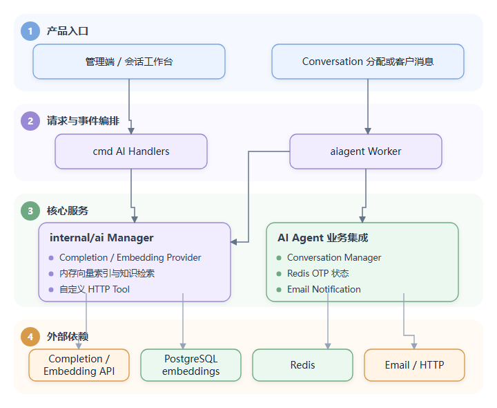
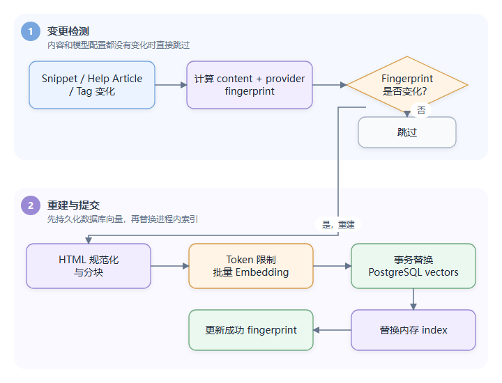
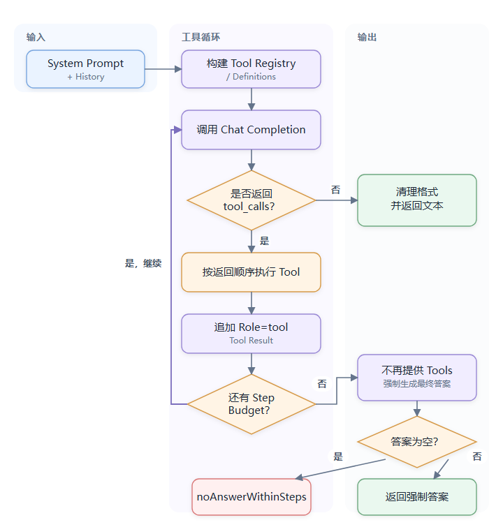
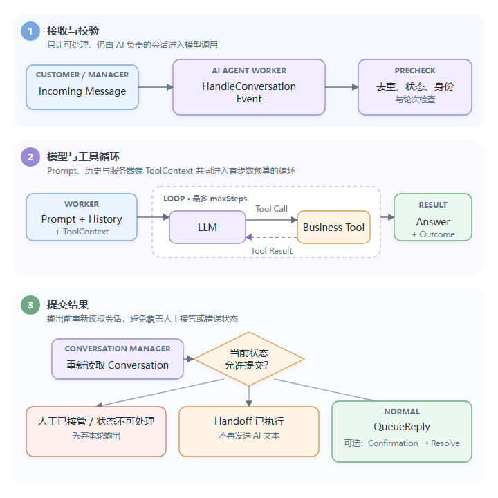
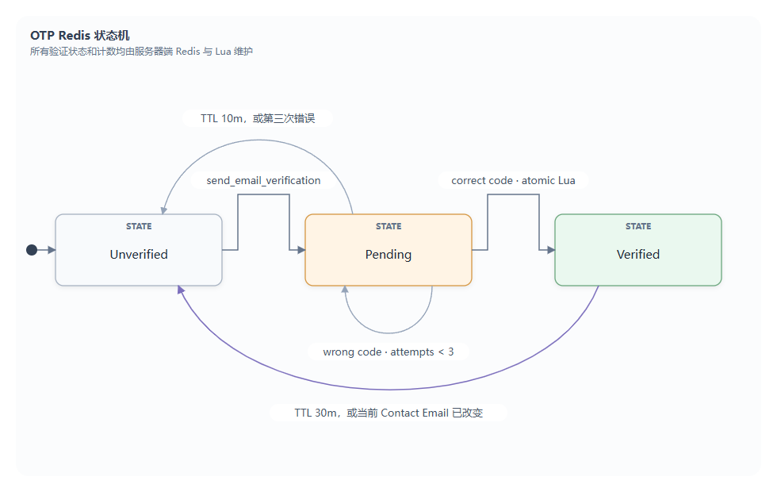
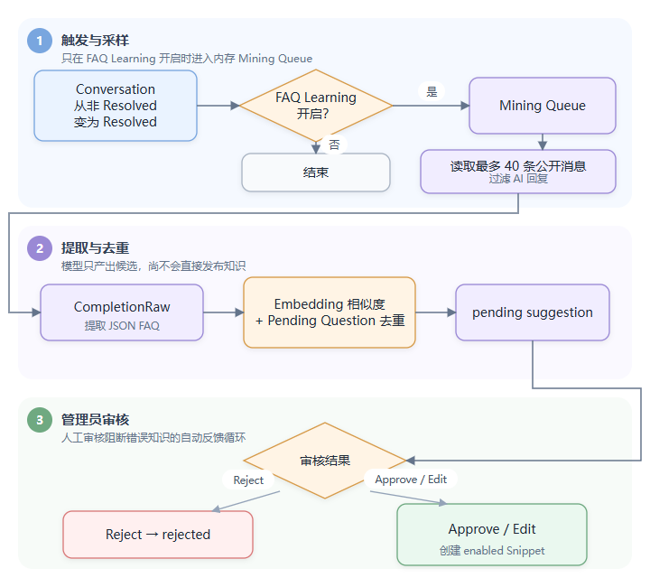

# Day 7：AI、RAG、Copilot 与自主 Agent 深入

这一天把 AI 当成一条完整业务链学习，而不是只看一次模型调用。目标是同时理解模型适配、知识检索、工具执行、会话事件、身份验证、自动回复、人工接管、数据持久化和前端入口。

> 基线：本地提交 `3dccdb4b`，2026-08-30 复核。行号会随源码变化，文中优先使用包名、类型名和函数名定位。
>
> 范围约定：本文完整覆盖当前 AI 产品能力和主要实现边界，但不会逐行解释 Vue 样式、每条 SQL 或所有提示词原文。源码事实、风险和候选方案仍按总手册中的标签区分。

## 1. 学完后必须能回答什么

1. 普通 Agent、Copilot 和自主 AI Assistant 有什么区别？
2. `internal/ai` 与 `internal/aiagent` 为什么拆成两个包？
3. Completion Provider 和 Embedding Provider 分别服务哪些调用？
4. Snippet、Help Center Article 和 Tag 如何进入向量索引？
5. `RunAgentWithTools` 怎样完成“模型 → 工具 → 模型”的循环？
6. 一条客户消息如何触发自主 Assistant 回复？
7. 自定义 HTTP Tool 怎样获得联系人身份，又如何防止模型伪造身份？
8. 哪些工具必须经过 OTP，OTP 的状态和限制保存在哪里？
9. 转人工、解决会话和 `[[confirm]]` 分别何时产生副作用？
10. FAQ 学习为什么只从人工客服答案提取，并且还要经过审核？
11. 当前 Agent 在重启、多实例、日志隐私和 Prompt Injection 上有哪些边界？
12. 现有测试证明了什么，又没有证明什么？

## 2. 先区分项目中的三个“Agent”

| 名称 | 面向谁 | 是否直接给客户发消息 | 是否使用工具循环 | 主要入口 |
|---|---|---:|---:|---|
| Human Agent | 人工客服账号 | 是，由人操作 | 可使用 AI 辅助 | `internal/user/agent.go`、会话工作台 |
| Agent Copilot | 人工客服 | 否，结果先给人工 | 是 | `internal/ai/copilot.go`、`cmd/ai.go` |
| Autonomous AI Assistant | 客户 | 是，无人工预审 | 是 | `internal/aiagent/worker.go` |

项目中 `users.type` 同时支持 `agent` 和 `ai_assistant`。自主 Assistant 不是一个脱离业务系统的通用智能体，而是拥有独立 User 身份、被分配到 Conversation、能搜索共享知识并执行受控工具的自动客服。

两个核心包的边界：

- [`internal/ai`](../../internal/ai/)：OpenAI-compatible Provider、Completion、Embedding、内存向量索引、知识库、通用 Tool Calling、Copilot 和自定义 HTTP Tool。
- [`internal/aiagent`](../../internal/aiagent/)：自主客服 Assistant 的配置、Prompt、Conversation Worker、业务工具、OTP、转人工、解决会话、统计和 FAQ 学习。
- [`cmd/ai.go`](../../cmd/ai.go)、[`cmd/aiagent.go`](../../cmd/aiagent.go)、[`cmd/aitools.go`](../../cmd/aitools.go)：HTTP 协议、资源授权和面向人工客服的只读业务工具。

可以把整体关系理解为：



## 3. 启动、装配与运行前提

启动装配位于 [`cmd/main.go`](../../cmd/main.go) 和 [`cmd/init.go`](../../cmd/init.go)：

```text
initAI
  -> 创建 SSRF-aware HTTP transport
  -> 准备 Provider / Tool / 普通 HTTP Client
  -> 异步从 PostgreSQL 加载 embeddings 到内存

initConversations
initAIAgent(ai, conversation, media, settings, user, notifier, redis)
conversation.SetAIAgent(aiAgent)

go aiAgent.Run(...)
go ai.Run(...)
```

关闭时先调用 `aiAgent.Close` 并等待 Worker 退出，再等待 AI Embedding reconcile 退出，然后才关闭 Inbox、Conversation 和数据库，避免 Worker 继续访问已经关闭的依赖。这里不是强交付语义：根 Context 已取消，回复队列会尽力逐项转人工，但 Pending-again 无法重新入队；FAQ Miner 也可能直接因 Context 结束而不排空 Mining Queue。

[`config.sample.toml`](../../config.sample.toml) 中的自主 Agent 配置：

| 配置 | 默认值 | 初始化约束 | 作用 |
|---|---:|---:|---|
| `ai_agent.worker_count` | 10 | 小于等于 0 时 Worker 内回退为 1 | 同时运行多少个回复 Worker |
| `ai_agent.queue_size` | 1000 | 直接作为 channel 容量 | 等待处理的 Conversation 数量 |
| `ai_agent.max_steps` | 6 | 1～20 | 一次回复最多多少轮带工具模型调用 |
| `ai_agent.max_history_messages` | 30 | 5～100 | 自动客服送入模型的最近消息数 |

真正运行还需要：

1. 配置 Completion Provider；否则调用返回 API Key 未设置。
2. 配置 Embedding Provider；否则知识不会完成向量化，RAG 搜索不可用。
3. 创建并启用 AI Assistant。
4. 准备启用的 Snippet，或启用且可访问的 Help Center Article。
5. 将 Conversation 分配给该 Assistant；仅创建 Assistant 不会自动接管会话。
6. 若使用验证邮件，配置可用的邮件 Inbox 或 Notification Email。

## 4. 数据模型：哪些状态持久化，哪些只在内存

核心表在 [`schema.sql`](../../schema.sql)：

| 表 | 关键内容 | 生命周期 |
|---|---|---|
| `ai_providers` | Completion/Embedding 配置 JSONB、加密 API Key | 管理员配置持久化 |
| `ai_prompts` | 回复框 Rewrite 等预置 Prompt | 安装时预置 |
| `ai_knowledge_base` | Snippet、来源、URL、enabled、fingerprint | 知识持久化 |
| `embeddings` | source type/id、chunk、BYTEA 向量、维度 | 向量持久化，可重建 |
| `ai_tools` | HTTP 方法、URL、JSON Schema、加密 Header、验证要求 | 工具定义持久化 |
| `ai_assistants` | Persona、语言、轮次、转人工、Fallback Team | Assistant 配置持久化 |
| `ai_assistant_tools` | Assistant 与自定义工具的多对多关系 | 工具授权集合 |
| `ai_agent_events` | `handoff`、`resolve` | 统计事件 |
| `copilot_messages` | Conversation + Human User 维度的 Copilot 历史 | Copilot 对话持久化 |
| `ai_faq_suggestions` | FAQ 候选及 pending/approved/rejected | 人工审核状态 |

另外还有三类重要状态：

- `users.type='ai_assistant'`：Assistant 的消息作者和会话 Assignee 身份。
- `conversation_messages`：真正的 AI 回复、确认消息和私有转交备注仍走统一消息模型。
- Redis `ai:otp:*`：待验证验证码、已验证邮箱和发送次数，都是有 TTL 的临时状态。

进程内状态包括：

- Embedding 的完整内存副本。
- AI Agent `queue`、`inflight`、`pending`、`lastSeen`。
- FAQ Mining Queue 和去重 Map。
- Assistant User ID 缓存。
- Provider 参数兼容性缓存，例如某个 Base URL + Model 是否需要 `max_completion_tokens`。

因此，“配置、消息、审核结果持久化”不等于“一次 Agent Run 持久化”。进程崩溃后不会自动恢复尚未执行的 Agent Queue 任务。

## 5. Provider 层：不只是一次 HTTP POST

入口是 [`internal/ai/openai.go`](../../internal/ai/openai.go)、[`provider.go`](../../internal/ai/provider.go) 和 [`ai.go`](../../internal/ai/ai.go)。当前数据库枚举只有 `openai`，但 `BaseURL` 可配置，所以实际支持 OpenAI-compatible 的 `/chat/completions` 与 `/embeddings` 服务。

### 5.1 Completion 与 Embedding 分离

`ai_providers.type` 对每种类型有唯一行：

- `completion`：Rewrite、Generate Reply、Summarize、Copilot、FAQ 提取、自主 Agent。
- `embedding`：知识建索引、查询向量、Tag 候选和 FAQ 相似度去重。

二者可以使用不同 Base URL、API Key、Model 和参数。默认模型只是在配置缺少 Model 时兜底：Completion 为 `gpt-5.4-mini`，Embedding 为 `text-embedding-3-small`。

### 5.2 Provider 配置安全

`UpdateProviderConfig` 的关键语义：

- 新 API Key 使用应用 Encryption Key 加密后写入 JSONB。
- 前端读配置只能看到 dummy mask 和 `has_api_key`。
- 提交 dummy mask 表示保留原密钥，空字符串表示清除。
- 拒绝把看起来已经带内部密文前缀的用户输入再次保存。
- Embedding 的 Model、Dimensions 或 Base URL 改变时，清理 Tag Vector 并触发知识重建。

注意：`embedding_max_tokens` 当前既不参与 Provider 更新后的重建判断，也不进入内容 Fingerprint。单独修改该值不会自动重建已有向量，这是当前实现边界，不应误写成“所有 Embedding 参数改变都会重建”。

`TestProviderConfig` 不先保存配置：Completion 发一条 “Reply with OK”，Embedding 请求 “connection test”，并校验显式配置的 Dimensions 是否和返回向量一致。

### 5.3 请求兼容性、超时与重试

一次 Provider 逻辑请求有 60 秒总预算；429、5xx 和网络错误最多额外重试 2 次，优先服从受上限约束的 `Retry-After`，否则指数退避。401 映射为无效 Key，429 映射为限流，超时和 Provider 不可用映射为本地错误 Envelope。

为兼容不同模型，Provider 还会：

- 在结构化 400 指出 `max_tokens` 不支持时改为 `max_completion_tokens`，并缓存该组合的选择。
- 在 Provider 不支持时移除 `temperature` 或 `reasoning_effort` 后重试。
- 非 Vision 模型自动去掉消息中的图片部分。
- 限制 Provider Response Body 为 20 MiB。

Embedding 请求会先按模型 Token 上限截断单个输入，再按最多 512 个条目和约 250k Token 分批；返回结果按 `index` 复位，防止 Provider 乱序返回导致 Chunk 与 Vector 错配。

## 6. RAG：从内容变化到检索结果

入口是 [`embedding.go`](../../internal/ai/embedding.go)、[`embedsource.go`](../../internal/ai/embedsource.go)、[`knowledgebase.go`](../../internal/ai/knowledgebase.go)、[`helparticles.go`](../../internal/ai/helparticles.go) 和 [`tagindex.go`](../../internal/ai/tagindex.go)。

### 6.1 三类向量来源

| Source Type | 进入条件 | 检索用途 |
|---|---|---|
| `snippet` | `ai_knowledge_base.enabled=true` | 通用知识搜索 |
| `help_article` | Article published、`ai_enabled=true`，且所属 Help Center/Collection 可访问 | 通用知识搜索 |
| `tag` | 当前存在且名称非空 | Tag Suggestion 的候选召回 |

自主 Assistant 使用的是共享知识库，没有每个 Assistant 独立的知识集合；每个 Assistant 目前只能独立绑定自定义 Tool。

### 6.2 索引链路



关键并发措施：

- 启动时异步读取全部 `embeddings`；`Search` 等待 `indexReady`，不会在空索引误搜。
- 内存 Index 使用 `RWMutex`；搜索持读锁，整体/局部替换持写锁。
- `reindexMu` 串行化数据库和内存提交顺序。
- 每个内容项有 generation；旧的慢任务不能覆盖更新后的新内容，也不能在删除后重新插入。
- 后台 Embedding 并发最多 4 个。
- 每分钟 reconcile 未成功或 fingerprint 过期的内容，并清理 Help Article 孤儿向量。
- Tag 使用独立的 `tagGen`，Provider 切换时在途旧任务不能重新提交。

Snippet 删除把内容行和 Vector 行放进同一事务，提交后再删除内存向量。Help Article 的可索引性则由 Help Center/Collection 的发布可达性共同决定。

### 6.3 搜索算法和边界

`Search` 先把 Query 转成向量，再遍历内存中指定 Source Type 的所有 Chunk：

```text
score = dot(query, chunk) / (norm(query) * norm(chunk))
```

所有候选按分数排序，再截取 Top-K。时间复杂度约为 `O(N·D + N log N)`，其中 N 是候选 Chunk 数，D 是向量维度；空间上每个应用实例都保存向量和 Chunk Text 的完整副本。

自主 Agent 的 `search_knowledge_base` 额外要求最高分至少为 `0.30`；低于阈值就当作无相关知识。通用 Copilot `search_articles` 没有同一阈值，所以两条产品链对“相关”的判断并不完全一致。

维度不匹配的旧向量会被跳过并记日志，而不是拿不同维度硬算；这提供了降级保护，但不替代完整重建。

Provider 切换触发的是后台逐项替换，不是整套 Index 的原子版本切换。新旧模型维度相同时，重建窗口内可能用新 Query Vector 比较尚未更新的旧 Document Vector；维度检查无法发现这种语义不兼容。

### 6.4 Snippet、URL 导入与 Tag Suggestion

Snippet 支持手工创建、编辑、启停和删除。URL 导入只接受 HTTP/HTTPS，使用 SSRF-aware Client、20 秒超时和 3 MiB Body 上限，仅接受 HTML/XHTML，再提取可读标题和正文。

Tag Suggestion 最终只返回现有 Tag，最多 3 个：

- Tag 不超过 300 个时全部作为允许集合。
- 超过 300 个时，先把最多 1000 Token 的 Transcript 向量化，召回最相似的 300 个 Tag。
- LLM 只能从允许集合中返回，解析阶段再次按大小写不敏感方式做白名单过滤、去重和数量限制。
- Tag 向量检索失败时降级为列表前 300 个，不阻断整个请求。

## 7. 通用 Agent Loop

核心函数是 [`RunAgentWithTools`](../../internal/ai/agent.go#L19-L94)。它不是规划器、图执行引擎或可恢复工作流，而是一个有步数预算的顺序 Tool Calling Loop。



Registry 的构建顺序是：Built-in Search → 调用方 Extra Tools → 按 ID 允许的 Custom Tools。先注册者优先，重复名称会被跳过；Tool 创建时还会拒绝所有保留名称。

一个 Tool 执行失败不会直接结束 Loop，而是把固定的失败文本作为 Tool Result 交给模型；Provider 调用失败才会返回 Error。多个 Tool Call 当前顺序执行，不并行执行，因此后一个工具可以依赖前一个工具改变的验证状态。

需要特别区分两个预算：

- `maxSteps`：模型调用/工具循环的逻辑步数。
- Context/Run Timeout：整个调用链的墙钟时间。

`maxSteps=N` 最坏会调用 `N+1` 次 Completion，因为预算用完后还有一次不带 Tool 的强制回答。当前也没有统一的总 Context Token Budget；长 History、图片和连续 Tool Result 仍可能超过所选模型的上下文限制。

同一个 Assistant Turn 返回多个 Tool Call 时，Loop 会全部顺序执行。即使前一个已经即时 Handoff，后面的 Tool 仍会继续执行；这对有外部副作用的 Tool 尤其重要。

Tool Loop 本身不保存 Run ID、当前 Step 或 Tool Result；崩溃后无法从中间步骤继续。

逐函数跟踪时按 `getProviderConfig` → `buildToolRegistry` → `chatCompletion` → [`executeToolCall`](../../internal/ai/agent.go#L96-L112) 前进，同时对比服务器端 `registry` 和发给模型的 `defs`。前者包含可执行实现，后者只有名称、描述和 JSON Schema；模型给出的身份字段不能覆盖服务器构造的 `ToolContext`。

## 8. 人工客服侧 AI：Rewrite、Generate Reply、Summarize、Suggest Tags、Copilot

入口集中在 [`internal/ai/copilot.go`](../../internal/ai/copilot.go) 和 [`cmd/ai.go`](../../cmd/ai.go)。

### 8.1 五种能力不要混在一起

| 能力 | 输入 | 是否 Tool Loop | 结果去向 |
|---|---|---:|---|
| Reply-box Completion | 当前草稿 + DB Prompt Key | 否 | HTML 草稿替换 |
| Generate Reply | Conversation Transcript + 人工附加指令 | 是 | 返回给人工，不自动发送 |
| Summarize | 最多 50 条公开消息 | 否 | 以请求人工客服身份写入 Private Note |
| Suggest Tags | Transcript + 允许 Tag | 否，Embedding 只做候选召回 | 返回建议，不自动打 Tag |
| Copilot Chat | 当前会话上下文 + 独立聊天历史 | 是 | Conversation/User 维度持久化 |

Generate Reply 与 Copilot 都强制挂载 `search_articles`。Generate Reply 只允许查看当前 Contact 的其他 Conversation；Copilot 还可以按 Email 搜索 Conversation、按 Reference Number 读 Transcript、搜索 Contact。

这些业务工具在 [`cmd/aitools.go`](../../cmd/aitools.go) 中逐条执行 Conversation 资源授权。拒绝访问和不存在返回同一结果，避免把 Tool 变成资源存在性探针；Generate Reply 还会用 Contact ID 限制跨客户读取。

### 8.2 Copilot History 与 Persona

Copilot 历史按 `(conversation_id, user_id)` 隔离，最多读取最近 50 条，并恢复为正序。成功生成回复后才写 User Turn，避免 Provider 失败留下孤立问题；Assistant Turn 保存失败只记录错误，所以仍可能形成单边历史。

`copilot_messages` 没有自动保留期限。Limit 只限制每次送入模型的条数，不限制表持续增长；记录会一直存在到人工 Clear、Conversation/User 删除或额外的数据保留任务处理。

人工客服可选择一个已启用的自主 Assistant 作为 Persona。只借用 Tone、Response Length、Languages、Description 和 Instructions，不借用其工具集合，也不放松 Copilot 原有安全规则。

前端 [`CopilotPanel.vue`](../../frontend/apps/main/src/features/conversation/sidebar/CopilotPanel.vue) 还负责：

- 按 Conversation UUID 隔离本地状态。
- 切换会话时从服务端恢复历史。
- Clear 时使用 Revision 防止在途响应把已清空内容写回来。
- 将回答复制、插入回复框或作为 Private Note。
- Persona 选择保存在当前浏览器的 `localStorage`。

## 9. Assistant 配置与身份生命周期

Assistant 模型见 [`internal/aiagent/models/models.go`](../../internal/aiagent/models/models.go)，CRUD 与统计见 [`aiagent.go`](../../internal/aiagent/aiagent.go)。

### 9.1 配置字段如何影响行为

| 字段 | 运行时影响 |
|---|---|
| `name` | 创建对应 AI User 的显示名，也是 Prompt 中的身份 |
| `description` | Persona 的“About you” |
| `instructions` | Workspace Admin 指令 |
| `guardrails` | 自主 Assistant 专用的强约束文本；Copilot Persona 不继承 |
| `tone` | friendly/professional/neutral/casual |
| `response_length` | concise/balanced/detailed |
| `languages` | 同语言回复，或限制到管理员允许列表 |
| `max_turns` | 自最近一次分配给该 Assistant 后的最大公开回复数 |
| `fallback_team_id` | 转人工时目标 Team；为空则回到 Unassigned |
| `handoff_enabled` | 是否暴露 Handoff Tool，并改变无法回答规则 |
| `expectation` | Widget 展示给客户的预期说明 |
| `enabled` | Worker 是否真正处理分配事件 |
| `tool_ids` | 该 Assistant 可调用的 Custom Tool 白名单 |

当前知识库是全局共享的，配置中没有 `knowledge_ids`。不要把 Tool 绑定误读成知识库隔离。

### 9.2 CRUD 的事务语义

创建 Assistant 在一个事务中：

```text
insert users(type=ai_assistant)
  -> insert ai_assistants
  -> insert ai_assistant_tools
  -> commit
  -> refresh assistant user id cache
```

更新同时修改 Assistant 配置、User Name，并以“先删后重插”替换 Tool 绑定。删除时：

1. 删除 Assistant 配置。
2. Soft-delete 对应 User，使历史消息仍能保留作者身份。
3. 把尚未 Resolved 且仍分配给它的 Conversation 移到 Fallback Team 或 Unassigned。
4. 刷新 AI User ID Cache。

Avatar 文件不在同一数据库事务中。Create Handler 在 Avatar 应用失败时调用删除作补偿；Update Handler 则可能出现配置已更新但 Avatar 更新失败的部分成功，需要把它视为跨存储一致性边界。

### 9.3 Preview 与统计

Preview 只提供知识搜索工具：没有 Handoff、Resolve、OTP 或自定义工具，因此不会改变业务状态。它收集真正被搜索工具采用的结果，按 `(source_type, source_id)` 去重并返回最高分和标题。Preview 本身也不要求 Assistant 处于 Enabled，所以它只能验证 Persona + 共享 RAG，不能等同于线上运行条件。

统计支持 7/30/90 天等窗口，当前窗口与上一个等长窗口比较，包括：Conversation、Reply、Resolution/Handoff/Reopen Rate、平均回复深度和 CSAT。Confirmation 与 CSAT 消息会从 Reply 计数中排除；Handoff/Resolve 依赖 `ai_agent_events`，因此事件写入失败不会阻止业务动作，却会让统计偏低。

## 10. 自主 Agent 的完整事件链

### 10.1 两个触发入口

Conversation 通过小接口 `AIAgentEngine` 与 AI Agent 解耦：

- 分配 User 后调用 `HandleConversationEvent(conversationID, assigneeUserID)`。
- 新 Incoming Message 完成主链路 Hook 后，再对当前 Assignee 调用同一函数。
- Conversation 每次从非 Resolved 变成 Resolved 时调用 `HandleConversationResolved`，这是 FAQ Learning 的入口；同一 Conversation 已存在 Suggestion 时，Miner 会 No-op。

新建 Conversation 的第一条 Incoming Message 在 `ProcessIncomingMessageHooks` 的新会话分支触发 Webhook/Automation 后会提前返回，不直接从该 Hook 入 AI Queue。它需要后续“分配给 AI Assistant”链路触发；只有已有 Conversation 的新 Incoming 才直接按当前 Assignee 入队。

[`HandleConversationEvent`](../../internal/aiagent/worker.go#L112-L121) 先用 Assistant User ID Cache 判断目标是否是 AI，普通人工分配不会进入 Queue。

### 10.2 入队、去重和 Pending Again

```text
Conversation Event
  -> 不是 AI User：忽略
  -> inflight=false：标记 inflight，非阻塞写 queue
  -> inflight=true：只标记 pending=true
  -> Queue 满：清理内存标记，异步转人工
  -> Worker 完成：markDone
       -> pending=true：重新 enqueue 一次
       -> pending=false：清理 lastSeen
```

这解决了单进程内同一 Conversation 并发回复，以及运行期间新消息被完全吞掉的问题。`lastSeen` 让重排队任务能识别本轮历史尚未包含的新 Incoming Message。

对应实现集中在 [`enqueue`](../../internal/aiagent/worker.go#L123-L158) 和 [`markDone`](../../internal/aiagent/worker.go#L185-L198)：`inflight` 负责互斥，`pending` 折叠运行中的新事件，Queue 满则清理标记并转人工。三者都是进程内状态，因此不能作为多实例互斥证据。

### 10.3 Worker 前置检查

[`handle`](../../internal/aiagent/worker.go#L200-L310) 在调用模型前依次确认：

1. Conversation 仍存在且有 User Assignee。
2. Assignee 能解析为启用的 Assistant。
3. Status Category 不是 Waiting/Resolved。
4. 能读到公开 Incoming/Outgoing History。
5. 存在需要回答的新 Contact Incoming Message。
6. 最新有效 Incoming 的 Sender 是 Conversation 主 Contact；Email CC/其他参与者触发会直接转人工。
7. 自最近一次 Assigned Activity 后的 AI Reply 数没有达到 `max_turns`。

这组检查体现了重要原则：Tool 的身份是主 Contact，所以不能让另一个邮件参与者的文本驱动主 Contact 权限下的工具。

### 10.4 一次 Run 的时序



Live Chat Run 总预算为 90 秒，Email 为 3 分钟；每次底层 Provider Request 仍受 60 秒限制。Widget Typing 每 3 秒刷新一次，Run 完成后关闭。

`postReply` 并不直接调用 SMTP 或 Widget Channel。它只写入 `meta.ai_assistant_id` 并调用统一 `Conversation.QueueReply`，随后完全复用 Day 4 的主链：

```text
pending Message
  -> Conversation scanner/worker
  -> Email / Live Chat delivery
  -> sent / failed
  -> Conversation snapshot、WebSocket、Automation/Webhook 等后续事件
```

因此 AI 生成成功不等于客户渠道已经投递成功；最终交付状态仍由 Message Pipeline 决定。前端 Message Bubble 根据 Author Type 和 AI Metadata 显示 AI 身份，并允许有权限的管理员跳转到 Assistant 配置。

模型返回后 Worker 再读 Conversation：如果人工已经接管、取消分配、Waiting 或 Resolved，本轮文本和状态动作全部丢弃，避免 AI 越过人工继续说话。

这只能阻止检查之后的回复写入，无法撤销之前已经执行的外部 Tool。验证时让 Provider/Tool 延迟，在 Tool 前、Tool 后、`QueueReply` 前分别人工改 assignee，记录 Tool、回复、状态和 Automation 副作用；结果决定是否需要数据库条件写和贯穿 Run 的 generation（运行代次）。

## 11. Prompt、History 与多模态边界

### 11.1 System Prompt 的组成

[`prompt.go`](../../internal/aiagent/prompt.go) 把固定客服规则和 Assistant Persona 组合起来：

```text
固定角色和工具使用规则
  + Knowledge-only / Support-only 约束
  + 是否允许 Handoff 的不同无法回答策略
  + Language Policy
  + Tone / Response Length
  + Description
  + Workspace Instructions
  + Guardrails
  + 可选 OTP 指引
```

客户姓名、Email、Phone、Country、External ID、Custom Attributes、Conversation Subject 和 Attributes 都是用户可控或业务数据，不进入 System Prompt。它们被放进带边界标记的 User-role Context Block，并把内容里的 `<<`/`>>` 替换为不同字符，降低伪造边界的机会。

自主 Assistant 调用 `RunAgentWithTools` 时传入 `appendWorkspaceInstructions=false`，所以 Completion Provider 配置里的全局 `instructions` 不会再次追加；它以 Assistant 自己的 Instructions/Guardrails 为准。Copilot 和 Generate Reply 则会追加 Provider 的 Workspace Instructions。

这不是“Prompt Injection 已被彻底解决”。真正的安全依赖服务端 Tool 白名单、资源授权、Verification Gate 和副作用约束，而不是只依赖提示词。

### 11.2 History 清洗

History 构建时：

- 只保留主 Contact 消息和客服/Assistant 回复。
- 跳过 Continuity 与 CSAT 消息。
- HTML 转文本并剥离历史 Email Quote；如果剥离后为空，则保留完整 Quote-only 内容。
- Customer 为 `user` Role，客服/AI 历史为 `assistant` Role。
- Contact/Conversation Context 在最前面作为单独 User Message。

### 11.3 图片处理

只有 Provider 标记 `vision=true` 才会读取图片 Blob。预算优先给最新消息：

- 每条消息最多 3 张。
- 整个 History 最多 4 张。
- 单图最大 8 MiB。
- 只发送客户附件，不发送客服附件。

图片经 Media Manager 读取后会经过图像处理：限制约 2500 万像素、最长边缩到 1568，并以 JPEG Quality 85 编码，然后以内联 `data:<type>;base64,...` 发送。非图片、过大、超过预算、读取失败或非 Vision 情况会转成文本 Marker，提示模型请客户用文字提供信息，而不是悄悄丢失附件语义。

## 12. Tool 系统：模型能看到什么，服务器掌握什么

### 12.1 Tool 分类

| 使用方 | Tool | 是否有业务副作用 |
|---|---|---:|
| 通用 Agent/Copilot | `search_articles` | 否 |
| 自主 Assistant | `search_knowledge_base` | 否 |
| 自主 Assistant | `get_previous_conversations` | 否 |
| 自主 Assistant | `hand_off_to_human` | 是 |
| 自主 Assistant | `resolve` | 延迟到回复后执行 |
| 自主 Assistant | `send_email_verification` | 是，发送邮件 |
| 自主 Assistant | `check_email_verification` | 是，改变 Redis 验证状态 |
| Visitor 自主 Assistant | `set_contact_email` | 是，修改 Contact Email |
| Copilot | Conversation/Contact 查询工具 | 否，且逐条授权 |
| Assistant 白名单 | 管理员定义的 GET/POST HTTP Tool | 取决于外部服务 |

### 12.2 ToolContext 是服务端信任边界

模型只看 Tool Name、Description 和 Parameters JSON Schema。下面这些上下文由服务器注入，模型不能通过参数伪造：

- Contact ID、External ID、Type、当前 Email。
- Conversation UUID、Inbox ID。
- `Verified()` 动态判断。

Custom HTTP Tool 把它们放到 `X-Libredesk-*` Header。Email 和 Verified 都是每次执行时动态读取，因此同一 Tool Loop 中 `set_contact_email → send OTP → check OTP → retry business tool` 可以立即看到新状态。

### 12.3 Custom HTTP Tool 安全与限制

Tool 定义只允许 GET/POST、合法 HTTP/HTTPS URL、最长 64 字符且符合白名单正则的名称，并拒绝 Built-in 保留名。GET 参数展开到 Query；URL 原有同名参数优先，模型不能覆盖管理员固定参数；POST 把 Arguments 作为 JSON Body。

保存 Tool 时只验证 `parameters` 能解析为 JSON Object，没有用 JSON Schema Validator 对每次模型 Arguments 做服务端校验。这个 Schema 主要用于约束模型生成；外部 Tool 服务仍必须把收到的 Query/Body 当作不可信输入重新验证。

Header Secret 加密保存，读取配置时统一 Dummy Mask。执行时解密失败会跳过该 Header，不会把密文原样发给外部服务。

网络边界包括：

- 复用项目 SSRF Transport；实际保护强度仍取决于部署是否启用并正确配置 SSRF Control。
- 20 秒 HTTP Client Timeout。
- 禁止 Redirect，防止把 Auth 和 Contact Header 转发到另一个 Host。
- Response Body 最多读取 1 MiB。
- 送回模型的 Tool Result 最多 64 KiB 字符。
- 非 2xx 作为普通 Tool Result 返回，允许模型决定如何回复。

风险仍然存在：管理员可以配置有写副作用的 POST；模型参数可能导致误操作；工具响应是 Prompt Injection 输入；Header 和 Body 可能包含 PII；外部系统还必须自行做授权、幂等、审计和参数校验。

## 13. OTP 与敏感工具验证

OTP 实现位于 [`otp.go`](../../internal/aiagent/otp.go) 和 [`tools.go`](../../internal/aiagent/tools.go)。`requires_verification=true` 的 Custom Tool 在服务端 Fail Closed；提示词只是引导体验，不是授权机制。

### 13.1 谁默认可信

- 非 Email Channel 且 User Type 为已知 Contact：视为已登录/可信。
- Email Contact：需要本 Conversation 的 OTP。
- Anonymous Visitor：需要 OTP，并可使用 `set_contact_email` 写入自声明 Email。
- 已知 Contact 的 Email 不能被聊天文本通过该工具替换。

历史 Conversation 也只在验证后提供，避免把过去 PII 暴露给仅自称某个 Email 的人。

### 13.2 Redis 状态机



重要限制：

- Code 为加密安全随机 6 位数字。
- Pending TTL 10 分钟，Verified TTL 30 分钟。
- 最多错误尝试 3 次。
- 同一 Conversation + Email 最多发送 3 次。
- 同一 Conversation 即使不断换 Email，最多总发送 6 次。
- 发送计数只在邮件实际同步发送成功后增加。
- 验证值保存“已经证明的标准化 Email”，每次敏感调用都与当前 Contact Email 比较；其他会话修改 Email 后旧验证不会继续生效。

Lua Script 原子完成“比较 Code、增加错误次数、删除 Pending、写 Verified”，避免两个并发校验都从旧状态通过。

Email Channel 复用当前 Thread 发送临时邮件；Live Chat 走 Notification Email，并尽量设置 `Reply-To: noreply@...`，避免客户回复验证码邮件后被 Inbox 误收为新 Conversation。这里使用同步发送，因为异步入队成功不能证明 SMTP 已经接受邮件。

## 14. Handoff、Resolve 和 Confirmation 的副作用顺序

### 14.1 Handoff

Handoff 会先写一条 Private Note 记录原因，再尝试分配 Fallback Team；若未配置或分配后 AI User 仍保留，则移除 AI Assignee，最后写 `ai_agent_events(type=handoff)`。

Queue 满、Run Error、超出 Max Turns、其他 Email Participant、空答案等路径也会走 Handoff。Queue 满时使用额外 Goroutine 异步转交，避免生产消息请求被慢操作阻塞。

### 14.2 Resolve

`resolve` Tool 只在内存 `runOutcome` 里记意图，不立即改状态。Worker 先 Queue 客户可见回复，再调用统一 `UpdateConversationStatus`：这样 Resolve 触发的 CSAT 不会跑到最终答案前面。状态更新成功后再写 Resolve Event。

### 14.3 Confirmation

Prompt 要求在完整回答后输出：

```text
主要答案
[[confirm]]
Did that resolve your question?
```

Worker 把它拆成两条 Widget Message，并给第二条设置 `meta.is_confirmation=true`，统计 Reply 时排除。Email 不适合聊天气泡，所以合并成一封。

`[[confirm]]` 是协议约定，不是结构化 Tool Call；如果模型格式不正确，拆分可能失败。它适合 UX 分段，但鲁棒性弱于结构化输出。

## 15. FAQ Learning：从人工答案成长知识库

FAQ 功能位于 [`faq.go`](../../internal/aiagent/faq.go)，默认开关 `ai_agent.faq_learning_enabled=false`。



只学习人工回答是设计目标：让 AI 自己生成的答案再成为新知识会形成未经验证的反馈循环。当前代码的实际判定是“排除已知 AI Assistant User 后的 Outgoing”，没有进一步严格验证 Sender Type 必然是人工 Agent，因此 System/Automation 类 Outgoing 仍需测试是否可能进入 Mining Transcript。没有此类回复、只含寒暄、账号特例或未解决问题时模型应返回空数组。

去重分三层：

1. 同一 Conversation 已产生过 Suggestion 就不重复 Mining。
2. Question + Answer 对现有知识搜索，Top-1 Cosine Score ≥ `0.88` 视为近重复。
3. Pending Question 按大小写不敏感精确比较。

Embedding 去重失败时选择保留候选，让人工审核兜底；这是 Availability 优先于自动去重精度的选择。

Approve 使用条件更新先把 `pending → approved` 作为 Claim，只有成功 Claim 的请求创建 Snippet，避免并发重复审批生成两条知识。Snippet 创建失败会尝试回滚 Suggestion 到 Pending，但两张表的变化不在同一数据库事务中，回滚失败仍可能留下 Approved 而无 Snippet 的不一致。

Mining Queue 只在内存中，满时直接丢任务，不像客户回复 Queue 那样转人工；进程重启也不会重扫历史 Resolved Conversation。

## 16. API、权限与前端入口

全部路由定义在 [`cmd/handlers.go`](../../cmd/handlers.go)。必须区分“登录即可调用”“动作权限”和“Conversation 资源权限”。

| API 组 | 路由摘要 | Route Gate | 额外约束 |
|---|---|---|---|
| Prompt Completion | `/ai/prompts`、`/ai/completion` | `auth` | 使用预置 Prompt |
| Provider | `/ai/config/{type}`、`/test` | `ai:manage` | Key Mask/Encryption |
| Custom Tool | `/ai/tools` CRUD | `ai:manage` | 名称、URL、Method、Schema 校验 |
| Snippet | `/ai/snippets` CRUD、`import-url` | `ai:manage` | URL 走 SSRF-aware Client |
| Generate Reply | `/ai/generate-reply` | `auth` | 有 UUID 时检查 Conversation Access |
| Summarize | `/ai/summarize` | `messages:write` | Conversation Access；写 Private Note |
| Suggest Tags | `/ai/suggest-tags` | `auth` | Conversation Access；只建议不应用 |
| Copilot | `/ai/copilot`、History GET/DELETE | `auth` | Conversation Access；User 维度隔离 |
| Assistant Compact | `/ai/assistants/compact` | `auth` | 仅暴露 Enabled Assistant 的 ID/Name |
| Assistant Admin | `/ai/assistants` CRUD/Preview/Stats | `ai:manage` | Avatar、Tool 绑定、统计 |
| FAQ Learning | `/ai/faq-suggestions`、`/ai/faq-learning` | `ai:manage` | 条件审批、Setting 开关 |

管理端页面集中在 [`frontend/apps/main/src/views/admin/ai`](../../frontend/apps/main/src/views/admin/ai/)：

- Providers：Completion/Embedding 配置和连接测试。
- Snippets：手工知识与 URL Import。
- Tools：Custom Tool 定义和 Secret Header。
- Assistants：Persona、Avatar、Tool、Handoff、Preview 和 Performance。
- Suggestions：FAQ Learning 开关和审核队列。

人工客服工作台还包含 Reply Rewrite/Generate、Summarize、Suggest Tags 和 Copilot Panel。前端 `AI_TIMEOUT` 只控制浏览器请求体验；后端 Provider、Agent Run 和 Custom Tool 仍各有自己的 Timeout。

### 16.1 会话如何真正分配给 AI

AI Assistant 与 Human Agent 共用 Assignee 交互：

```text
GET /api/v1/agents/compact
  -> 同时返回 agent / ai_assistant
  -> Conversation Sidebar 选择 Assignee
  -> PUT /api/v1/conversations/{uuid}/assignee/user
  -> Conversation Resource Access + conversations:update_user_assignee
  -> UpdateConversationUserAssignee
  -> afterUserAssignedHooks
  -> HandleConversationEvent
```

分配操作不要求 `ai:manage`；该权限管理的是 Provider、知识、Tool 和 Assistant 配置。具备会话分配权限的客服可以把可访问 Conversation 交给已存在的 AI User。

前端 Navigation 会根据 `ai:manage` 隐藏 AI 管理菜单，但 Router 本身没有把该权限作为最终授权层；直接访问 URL 仍必须依赖后端 Route Gate 返回 403。前端隐藏从来不能替代 RBAC。

## 17. 可靠性、并发和多实例边界

| 场景 | 当前措施 | 仍然存在的边界 |
|---|---|---|
| 同一 Conversation 连续来消息 | `inflight + pending + lastSeen` | 仅单进程有效；事件只折叠成“再跑一次” |
| Queue 满 | 回复任务异步 Handoff | Handoff 本身失败时仍可能卡住 |
| Worker Panic | `recover` 防止整个 Pool 崩溃 | 只记录日志、不自动 Handoff；若 Typing 已启动，清理函数也可能没机会执行 |
| Disabled Assistant | Worker 运行前检查 Enabled | 已分配会话不会自动释放；`/agents/compact` Assignee 查询也未过滤 Enabled，仍可能继续被选择 |
| Provider/Tool 慢 | 分层 Timeout、Context Cancel | 多轮串行工具仍可耗尽 Run Budget |
| 人工中途接管 | 输出前重新读 Conversation 并丢弃旧 Run | 外部 Custom Tool 的副作用可能已经发生，无法撤销 |
| Handoff | Private Note、Fallback Team、Remove Assignee | Tool 不接收内部失败结果，可能把失败转交仍标成 `handedOff` |
| 进程关闭 | `Close` 关 Queue 并等待 Worker | 回复任务尽力转交；Pending-again 和 FAQ Mining 不保证排空 |
| 进程崩溃 | Conversation Message 仍持久化 | 内存中的待执行 Run/Mining Job 丢失 |
| 两个应用实例 | 各有 Queue/Map/Index | 同一 Conversation 可被两个实例同时回答 |
| Embedding 更新 | Generation + Fingerprint + Reconcile | 各实例更新存在时间差，内存成本按实例倍增 |
| 启动 Index Load 失败 | 记录错误并关闭 `indexReady` | DB 虽有向量，匹配 Fingerprint 的 Reconcile 仍可能跳过，内存 Index 长期为空 |

多实例改造不能只把 `map` 换成 Redis Set。至少需要：

- Conversation 级分布式 Lease/Run Generation。
- 可恢复的 Job 或基于最新 Incoming Message 的周期补扫。
- Tool 副作用 Idempotency Key。
- 在发送答案前验证 Lease 仍属于当前 Run。
- 跨实例 Index Version/Invalidation，或外部向量存储。

如果业务承诺每条客户消息都必须得到 AI 回复或人工接管，当前内存 Queue 只能算尽力而为，不是持久化交付保证。

### 17.1 代码级竞态和近似语义

下面这些不是已经发生的线上事故，而是必须通过测试或故障注入验证的源码风险：

1. 人工接管检查只在整个 Tool Loop 后执行。Custom POST、发 OTP、改 Visitor Email 等已经发生的副作用无法撤销；重新读取 Conversation 失败时当前逻辑还会继续，检查与 `QueueReply` 之间也存在 TOCTOU 窗口。
2. `handoffTool` 会立即把 Outcome 标记为 Handed-off，而内部 `handoff()` 不返回 Error。Private Note、Team Assignment 和 Remove Assignee 全部失败时，Worker 仍可能停止回答。
3. `get_previous_conversations` 只在 Run 开始时决定是否注册，执行时不重新验证；OTP 在中途过期仍可能读到旧会话。历史 Transcript 也没有像当前会话一样逐条过滤其他 Email Participant。
4. Verified Closure 会实时读 Redis，但 Contact Email 通常来自 Run 开始时加载的 Conversation 对象；另一会话并发修改同一 Contact 时，本 Run 不一定立刻看到。
5. OTP 的“检查发送上限 → 发邮件 → 增加计数”不是原子事务；并发发送可能越过上限，计数写失败也只记录日志。
6. FAQ Miner 没有每个 Job 的独立总超时，执行时不重新确认 Conversation 仍为 Resolved；Queue 满和重启都没有补扫机制。
7. 高速连续编辑知识会创建等待 Embedding Semaphore 的 Goroutine。Generation 只阻止旧任务提交，不会在它调用 Provider 前取消，所以旧任务仍可能消耗内存、请求和费用。
8. 启动 `loadIndex` 失败后仍会放开 Search；若数据库内容 Fingerprint 已匹配，周期 Reconcile 可能不重新加载这些 Vector。
9. `embeddings` 没有 Source FK 或 `(source_type, source_id, chunk)` 唯一约束，一致性主要依赖应用事务、Generation 和孤儿清理。
10. URL Import 达到 3 MiB 时使用截断内容继续解析，没有显式告诉管理员页面被截断。

统计也属于业务近似而不是审计账本：无 AI Reply 就 Handoff 的会话不会进入 Conversations 分母；Reopened 根据当前状态而不是独立 Reopen Event；CSAT 只要会话曾有该 Assistant Reply 就可能被归因；删除 Assistant 会级联删除它的 Handoff/Resolve Event 历史。

## 18. 安全与隐私审查

### 18.1 已经存在的防线

- Conversation Handler 和 Copilot Tool 都执行资源授权。
- 主 Contact 与其他 Email Participant 隔离。
- 用户数据放 User Role，工具输出标记为 Untrusted。
- Tool 白名单和保留名防止 Custom Tool 覆盖 Built-in。
- 身份 Header 来自服务端 ToolContext。
- Verification Gate 在服务器执行并 Fail Closed。
- API Key/Tool Secret 加密保存、读取时 Mask。
- Provider、URL Import 和 Tool HTTP Client 使用 SSRF-aware Transport。
- Custom Tool 禁止 Redirect，并限制 Timeout/Response Size。
- 历史 Conversation 只对已验证客户开放。
- 模型输出的 Tag 再做白名单过滤。

### 18.2 仍需重点关注

1. `RunAgentWithTools` 的 Debug 日志记录 System Prompt、模型正文、Tool Arguments 和 Tool Result，可能包含 PII、OTP 相关数据或外部系统响应。
2. Provider 错误日志会记录 Response Body；外部 Provider 可能回显请求片段。
3. Prompt Injection 无法只靠“不要执行指令”的 Prompt 解决；所有新 Tool 都必须独立授权、校验和审计。
4. Custom Tool 是高权限出站通道；托管部署必须真正启用 SSRF Control，而不能只看到 Transport 就认为安全。
5. `set_contact_email` 修改 Visitor Contact 是真实副作用，需要审计、速率限制和业务确认。
6. OTP 为 6 位数字且允许 3 次尝试，安全性依赖 TTL、Redis 原子状态和邮件账号控制；不能把它扩展成高风险金融认证而不重新做威胁建模。
7. Vision 会把客户图片 Base64 发送给外部 Provider，隐私告知、数据地域和保留策略必须纳入部署要求。
8. Assistant Admin Instructions/Guardrails 和 Custom Tool 配置拥有高权限，应由 `ai:manage` 的最小角色集合控制并记录 Activity Log。

上述第一项可直接对照 [`RunAgentWithTools` 的 debug 记录](../../internal/ai/agent.go#L46-L65) 和 [`executeToolCall`](../../internal/ai/agent.go#L96-L112)。生产指标应优先保留 model、step、token、tool name、耗时和错误类型；正文、联系人资料、认证头与 Tool Result 必须脱敏或禁止长期记录。

生产整改优先级可继续参考[源码审查与场景深挖](09-production-review-and-interview.md)。

## 19. 测试现状：哪些结论有自动化证据

Go 单元测试目前覆盖：

- Provider 不支持参数后的自适应与后续缓存。
- Embedding Batch 和 Token Limit。
- Tokenizer 对 CJK 的计数与截断。
- Tag Index Diff、Source Filter 和局部替换。
- Fingerprint 稳定性。
- Custom Tool 输入校验、Secret 保留/更新/删除和 Mask。
- Code Fence/HTML Fragment 规范化。
- Prompt Context Marker Neutralization。
- OTP 成功、错误次数、TTL、损坏状态、Redis 错误 Fail Closed 和 Email Rebind。

Cypress 覆盖 Custom Tool 与 Snippet 的 API/UI CRUD。注意 [`frontend/cypress/e2e/api/agents.cy.js`](../../frontend/cypress/e2e/api/agents.cy.js) 测的是人工 Agent，不是 AI Assistant。

当前明显缺少：

- `RunAgentWithTools` 的多步 Tool Call、未知 Tool、Step Exhaustion 和取消测试。
- Autonomous Worker 的入队折叠、Queue Full Handoff、Max Turns、Mid-run Takeover 和 Reply/Resolve 顺序测试。
- Custom HTTP Tool 的 SSRF、Redirect、Header Injection、Response Truncation 和 Verification E2E。
- AI Assistant CRUD/Preview/Stats API 与前端 E2E。
- Copilot History 隔离、授权和失败后的单边持久化测试。
- FAQ Mining/Approve 并发、相似度去重和补偿失败测试。
- Vision 图片预算、过大图片和 Media 读取失败测试。
- 双实例同会话回复和进程重启恢复实验。

因此，`go test ./internal/ai/... ./internal/aiagent/...` 通过只能证明已有单元覆盖没有回归，不能证明自主客服整条链路已经端到端可靠。

## 20. 建议的源码阅读顺序

不要直接从 700 行 Worker 开始。按下面顺序更容易建立模型：

1. [`internal/ai/models/models.go`](../../internal/ai/models/models.go)：先认识 Provider、ChatMessage、Tool、Embedding。
2. [`internal/ai/openai.go`](../../internal/ai/openai.go) 与 [`tokenizer.go`](../../internal/ai/tokenizer.go)：理解外部协议、Token Budget 和错误边界。
3. [`internal/ai/embedding.go`](../../internal/ai/embedding.go)、[`embedsource.go`](../../internal/ai/embedsource.go)、[`knowledgebase.go`](../../internal/ai/knowledgebase.go)、[`helparticles.go`](../../internal/ai/helparticles.go)、[`tagindex.go`](../../internal/ai/tagindex.go) 与 [`urlimport.go`](../../internal/ai/urlimport.go)：理解三类索引来源和内容生命周期。
4. [`internal/ai/toolstore.go`](../../internal/ai/toolstore.go)、[`tools.go`](../../internal/ai/tools.go) 与 [`agent.go`](../../internal/ai/agent.go)：理解 Tool 定义、Secret、Registry 和通用 Loop。
5. [`internal/ai/copilot.go`](../../internal/ai/copilot.go) 和 [`cmd/aitools.go`](../../cmd/aitools.go)：先看低风险、人工审核的 Agentic 使用方式。
6. [`internal/aiagent/models/models.go`](../../internal/aiagent/models/models.go) 与 [`prompt.go`](../../internal/aiagent/prompt.go)：理解自主 Assistant 配置和信任边界。
7. [`internal/aiagent/tools.go`](../../internal/aiagent/tools.go) 与 [`otp.go`](../../internal/aiagent/otp.go)：理解业务副作用和身份验证。
8. [`internal/aiagent/worker.go`](../../internal/aiagent/worker.go)：追完整运行链。
9. [`internal/aiagent/faq.go`](../../internal/aiagent/faq.go)：看知识反馈闭环。
10. [`cmd/handlers.go`](../../cmd/handlers.go)、[`cmd/ai.go`](../../cmd/ai.go)、[`cmd/aiagent.go`](../../cmd/aiagent.go) 和前端 AI 页面：闭合产品入口。
11. [`internal/ai/queries.sql`](../../internal/ai/queries.sql)、[`internal/aiagent/queries.sql`](../../internal/aiagent/queries.sql) 与 [`schema.sql`](../../schema.sql)：核对持久化语义。
12. 最后读测试，判断哪些理解已有证据、哪些只是代码推演。

## 21. 三小时实践任务

### 第一小时：追一条无副作用 Copilot 链路

从浏览器 Copilot 提问开始，记录：

```text
CopilotPanel.send
  -> POST /api/v1/ai/copilot
  -> enforceAIConversationAccess
  -> load Copilot history
  -> build Copilot tools
  -> RunAgentWithTools
  -> SaveCopilotMessage
```

验证切换 Conversation、刷新页面、Clear History 和选择 Assistant Persona 后的差异。

### 第二小时：追一条自主回复链路

创建 Assistant，配置知识 Snippet，把测试 Conversation 分配给它，然后发一条客户消息。至少观察：

- `ai agent handling conversation`
- `ai run starting/step`
- `ai agent knowledge search`
- `ai agent replying` 或 Handoff 日志
- `conversation_messages.meta.ai_assistant_id`

不要把 Debug 日志贴到公开位置；先清理 Prompt、Contact 和 Tool 数据。

### 第三小时：做两个失败实验

任选两个：

1. 把知识问题改成知识库覆盖不到的内容，观察 Handoff Offer 与实际 Handoff 的区别。
2. 在 Provider 调用中途由人工接管，确认 AI 回复被丢弃。
3. 配置需要 Verification 的只读测试 Tool，走完整 OTP 流程并修改 Email，验证旧状态失效。
4. 把 `queue_size` 调得很小，用并发测试触发 Queue Full，观察是否转人工。
5. 切换 Embedding Model/Dimensions，观察 Fingerprint、重建和维度不匹配日志。

每次实验都写清：输入、预期、实际日志/SQL、失败语义和是否能自动恢复。

## 22. 建议补充的高价值测试

优先级从高到低：

1. Worker 在 Tool 执行后、Reply 前被人工接管：不发文本、不 Resolve，但记录外部副作用不可回滚。
2. Queue 满时最终 Assignee 不再是 AI；Handoff 失败必须可观测。
3. 两次并发事件只有一个 Run，同时到达的新消息触发恰好一次补跑。
4. Resolve Tool 必须发生在最终 Reply/Confirmation 入队之后。
5. 未验证 Tool 不发 HTTP；验证成功后同一 Loop 立即放行。
6. Assistant 删除后 Open Conversation 进入 Fallback/Unassigned，历史消息作者仍能识别为 AI。
7. FAQ 两次并发 Approve 最多创建一个 Snippet。
8. 两个应用实例对同一 Incoming Message 的重复响应实验，作为分布式 Lease 改造的 Baseline。

## 23. 面试表达

### 一分钟版本

> LibreDesk 把 AI 分成共享能力层和业务 Agent 层。`internal/ai` 负责 OpenAI-compatible Completion/Embedding、内存 RAG、通用 Tool Calling 和 Copilot；`internal/aiagent` 把它接到 Conversation 事件上，处理 Assistant Persona、主联系人隔离、OTP、转人工、解决会话、图片、统计和 FAQ 学习。一次客户消息进入内存去重队列，Worker 校验状态和轮次，构造低信任历史与服务端 ToolContext，在有步数和超时预算的循环里执行工具，最后重新读取 Conversation，避免覆盖人工接管。当前优势是单体内集成简单、安全边界较完整；主要限制是 Run 和 Queue 不持久化，多实例缺少分布式 Lease，Debug 日志也可能泄漏敏感上下文。

### 常见追问

1. **为什么不是直接把知识全文塞进 Prompt？** 向量召回降低上下文长度和成本，并允许知识独立更新；代价是召回误差和索引一致性。
2. **为什么 ToolContext 不作为模型参数？** 身份和验证状态属于服务器信任数据，让模型传入就可能被 Prompt Injection 伪造。
3. **为什么 Resolve 延迟执行？** 先发答案再改状态，保证 Resolve 触发的 CSAT 不早于最终答复。
4. **为什么 FAQ 不自动发布？** 自动提取仍可能误读，人工审核阻断错误知识反馈循环。
5. **为什么已有 `inflight` 还不能多实例？** Map 只存在当前进程，另一个实例完全看不到。
6. **什么时候换 pgvector/HNSW？** 先用 Chunk 数、内存、启动时间、查询 P95 和更新频率证明暴力扫描成为瓶颈，再承担索引参数和运维复杂度。
7. **Prompt Injection 的最终防线是什么？** 服务器端权限、Tool 白名单、参数校验、Verification、SSRF、响应限制、幂等与审计；Prompt 只是其中一层。

## 24. 完整性验收清单

读完源码和本文后，不看文档画出并解释：

- [ ] Completion 与 Embedding 两条 Provider 路径。
- [ ] Snippet/Article/Tag 的索引与检索差异。
- [ ] Tool Registry 顺序和 Step Exhaustion 行为。
- [ ] Generate Reply、Summarize、Suggest Tags、Copilot 的差异。
- [ ] Assistant 创建、更新、删除、Preview 和 Stats。
- [ ] 分配/新消息触发自主 Worker 的完整时序。
- [ ] History 清洗、客户 Context 和 Vision Budget。
- [ ] Built-in、Copilot 和 Custom HTTP Tool 的权限边界。
- [ ] OTP 状态机与 Email Rebind 不变量。
- [ ] Handoff、Resolve、Confirmation 的副作用顺序。
- [ ] FAQ Mining、去重、审核和补偿路径。
- [ ] API/RBAC/Conversation Resource Access 的分层。
- [ ] 单进程去重、Shutdown、Crash 和双实例风险。
- [ ] 现有自动化测试覆盖与空白。

全部能用函数、表和一次运行证据回答，才算完整掌握当前项目的 Agent 实现。
